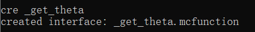
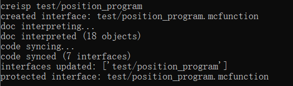
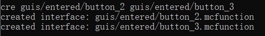
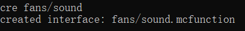

# 第二章：控制系统

## 第一节：程序与GUI系统

### 2.1.1 构建程序系统

创建子模块program

```
cre program/init
```

输入回车同步代码


创建文档program/.doc.mcfo

编写program/.doc.mcfo

```
#mot_uav:program/doc.mcfo

# 控制程序协议
_this: {
	pointer: [storage mot_uav:io ptr,String]
}

_interface: {
	_run: {
		input: mot_uav,
		result: mot_uav
	},
	_proj: {
		input: [storage mot_uav:io input]
	},
	_model: {
		result: [storage mot_uav:io result]
	}
}
```

编写program/init

```
#mot_uav:program/init
# mot_uav:_init调用

# 预设控制程序的数据模板
data modify storage mot_uav:class default_programs set value [\
	{id:"waiting", pointer:"mot_uav:program/waiting"},\
	{id:"height", pointer:"mot_uav:program/height", target_y:0.0d, damp_params:[0.95d,1.0d,0.008d]},\
	{id:"position", pointer:"mot_uav:program/position", target_pos:[0.0d,0.0d,0.0d], damp_params:[0.95d,1.0d,0.008d]}\
]
```

我们回到上级目录，修改mot_uav的文档.doc.mcfo，

为mot_uav临时对象添加一个字段program，

它用于储存无人机当前正在运行的控制程序的数据模板

```
#mot_uav:doc.mcfo

# 临时对象
_this:{
	program:[storage mot_uav:io program,Compound],
	...
}
```

输入回车同步代码


进入游戏重新运行初始化

```
reload
function mot_uav:_init
```

编写fans/main，打开机翼电机时运行控制程序

```
#mot_uav:fans/main
...

# 运行控制程序
execute if data storage mot_uav:io program.pointer run function mot_uav:fans/run_program with storage mot_uav:io program
```

打开mot终端，创建函数fans/run_program

```
cre fans/run_program
```


编写fans/run_program

```
#mot_uav:fans/run_program
# mot_uav:fans/main调用

data modify storage mot_uav:io input set from storage mot_uav:io program
$function $(pointer)/_proj
$function $(pointer)/_run
```

我们创建第一个控制程序：让无人机飞行到指定高度

```
cre program/height/_proj program/height/_run program/height/_model
```


创建program/height/.doc.mcfo

编写program/height/.doc.mcfo

```
#mot_uav:program/height/doc.mcfo

# 高度控制程序的临时对象
_this: {
	pointer: [storage mot_uav:io ptr,String],
	target_y: <target_y,int,1w>,
	damp_params:{
		<damp_k,int,1w>,
		<damp_b,int,1w>,
		<damp_f,int,1w>
	}
}
```

实现高度控制程序的_proj和_model接口

```
#mot_uav:program/height/_proj
# 数据模板投射到临时对象
# 输入[storage mot_uav:io input]

data modify storage mot_uav:io ptr set from storage mot_uav:io input.pointer
execute store result score target_y int run data get storage mot_uav:io input.target_y 10000
execute store result score damp_k int run data get storage mot_uav:io input.damp_params[0] 10000
execute store result score damp_b int run data get storage mot_uav:io input.damp_params[1] 10000
execute store result score damp_f int run data get storage mot_uav:io input.damp_params[2] 10000
```

```
#mot_uav:program/height/_model
# 使用临时对象构建数据模板
# 输出[storage mot_uav:io result]

data modify storage mot_uav:io result set value {pointer:"", target_y:0.0d, damp_params:[0.0d,0.0d,0.0d]}

data modify storage mot_uav:io result.pointer set from storage mot_uav:io ptr
execute store result storage mot_uav:io result.target_y double 0.0001 run scoreboard players get target_y int
execute store result storage mot_uav:io result.damp_params[0] double 0.0001 run scoreboard players get damp_k int
execute store result storage mot_uav:io result.damp_params[1] double 0.0001 run scoreboard players get damp_b int
execute store result storage mot_uav:io result.damp_params[2] double 0.0001 run scoreboard players get damp_f int
```

编写_run，实现高度控制程序的逻辑

```
#mot_uav:program/height/_run
# 输入mot_uav临时对象
# 输出mot_uav临时对象

# 输入阻尼运动位置和速度
scoreboard players operation damp_x int = y int
scoreboard players operation damp_x int -= target_y int
scoreboard players operation damp_v int = vy int

# 判定阻尼运动终止
function math:damp/_energy
scoreboard players operation temp_e int = res int
function math:damp/_threshold
execute if score temp_e int <= res int run return fail

# 阻尼迭代
scoreboard players operation temp_v int = damp_v int
function math:damp/_iter

# 输出机翼电机功率
scoreboard players operation damp_v int -= temp_v int
scoreboard players operation fans_power int = damp_v int
scoreboard players operation fans_power int += mot_uav_g int
scoreboard players operation fans_power int > 1 int
```

打开mot终端，创建测试

```
creisp test/height_program
```


编写test/height/program

```
#mot_uav:test/height_program
# 聊天栏调用
# 需要以无人机为执行者

function mot_uav:_get
data modify storage mot_uav:io program set from storage mot_uav:class default_programs[{id:"height"}]
data modify storage mot_uav:io program.target_y set value -50.0d
function mot_uav:_store
```

进入游戏运行测试

```
reload
function mot_uav:test/general/start
```

等待无人机落地


聊天栏手动给无人机添加控制程序

```
execute as @e[tag=test,limit=1] run function mot_uav:test/height_program
```

启动无人机运行

```
execute as @e[tag=test,limit=1] run function mot_uav:fans/_on
```


观察到无人机上下颠簸严重

结束测试程序

```
scoreboard players set test int 1
```

我们修改一点阻尼算法

```
#mot_uav:program/height/_run
# 输入mot_uav临时对象
# 输出mot_uav临时对象

# 输入阻尼运动位置和速度
scoreboard players operation damp_x int = y int
scoreboard players operation damp_x int -= target_y int
scoreboard players operation damp_v int = vy int

# 设置阻尼冲量参数
scoreboard players set damp_m int 100
scoreboard players operation temp_f int = damp_x int
execute if score temp_f int matches ..-1 run scoreboard players operation temp_f int *= -1 int
scoreboard players operation temp_f int /= damp_m int
scoreboard players operation temp_f int > 1 int
scoreboard players operation damp_f int < temp_f int

...
```

进入游戏重新运行测试

```
reload
function mot_uav:test/general/start
```

等待无人机落地


聊天栏手动给无人机添加控制程序

```
execute as @e[tag=test,limit=1] run function mot_uav:test/height_program
```

启动无人机运行

```
execute as @e[tag=test,limit=1] run function mot_uav:fans/_on
```


无人机平稳飞行

结束测试程序

```
scoreboard players set test int 1
```

### 2.1.2 构建GUI系统

编写_class，建立无人机计数器

```
#mot_uav:_class
# 生成预设静态数据模板

...

# 无人机计数器
scoreboard objectives add mot_uav_id dummy
scoreboard players set #id mot_uav_id 0
```

编写set_operations，添加无人机实例的编号

```
#mot_uav:set_operations
# mot_uav:_new调用

...

# 获取无人机编号
execute store result score @s mot_uav_id run scoreboard players add #id mot_uav_id 1
```

编写set_operations，将无人机初始化为一个iframe_box对象

```
#mot_uav:set_operations
# mot_uav:_new调用

...

# 初始化为iframe_box对象
function iframe:box/_prescript
```

编写main函数，同步iframe_box数据

```
#mot_uav:main
# mot_uav:tick调用
# 实体对象主程序

...

# 同步iframe_box数据
scoreboard players operation @s x_min = @s x
scoreboard players operation @s y_min = @s y
scoreboard players operation @s z_min = @s z
scoreboard players remove @s x_min 2500
scoreboard players remove @s y_min 2500
scoreboard players remove @s z_min 2500
scoreboard players operation @s x_max = @s x
scoreboard players operation @s y_max = @s y
scoreboard players operation @s z_max = @s z
scoreboard players add @s x_max 2500
scoreboard players add @s y_max 2500
scoreboard players add @s z_max 2500

# 坐标安全
execute unless score y int matches -640000..5120000 run function mot_uav:_del
```

打开mot终端，将tick函数加入白名单

```
protect tick
```


回到function上级目录，创建进度advancement/inv_c

```
{
	"criteria":{
		"requirement":{
			"trigger":"minecraft:inventory_changed"
		}
	},
	"rewards":{
		"function":"mot_uav:inv_c"
	}
}
```

打开mot终端，创建inv_c函数

```
cre inv_c
```


编写inv_c函数，输出玩家物品栏变化信号

```
#mot_uav:inv_c
# 物品栏更新信号
# 进度调用

tag @s add mot_uav_inv_c
```

修改tick函数，检测玩家物品栏变动

```
#mot_uav:tick

# 玩家物品栏更新检测
execute as @a[tag=mot_uav_inv_c] run function mot_uav:inv_detect

# 无人机主程序入口
execute as @e[tag=mot_uav] run function mot_uav:main
```

打开mot终端，创建inv_detect函数

```
cre inv_detect
```


编写inv_detect函数，获取玩家物品栏是否有无人机控制权限

```
#mot_uav:inv_detect
# mot_uav:tick调用

# 缓存玩家物品栏
data modify storage mot_uav:io inv set from entity @s Inventory

# 检测控制权限
tag @s remove mot_uav_player
execute if data storage mot_uav:io \
	inv[].components."minecraft:custom_data"{mot_uav:"controller"} \
	run tag @s add mot_uav_player

tag @s remove mot_uav_inv_c
advancement revoke @s only mot_uav:inv_c
```

修改tick函数，拥有控制权限的玩家运行视线搜索程序

```
#mot_uav:tick

# 玩家物品栏更新检测
execute as @a[tag=mot_uav_inv_c] run function mot_uav:inv_detect

# 无人机主程序入口
execute as @e[tag=mot_uav] run function mot_uav:main

# 玩家视线搜索程序入口
execute as @a[tag=mot_uav_player,tag=!iframe_player] run function mot_uav:raycast
```

打开mot终端，创建raycast函数

```
cre raycast
```


编写raycast函数，检测iframe前置包返回的视线追踪结果

```
#mot_uav:raycast
# mot_uav:tick调用

# 保证玩家已经被初始化为一个时钟周期小于等于3的iframe_ray对象
execute unless entity @s[tag=iframe_ray] run return run function iframe:ray/_prescript_3
execute if score @s iframe_ray_per > 3 int run return run function iframe:ray/_unbe

# 视线追踪返回值为空提前返回
execute if score @s iframe_ray_res matches 0 run return fail

# 检测视线追踪的返回值，获取编号
scoreboard players set res int 0
scoreboard players operation tempid int = @s iframe_ray_ptr
execute as @e[tag=mot_uav] if score @s iframe_oid = tempid int \
	store success score res int run \
	scoreboard players operation tempid int = @s mot_uav_id
execute if score res int matches 0 run return fail

# 检查玩家背包的控制权限是否包含编号
execute store result storage mot_uav:io tempid int 1 run scoreboard players get tempid int
data modify storage mot_uav:io temp set value []
data modify storage mot_uav:io temp append from \
	entity @s Inventory[].components."minecraft:custom_data"{mot_uav:"controller"}.mot_uav_id
execute store result score res int run data get storage mot_uav:io temp
execute store result score temp int run data modify storage mot_uav:io temp[] set from storage mot_uav:io tempid
scoreboard players operation res int -= temp int
execute if score res int matches 0 run return fail

# 进入对应编号无人机的选中界面
data modify storage iframe:io input set value "mot_uav:guis/selected"
function iframe:_enter
function iframe:_inv
function iframe:player_space/_get
data modify storage iframe:io result.mot_uav_id set from storage mot_uav:io tempid
function iframe:player_space/_store
```

打开mot终端，创建一个用户界面命名为selected

```
creisp guis/selected/enter
```


创建_controller接口，用于返回控制权限

```
cre _controller
```


编写_controller接口，让无人机返回控制权限物品

```
#mot_uav:_controller
# 生成控制权限物品
# 以实体对象为执行者
# 输出 @e[tag=result,limit=1]

tag @e[tag=result] remove result
execute at @s run summon item ~ ~ ~ {\
	Item:{id:"minecraft:tripwire_hook",count:1b},\
	Motion:[0.0d,0.2d,0.1d],\
	Tags:["result"]\
}

data modify storage mot_uav:io temp set value {mot_uav:"controller",mot_uav_id:0}
execute store result storage mot_uav:io temp.mot_uav_id int 1 run scoreboard players get @s mot_uav_id
data modify entity @e[tag=result,limit=1] Item.components."minecraft:custom_data" set from storage mot_uav:io temp

scoreboard players operation temp int = @s mot_uav_id
data modify storage mot_uav:io input set value '[{"text":"mot_uav_","color":"red","italic":false},{"score":{"name":"temp","objective":"int"}},{"text":"控制权限"}]'
item modify entity 0-0-0-0-1 container.0 mot_uav:_interpret
data modify entity @e[tag=result,limit=1] Item.components."minecraft:custom_name" set from entity 0-0-0-0-1 Item.components."minecraft:lore"[0]
```

回到上级目录，创建物品修饰器item_modifier/_interpret

```
{
	"entity":"this",
	"function":"set_lore",
	"mode":"replace_all",
	"lore":[
		{"nbt":"input","storage":"mot_uav:io","interpret":true}
	]
}
```

编写guis/selected/main，实现GUI退出逻辑：

检测玩家视线追踪结果，如果玩家不再看向该无人机，则退出GUI

```
#mot_uav:guis/selected/main

...

# 获取当前无人机编号
function iframe:player_space/_get
execute store result score tempid int run data get storage iframe:io result.mot_uav_id

# 检测无人机是否仍然存在
scoreboard players set res int 0
execute as @e[tag=mot_uav] if score @s mot_uav_id = tempid int \
	store success score res int run \
	scoreboard players operation tempid int = @s iframe_oid
execute if score res int matches 0 run return run function mot_uav:guis/selected/exit

# 检测玩家是否看向无人机

# 保证玩家已经被初始化为一个时钟周期小于等于3的iframe_ray对象
execute unless entity @s[tag=iframe_ray] run return run function iframe:ray/_prescript_3
execute if score @s iframe_ray_per > 3 int run return run function iframe:ray/_unbe

# 视线追踪返回值为空
execute if score @s iframe_ray_res matches 0 run return run function mot_uav:guis/selected/exit

# 看向的无人机编号不一致
execute unless score tempid int = @s iframe_ray_ptr run return run function mot_uav:guis/selected/exit
```

打开mot终端，创建函数guis/selected/exit

```
cre guis/selected/exit
```


编写guis/selected/exit，实现GUI退出程序

```
#mot_uav:guis/selected/exit

# 原物品栏返还，退出iframe GUI
function iframe:_exit_inv
```

修改inv_detect函数，解除视线追踪服务

```
#mot_uav:inv_detect
# mot_uav:tick调用

# 缓存玩家物品栏
data modify storage mot_uav:io inv set from entity @s Inventory

# 检测控制权限
execute store success score res int run tag @s remove mot_uav_player
execute if data storage mot_uav:io \
	inv[].components."minecraft:custom_data"{mot_uav:"controller"} \
	run tag @s add mot_uav_player
# 解除视线追踪服务
execute if score res int matches 1 unless entity @s[tag=mot_uav_player] \
	run function iframe:ray/_unbe

tag @s remove mot_uav_inv_c
advancement revoke @s only mot_uav:inv_c
```

进入游戏运行测试

```
reload
function mot_uav:_init
function mot_uav:test/general/start
```

调用_controller接口，使无人机掉落一个控制权限

```
execute as @e[tag=test,limit=1] run function mot_uav:_controller
```


我们捡起这个控制权限，视线看向无人机


物品栏被替换成了玻璃（GUI界面的预设）

尝试对这块玻璃使用Q键和F键，无法改动

然后我们把视线从无人机上移开


原物品栏复原

接下来，让我们简单装饰一下这个简陋的selected GUI

修改guis/selected/items，填充GUI物品

```
#mot_uav:guis/selected/items

clear @s

# 填充GUI物品
item replace entity @s hotbar.0 with blue_stained_glass_pane[minecraft:custom_data={iframe_ui:1b,button:0b},minecraft:custom_name='{"text":""}']
item replace entity @s hotbar.1 with blue_stained_glass_pane[minecraft:custom_data={iframe_ui:1b,button:1b},minecraft:custom_name='{"text":""}']
item replace entity @s hotbar.2 with blue_stained_glass_pane[minecraft:custom_data={iframe_ui:1b,button:2b},minecraft:custom_name='{"text":""}']

item replace entity @s hotbar.6 with blue_stained_glass_pane[minecraft:custom_data={iframe_ui:1b,button:6b},minecraft:custom_name='{"text":""}']
item replace entity @s hotbar.7 with blue_stained_glass_pane[minecraft:custom_data={iframe_ui:1b,button:7b},minecraft:custom_name='{"text":""}']
item replace entity @s hotbar.8 with blue_stained_glass_pane[minecraft:custom_data={iframe_ui:1b,button:8b},minecraft:custom_name='{"text":""}']

item replace entity 0-0-0-0-2 contents with comparator[minecraft:custom_data={iframe_ui:1b,button:4b},minecraft:consumable={consume_seconds:1024f}]
function iframe:player_space/_get
execute store result score tempid int run data get storage iframe:io result.mot_uav_id
data modify storage mot_uav:io input set value '[{"text":"enter mot_uav_","color":"red","italic":false},{"score":{"name":"tempid","objective":"int"}}]'
item modify entity 0-0-0-0-1 container.0 mot_uav:_interpret
data modify entity 0-0-0-0-2 item.components."minecraft:custom_name" set from entity 0-0-0-0-1 Item.components."minecraft:lore"[0]
item replace entity @s hotbar.4 from entity 0-0-0-0-2 contents
```

修改guis/selected/main，编写各个GUI物品相对应的更新检测

```
#mot_uav:guis/selected/main

data modify storage iframe:io inv set from entity @s Inventory

# 检测GUI发生变动
scoreboard players set update_gui int 0

execute unless data storage iframe:io inv[{Slot:0b}].components."minecraft:custom_data"{button:0b} run scoreboard players set update_gui int 1
execute unless data storage iframe:io inv[{Slot:1b}].components."minecraft:custom_data"{button:1b} run scoreboard players set update_gui int 1
execute unless data storage iframe:io inv[{Slot:2b}].components."minecraft:custom_data"{button:2b} run scoreboard players set update_gui int 1

execute unless data storage iframe:io inv[{Slot:4b}].components."minecraft:custom_data"{button:4b} run scoreboard players set update_gui int 1

execute unless data storage iframe:io inv[{Slot:6b}].components."minecraft:custom_data"{button:6b} run scoreboard players set update_gui int 1
execute unless data storage iframe:io inv[{Slot:7b}].components."minecraft:custom_data"{button:7b} run scoreboard players set update_gui int 1
execute unless data storage iframe:io inv[{Slot:8b}].components."minecraft:custom_data"{button:8b} run scoreboard players set update_gui int 1

execute if score update_gui int matches 1 run function mot_uav:guis/selected/items

...
```

进入游戏测试

```
reload
```

看向无人机，观察到界面已加载


修改guis/selected/main，编写界面跳转逻辑

```
#mot_uav:guis/selected/main

data modify storage iframe:io inv set from entity @s Inventory
data modify storage iframe:io sel set from entity @s SelectedItem

...

# GUI跳转
execute if score @s iframe_crc matches 1 if data storage iframe:io sel.components."minecraft:custom_data"{button:4b} run function mot_uav:guis/selected/to_entered
```

打开mot终端，创建guis/selected/to_entered

```
cre guis/selected/to_entered
```


在mot终端中创建一个GUI，命名为entered

```
creisp guis/entered/enter
```


编写guis/selected/to_entered，实现GUI跳转

```
#mot_uav:guis/selected/to_entered

data modify storage iframe:io input set value "mot_uav:guis/entered"
function iframe:_enter
```

进入游戏测试

```
reload
```


右键红石比较器后成功跳转GUI

聊天栏执行命令，手动退出GUI

```
function iframe:_exit_inv
```

修改guis/entered/main，实现无人机信号失联时退出GUI

```
#mot_uav:guis/entered/main

data modify storage iframe:io inv set from entity @s Inventory

# 获取玩家空间
function iframe:player_space/_get

# 检测无人机是否失联
execute store result score tempid int run data get storage iframe:io result.mot_uav_id
scoreboard players set res int 0
execute as @e[tag=mot_uav] if score @s mot_uav_id = tempid int run scoreboard players set res int 1
execute if score res int matches 0 run return run function mot_uav:guis/entered/exit_error

# 连接显示
title @s actionbar [{"text":"已连接到mot_uav_","color":"green"},{"score":{"name":"tempid","objective":"int"}}]

# 检测GUI发生变动
...
```

打开mot终端，创建guis/entered/exit_error

```
cre guis/entered/exit_error
```


编写guis/entered/exit_error

```
#mot_uav:guis/entered/exit_error

tellraw @s [{"text":"mot_uav_","color":"red"},{"score":{"name":"tempid","objective":"int"}},"已失联！"]
function iframe:_exit_inv
```

修改guis/entered/enter，进入GUI时设置一个按钮状态

```
#mot_uav:guis/entered/enter

function iframe:player_space/_get
data modify storage iframe:io result.button_0 set value "up"
function iframe:player_space/_store

function mot_uav:guis/entered/items
```

修改guis/entered/items，添加三个按钮

```
#mot_uav:guis/entered/items

clear @s

# 填充GUI物品
execute if data storage iframe:io result{button_0:"up"} run \
	item replace entity @s hotbar.0 with firework_rocket[minecraft:custom_data={iframe_ui:1b,button:0b},minecraft:custom_name='{"text":"up","color":"red"}']
execute if data storage iframe:io result{button_0:"down"} run \
	item replace entity @s hotbar.0 with anvil[minecraft:custom_data={iframe_ui:1b,button:0b},minecraft:custom_name='{"text":"down","color":"red"}']

execute store result score tempid int run data get storage iframe:io result.mot_uav_id
execute as @e[tag=mot_uav] if score @s mot_uav_id = tempid int run scoreboard players operation fans_power int = @s fans_power
execute if score fans_power int matches 0 run \
	item replace entity @s hotbar.7 with redstone_torch[minecraft:custom_data={iframe_ui:1b,button:7b},minecraft:custom_name='{"text":"on","color":"red"}']
execute if score fans_power int matches 1.. run \
	item replace entity @s hotbar.7 with lever[minecraft:custom_data={iframe_ui:1b,button:7b},minecraft:custom_name='{"text":"off","color":"red"}']

item replace entity @s hotbar.8 with barrier[minecraft:custom_data={iframe_ui:1b,button:8b},minecraft:custom_name='{"text":"exit","color":"red"}']
```

修改guis/entered/main，检测相应按钮的更新

```
#mot_uav:guis/entered/main

...

# 检测GUI发生变动
scoreboard players set update_gui int 0

execute unless data storage iframe:io inv[].components."minecraft:custom_data"{button:0b} run function mot_uav:guis/entered/s_up_down
execute unless data storage iframe:io inv[].components."minecraft:custom_data"{button:7b} run function mot_uav:guis/entered/s_on_off
execute unless data storage iframe:io inv[].components."minecraft:custom_data"{button:8b} run return run function mot_uav:guis/entered/exit

execute if score update_gui int matches 1 run function mot_uav:guis/entered/items
```

打开mot终端，创建guis/entered/s_up_down, guis/entered/s_on_off, guis/entered/exit

```
cre guis/entered/s_up_down guis/entered/s_on_off guis/entered/exit
```


编写guis/entered/s_up_down，实现上升下降按钮切换功能

```
#mot_uav:guis/entered/s_up_down

data modify storage iframe:io temp set value "up"
execute if data storage iframe:io result{button_0:"up"} run data modify storage iframe:io temp set value "down"
data modify storage iframe:io result.button_0 set from storage iframe:io temp

function iframe:player_space/_store
scoreboard players set update_gui int 1
```

编写guis/entered/s_on_off，实现电机开关功能

```
#mot_uav:guis/entered/s_on_off

execute store result score tempid int run data get storage iframe:io result.mot_uav_id
execute as @e[tag=mot_uav] if score @s mot_uav_id = tempid int run tag @s add tmp
scoreboard players operation fans_power int = @e[tag=tmp,limit=1] fans_power

# 上传空程序
execute as @e[tag=tmp,limit=1] run function mot_uav:_get
data modify storage mot_uav:io program set value {}
execute as @e[tag=tmp,limit=1] run function mot_uav:_store

# 切换电机状态
execute if score fans_power int matches 0 as @e[tag=tmp,limit=1] run function mot_uav:fans/_on
execute if score fans_power int matches 1.. as @e[tag=tmp,limit=1] run function mot_uav:fans/_off

tag @e[tag=tmp] remove tmp
scoreboard players set update_gui int 1
```

编写guis/entered/exit，实现GUI退出功能

```
#mot_uav:guis/entered/exit

function iframe:_exit_inv
```

打开mot终端，创建guis/init接口

```
creisp guis/init
```


编写guis/init，创建用于记录玩家连接的记分板

```
#mot_uav:guis/init
# mot_uav:_init调用

scoreboard objectives add mot_uav_using dummy
```

修改guis/entered/enter，记录玩家连接

```
#mot_uav:guis/entered/enter

function iframe:player_space/_get

execute store result score @s mot_uav_using run data get storage iframe:io result.mot_uav_id

data modify storage iframe:io result.button_0 set value "up"

function iframe:player_space/_store

function mot_uav:guis/entered/items
```

修改guis/entered/main，处理冲突连接

```
#mot_uav:guis/entered/main

# 避免连接冲突
scoreboard players operation tempid int = @s mot_uav_using
scoreboard players set res int 0
execute as @a if score @s mot_uav_using = tempid int run scoreboard players add res int 1
execute if score res int matches 2.. run return run function mot_uav:guis/entered/exit_conflict

data modify storage iframe:io inv set from entity @s Inventory

# 获取玩家空间
function iframe:player_space/_get

...
```

打开mot终端，创建guis/entered/exit_conflict

```
cre guis/entered/exit_conflict
```


编写guis/entered/exit_conflict，实现冲突处理

```
#mot_uav:guis/entered/exit_conflict

tellraw @a {"text":"连接冲突！","color":"red"}
function mot_uav:guis/entered/exit
```

修改guis/entered/exit_error

```
#mot_uav:guis/entered/exit_error

tellraw @s [{"text":"mot_uav_","color":"red"},{"score":{"name":"tempid","objective":"int"}},"已失联！"]
function mot_uav:guis/entered/exit
```

修改guis/entered/exit，接触玩家连接

```
#mot_uav:guis/entered/exit

function iframe:_exit_inv

scoreboard players reset @s mot_uav_using
```

进入游戏测试

```
reload
function mot_uav:_init
```


测试GUI功能均正常

对屏障按钮使用Q键，退出GUI

修改guis/entered/main，编写上升/下降按钮逻辑

```
#mot_uav:guis/entered/main

...

execute if score update_gui int matches 1 run function mot_uav:guis/entered/items

execute if data storage iframe:io inv[{Slot:-106b}].components."minecraft:custom_data"{button:0b} run function mot_uav:guis/entered/button_0
```

打开mot终端，创建guis/entered/button_0

```
cre guis/entered/button_0
```


编写guis/entered/button_0，实现无人机上升/下降控制功能

```
#mot_uav:guis/entered/button_0

# 获取无人机
execute store result score tempid int run data get storage iframe:io result.mot_uav_id
scoreboard players set res int 0
execute as @e[tag=mot_uav] if score @s mot_uav_id = tempid int run tag @s add tmp

# 获取无人机当前高度
scoreboard players operation tempy int = @e[tag=tmp,limit=1] y

# 根据按钮状态设置目标高度
scoreboard players set temp_dy int 1000
execute if data storage iframe:io result{button_0:"down"} run scoreboard players operation temp_dy int *= -1 int

# 上传无人机上升/下降控制程序
execute as @e[tag=tmp,limit=1] run function mot_uav:_get
data modify storage mot_uav:io program set from storage mot_uav:class default_programs[{id:"height"}]
execute store result storage mot_uav:io program.target_y double 0.0001 run scoreboard players operation tempy int += temp_dy int
execute as @e[tag=tmp,limit=1] run function mot_uav:_store

tag @e[tag=tmp] remove tmp
```

进入游戏测试

```
reload
```

进入无人机GUI

对红石火把按钮使用Q键，打开机翼电机

对烟花火箭按钮使用F键切换到副手

观察到无人机缓慢上升


再次使用F键切换回主手

观察到无人机在空中悬停

对烟花火箭按钮按Q键切换为铁砧按钮

对铁砧按钮使用F键切换到副手

观察到无人机缓慢下降


按F键把铁砧按钮切换回主手

最后对拉杆按钮使用Q键，关闭机翼电机，无人机落地

对屏障按钮使用Q键，退出GUI

修改guis/entered/button_0，常量1000修改为5000

```
#mot_uav:guis/entered/button_0

...

# 根据按钮状态设置目标高度
scoreboard players set temp_dy int 5000
execute if data storage iframe:io result{button_0:"down"} run scoreboard players operation temp_dy int *= -1 int

...
```

修改guis/entered/items，将红石火把和按钮表示的状态对调

```
#mot_uav:guis/entered/items

...

execute store result score tempid int run data get storage iframe:io result.mot_uav_id
execute as @e[tag=mot_uav] if score @s mot_uav_id = tempid int run scoreboard players operation fans_power int = @s fans_power
execute if score fans_power int matches 0 run \
	item replace entity @s hotbar.7 with lever[minecraft:custom_data={iframe_ui:1b,button:7b},minecraft:custom_name='{"text":"on","color":"red"}']
execute if score fans_power int matches 1.. run \
	item replace entity @s hotbar.7 with redstone_torch[minecraft:custom_data={iframe_ui:1b,button:7b},minecraft:custom_name='{"text":"off","color":"red"}']

item replace entity @s hotbar.8 with barrier[minecraft:custom_data={iframe_ui:1b,button:8b},minecraft:custom_name='{"text":"exit","color":"red"}']
```

为解决打开机翼电机时，机翼第一次快速旋转的问题，我们修改fans/main，交换局部旋转角度更新顺序

```
#mot_uav:fans/main
# mot_uav:main调用

# 提供上升加速度
scoreboard players operation vy int += fans_power int

# 角速度阻尼
execute if score fans_power int >= mot_uav_ft int as 0-0-0-0-0 run function mot_uav:fans/spin

# 同步四元数姿态到机翼
#execute store result storage math:io xyzw[0] float 0.0001 run scoreboard players get rquat_x int
#execute store result storage math:io xyzw[1] float 0.0001 run scoreboard players get rquat_y int
#execute store result storage math:io xyzw[2] float 0.0001 run scoreboard players get rquat_z int
#execute store result storage math:io xyzw[3] float 0.0001 run scoreboard players get rquat_w int
#execute on passengers if entity @s[tag=fan] run function mot_uav:fans/sync_rr

# 按比例增加fans_theta
scoreboard players operation sstemp int = fans_power int
scoreboard players operation sstemp int *= mot_uav_fr int
scoreboard players operation fans_theta int -= sstemp int

# 计算本地四元数
scoreboard players operation theta int = fans_theta int
execute as 0-0-0-0-0 run function math:iquat/_theta_to
execute on passengers if entity @s[tag=fan] run function math:iquat/_store

# 关闭静体优化
scoreboard players set motion_static int 0

# 运行控制程序
execute if data storage mot_uav:io program.pointer as 0-0-0-0-0 run function mot_uav:fans/run_program with storage mot_uav:io program
```

## 第二节：基本控制程序

### 2.2.1 添加旋转程序

打开mot终端，创建控制程序rotation

```
cre program/rotation/_proj program/rotation/_model program/rotation/_run
```


创建文件program/rotation/.doc.mcfo

编写program/rotation/.doc.mcfo

```
#mot_uav:program/rotation/doc.mcfo

# 旋转控制程序的临时对象
_this: {
	pointer: [storage mot_uav:io ptr,String],
	target_y: <target_y,int,1w>,
	target_theta: <target_theta,int,1w>,
	damp_params:{
		<damp_k,int,1w>,
		<damp_b,int,1w>,
		<damp_f,int,1w>
	}
}
```

编写program/rotation/_proj, program/rotation/_model

```
#mot_uav:program/rotation/_proj
# 数据模板投射到临时对象
# 输入[storage mot_uav:io input]

data modify storage mot_uav:io ptr set from storage mot_uav:io input.pointer
execute store result score target_y int run data get storage mot_uav:io input.target_y 10000
execute store result score target_theta int run data get storage mot_uav:io input.target_theta 10000
execute store result score damp_k int run data get storage mot_uav:io input.damp_params[0] 10000
execute store result score damp_b int run data get storage mot_uav:io input.damp_params[1] 10000
execute store result score damp_f int run data get storage mot_uav:io input.damp_params[2] 10000
```

```
#mot_uav:program/rotation/_model
# 使用临时对象构建数据模板
# 输出[storage mot_uav:io result]

data modify storage mot_uav:io result set value {pointer:"", target_y:0.0d, target_theta:0.0d, damp_params:[0.0d,0.0d,0.0d]}

data modify storage mot_uav:io result.pointer set from storage mot_uav:io ptr
execute store result storage mot_uav:io result.target_y double 0.0001 run scoreboard players get target_y int
execute store result storage mot_uav:io result.target_theta double 0.0001 run scoreboard players get target_theta int
execute store result storage mot_uav:io result.damp_params[0] double 0.0001 run scoreboard players get damp_k int
execute store result storage mot_uav:io result.damp_params[1] double 0.0001 run scoreboard players get damp_b int
execute store result storage mot_uav:io result.damp_params[2] double 0.0001 run scoreboard players get damp_f int
```

修改program/init，添加旋转程序数据模板

```
#mot_uav:program/init
# mot_uav:_init调用

# 预设控制程序的数据模板
data modify storage mot_uav:class default_programs set value [\
	{id:"waiting", pointer:"mot_uav:program/waiting"},\
	{id:"height", pointer:"mot_uav:program/height", target_y:0.0d, damp_params:[0.95d,1.0d,0.008d]},\
	{id:"rotation", pointer:"mot_uav:program/rotation", target_y:0.0d, target_theta:0.0d, damp_params:[0.95d,1.0d,0.008d]},\
	{id:"position", pointer:"mot_uav:program/position", target_y:0.0d, target_pos:[0.0d,0.0d,0.0d], damp_params:[0.95d,1.0d,0.008d]}\
]
```

修改fans/main，为控制程序传入世界实体

```
#mot_uav:fans/main
# mot_uav:main调用

...

# 运行控制程序
execute if data storage mot_uav:io program.pointer as 0-0-0-0-0 run function mot_uav:fans/run_program with storage mot_uav:io program
```

编写program/rotation/_run，实现旋转控制功能

```
#mot_uav:program/rotation/_run
# 输入mot_uav临时对象
# 输出mot_uav临时对象

# 获取当前偏航角
execute store result storage math:io xyz[0] double 0.0001 run scoreboard players get kvec_x int
execute store result storage math:io xyz[2] double 0.0001 run scoreboard players get kvec_z int
data modify entity @s Pos set from storage math:io xyz
execute positioned 0.0 0.0 0.0 facing entity @s feet run tp @s ~ ~ ~ ~ ~
execute store result score damp_x int run data get entity @s Rotation[0] -10000

# 选取劣弧作为转动路径
scoreboard players operation damp_x int -= target_theta int
scoreboard players operation damp_x int %= 3600000 int
execute if score damp_x int matches 1800000.. run scoreboard players remove damp_x int 3600000

# 获取当前偏航角速度
scoreboard players operation damp_v int = angular_y int

# 阻尼迭代
function math:damp/_iter

# 更新角速度
scoreboard players operation angular_y int = damp_v int
function mot_uav:angular/_update

# 维持高度
function mot_uav:program/height/_run
```

打开mot终端，创建一个异步测试项目命名为rotation

```
creisp test/rotation/start
```


修改test/rotation/start，生成mot_uav作为测试实例

设置测试时间killtime为500

```
#mot_uav:test/rotation/start

# 生成测试程序实体
data modify storage mot_uav:io input set from storage mot_uav:class test
function mot_uav:_new

...

# 设置测试程序运行时间
scoreboard players set @e[tag=result,limit=1] killtime 100
```

修改test/rotation/end，销毁测试实例

```
#mot_uav:test/rotation/end

function mot_uav:_del
```

修改test/rotation/main，编写测试流程

```
#mot_uav:test/rotation/main

# 打开电机
execute if score @s killtime matches 495 run function mot_uav:fans/_on

# 上传高度程序
execute if score @s killtime matches 490 run function mot_uav:test/height_program

# 上传旋转程序
execute if score @s killtime matches 400 run function mot_uav:test/rotation_program
```

打开mot_终端，创建test/rotation_program

```
creisp test/rotation_program
```


编写test/rotation_program，上传旋转程序

```
#mot_uav:test/rotation_program

function mot_uav:_get
data modify storage mot_uav:io program set from storage mot_uav:class default_programs[{id:"rotation"}]
data modify storage mot_uav:io program.target_y set value -50.0d
data modify storage mot_uav:io program.target_theta set value 90.0f
function mot_uav:_store
```

进入游戏，结束已经运行的general测试

```
scoreboard players set test int 1
```

运行测试

```
reload
function mot_uav:_init
function mot_uav:test/rotation/start
```


观察到无人机旋转，但比较慢，并且抖动严重

我们修改角速度更新函数angular/_update，给四元数加入单位化操作

```
#mot_uav:angular/_update

# 把当前四元数姿态设置为旋转的初始姿态
execute as 0-0-0-0-0 run function math:quat/_norm
function math:quat/_topose

...
```

修改_consts，加入角速度阻尼常量

```
#mot_uav:_consts
# 创建常量

# 质量
scoreboard players set mot_uav_m int 20

# 速度阻尼
scoreboard players set mot_uav_k int 9800

# 角速度阻尼
scoreboard players set mot_uav_ak int 9800

...
```

修改main函数，编写角速度阻尼

```
#mot_uav:main
# mot_uav:tick调用
# 实体对象主程序

...

# 角速度的四元数迭代
scoreboard players operation quat_phi int += angular_len int
execute as 0-0-0-0-0 run function math:quat/_xyzw
# 四元数姿态同步到局部坐标系
function math:quat/_touvw

# 速度阻尼
scoreboard players operation vx int *= mot_uav_k int
scoreboard players operation vy int *= mot_uav_k int
scoreboard players operation vz int *= mot_uav_k int
scoreboard players operation vx int /= 10000 int
scoreboard players operation vy int /= 10000 int
scoreboard players operation vz int /= 10000 int

# 角速度阻尼
scoreboard players operation inp int = mot_uav_ak int
function mot_uav:angular/_factor

...
```

修改program/rotation/_run，加入旋转终止判定，调用原height程序的参数来维持高度

```
#mot_uav:program/rotation/_run
# 输入mot_uav临时对象
# 输出mot_uav临时对象

...

# 阻尼迭代
function math:damp/_iter

# 判定阻尼运动终止
function math:damp/_energy
scoreboard players operation temp_e int = res int
function math:damp/_threshold
scoreboard players operation res int *= 10 int
execute if score temp_e int <= res int run scoreboard players set damp_v int 0

# 更新角速度
scoreboard players operation angular_y int = damp_v int
function mot_uav:angular/_update

# 维持高度
data modify storage mot_uav:io input set from storage mot_uav:class default_programs[{id:"height"}]
execute store result storage mot_uav:io input.target_y double 0.0001 run scoreboard players get target_y int
function mot_uav:program/height/_proj
function mot_uav:program/height/_run
```

修改program/init，改变旋转程序的damp参数

```
#mot_uav:program/init
# mot_uav:_init调用

# 预设控制程序的数据模板
data modify storage mot_uav:class default_programs set value [\
	{id:"waiting", pointer:"mot_uav:program/waiting"},\
	{id:"height", pointer:"mot_uav:program/height", target_y:0.0d, damp_params:[0.95d,1.0d,0.008d]},\
	{id:"rotation", pointer:"mot_uav:program/rotation", target_y:0.0d, target_theta:0.0d, damp_params:[0.0095d,0.01d,0.08d]},\
	{id:"position", pointer:"mot_uav:program/position", target_y:0.0d, target_pos:[0.0d,0.0d,0.0d], damp_params:[0.95d,1.0d,0.008d]}\
]
```

进入游戏，重新运行测试

```
reload
function mot_uav:_init
function mot_uav:test/rotation/start
```


观察到无人机完成转向

接下来为GUI添加旋转按钮

修改guis/entered/enter，添加新的按钮状态

```
#mot_uav:guis/entered/enter

function iframe:player_space/_get

execute store result score @s mot_uav_using run data get storage iframe:io result.mot_uav_id

data modify storage iframe:io result.button_0 set value "up"
data modify storage iframe:io result.button_1 set value "counterclockwise"

function iframe:player_space/_store

function mot_uav:guis/entered/items
```

修改guis/entered/items，填充状态对应的按钮

```
#mot_uav:guis/entered/items

clear @s

# 填充GUI物品
execute if data storage iframe:io result{button_0:"up"} run \
	item replace entity @s hotbar.0 with firework_rocket[minecraft:custom_data={iframe_ui:1b,button:0b},minecraft:custom_name='{"text":"up","color":"red"}']
execute if data storage iframe:io result{button_0:"down"} run \
	item replace entity @s hotbar.0 with anvil[minecraft:custom_data={iframe_ui:1b,button:0b},minecraft:custom_name='{"text":"down","color":"red"}']

execute if data storage iframe:io result{button_1:"counterclockwise"} run \
	item replace entity @s hotbar.1 with light_blue_carpet[minecraft:custom_data={iframe_ui:1b,button:1b},minecraft:custom_name='{"text":"counterclockwise","color":"red"}']
execute if data storage iframe:io result{button_1:"clockwise"} run \
	item replace entity @s hotbar.1 with magenta_carpet[minecraft:custom_data={iframe_ui:1b,button:1b},minecraft:custom_name='{"text":"clockwise","color":"red"}']

...
```

修改guis/entered/main，编写按钮切换逻辑和按钮使用逻辑

```
#mot_uav:guis/entered/main

...

# 检测GUI发生变动
scoreboard players set update_gui int 0

execute unless data storage iframe:io inv[].components."minecraft:custom_data"{button:0b} run function mot_uav:guis/entered/s_up_down
execute unless data storage iframe:io inv[].components."minecraft:custom_data"{button:1b} run function mot_uav:guis/entered/s_clockwise
execute unless data storage iframe:io inv[].components."minecraft:custom_data"{button:7b} run function mot_uav:guis/entered/s_on_off
execute unless data storage iframe:io inv[].components."minecraft:custom_data"{button:8b} run return run function mot_uav:guis/entered/exit

execute if score update_gui int matches 1 run function mot_uav:guis/entered/items

execute if data storage iframe:io inv[{Slot:-106b}].components."minecraft:custom_data"{button:0b} run function mot_uav:guis/entered/button_0
execute if data storage iframe:io inv[{Slot:-106b}].components."minecraft:custom_data"{button:1b} run function mot_uav:guis/entered/button_1
```

打开mot终端，创建guis/entered/s_clockwise, guis/entered/button_1

```
cre guis/entered/s_clockwise guis/entered/button_1
```


编写guis/entered/s_clockwise，实现按钮切换

```
#mot_uav:guis/entered/s_clockwise

data modify storage iframe:io temp set value "clockwise"
execute if data storage iframe:io result{button_1:"clockwise"} run data modify storage iframe:io temp set value "counterclockwise"
data modify storage iframe:io result.button_1 set from storage iframe:io temp

function iframe:player_space/_store
scoreboard players set update_gui int 1
```

打开mot终端，创建函数接口_get_theta

```
cre _get_theta
```



编写_get_theta，实现获取偏航角功能

```
#mot_uav:_get_theta
# 获取无人机当前偏航角
# 输出<theta,int,1w>
# 需要传入世界实体

execute store result storage math:io xyz[0] double 0.0001 run scoreboard players get kvec_x int
execute store result storage math:io xyz[2] double 0.0001 run scoreboard players get kvec_z int
data modify entity @s Pos set from storage math:io xyz
execute positioned 0.0 0.0 0.0 facing entity @s feet run tp @s ~ ~ ~ ~ ~
execute store result score theta int run data get entity @s Rotation[0] -10000
scoreboard players operation theta int %= 3600000 int
execute if score theta int matches 1800000.. run scoreboard players remove theta int 3600000
```

编写guis/entered/button_1，上传旋转程序

```
#mot_uav:guis/entered/button_1

# 获取无人机
execute store result score tempid int run data get storage iframe:io result.mot_uav_id
scoreboard players set res int 0
execute as @e[tag=mot_uav] if score @s mot_uav_id = tempid int run tag @s add tmp

# 根据按钮状态设置偏移角度
scoreboard players set temp_dtheta int 50000
execute if data storage iframe:io result{button_1:"clockwise"} run scoreboard players operation temp_dtheta int *= -1 int

# 获取无人机当前偏航角
execute as @e[tag=tmp,limit=1] run function mot_uav:_get
execute as 0-0-0-0-0 run function mot_uav:_get_theta

# 维持无人机原高度
scoreboard players operation tempy int = y int
execute if data storage mot_uav:io program.target_y store result score tempy int run data get storage mot_uav:io program.target_y 10000

# 上传无人机上升/下降控制程序
data modify storage mot_uav:io program set from storage mot_uav:class default_programs[{id:"rotation"}]
execute store result storage mot_uav:io program.target_y double 0.0001 run scoreboard players get tempy int
execute store result storage mot_uav:io program.target_theta float 0.0001 run scoreboard players operation theta int += temp_dtheta int
execute as @e[tag=tmp,limit=1] run function mot_uav:_store

tag @e[tag=tmp] remove tmp
```

进入游戏，测试功能

```
reload
function mot_uav:_init
function mot_uav:test/general/start
execute as @e[tag=test,limit=1] run function mot_uav:_controller
```

捡起控制权限，进入GUI界面，测试旋转

旋转功能正常

### 2.2.2 添加水平位移程序

打开mot终端，创建水平位移程序

```
cre program/position/_proj program/position/_model program/position/_run
```


创建文件program/position/.doc.mcfo

编写program/position/.doc.mcfo

```
#mot_uav:program/position/doc.mcfo

# 位移控制程序的临时对象
_this: {
	pointer: [storage mot_uav:io ptr,String],
	target_y: <target_y,int,1w>,
	target_pos: {
		<target_x,int,1w>,
		<target_y,int,1w>,
		<target_z,int,1w>
	},
	damp_params: {
		<damp_k,int,1w>,
		<damp_b,int,1w>,
		<damp_f,int,1w>
	}
}
```

编写program/position/_proj, program/position/_model

```
#mot_uav:program/position/_proj
# 数据模板投射到临时对象
# 输入[storage mot_uav:io input]

data modify storage mot_uav:io ptr set from storage mot_uav:io input.pointer
execute store result score target_y int run data get storage mot_uav:io input.target_y 10000
execute store result score target_x int run data get storage mot_uav:io input.target_pos[0] 10000
execute store result score target_z int run data get storage mot_uav:io input.target_pos[2] 10000
execute store result score damp_k int run data get storage mot_uav:io input.damp_params[0] 10000
execute store result score damp_b int run data get storage mot_uav:io input.damp_params[1] 10000
execute store result score damp_f int run data get storage mot_uav:io input.damp_params[2] 10000
```

```
#mot_uav:program/position/_model
# 使用临时对象构建数据模板
# 输出[storage mot_uav:io result]

data modify storage mot_uav:io result set value {pointer:"", target_y:0.0d, target_pos:[0.0d,0.0d,0.0d], damp_params:[0.0d,0.0d,0.0d]}

data modify storage mot_uav:io result.pointer set from storage mot_uav:io ptr
execute store result storage mot_uav:io result.target_y double 0.0001 run scoreboard players get target_y int
execute store result storage mot_uav:io result.target_pos[0] double 0.0001 run scoreboard players get target_x int
execute store result storage mot_uav:io result.target_pos[1] double 0.0001 run scoreboard players get target_y int
execute store result storage mot_uav:io result.target_pos[2] double 0.0001 run scoreboard players get target_z int
execute store result storage mot_uav:io result.damp_params[0] double 0.0001 run scoreboard players get damp_k int
execute store result storage mot_uav:io result.damp_params[1] double 0.0001 run scoreboard players get damp_b int
execute store result storage mot_uav:io result.damp_params[2] double 0.0001 run scoreboard players get damp_f int
```

编写program/position/_run函数，实现水平位移控制功能

```
#mot_uav:program/position/_run
# 输入mot_uav临时对象
# 输出mot_uav临时对象

# 获取水平偏移
scoreboard players operation damp_x int = x int
scoreboard players operation damp_z int = z int
scoreboard players operation damp_x int -= target_x int
scoreboard players operation damp_z int -= target_z int
scoreboard players set damp_y int 0

# 获取水平速度
scoreboard players operation damp_vx int = vx int
scoreboard players operation damp_vz int = vz int
scoreboard players set damp_vy int 0

# 控制迭代
function math:damp_vec/_iter

# 抵达判定
function math:damp_vec/_energy
scoreboard players operation temp_e int = res int
function math:damp_vec/_threshold
scoreboard players operation res int *= 25 int

# 根据速度差值施加冲量
execute if score temp_e int > res int run function mot_uav:program/position/apply_impulse

# 维持高度
data modify storage mot_uav:io input set from storage mot_uav:class default_programs[{id:"height"}]
execute store result storage mot_uav:io input.target_y double 0.0001 run scoreboard players get target_y int
function mot_uav:program/height/_proj
function mot_uav:program/height/_run
```

打开mot终端，创建program/position/apply_impulse

```
cre program/position/apply_impulse
```


编写program/position/apply_impulse

```
#mot_uav:program/position/apply_impulse
# mot_uav:program/position/_run调用

# 计算冲量大小
scoreboard players operation impulse_fx int = damp_vx int
scoreboard players operation impulse_fz int = damp_vz int
scoreboard players operation impulse_fx int -= vx int
scoreboard players operation impulse_fz int -= vz int
scoreboard players operation impulse_fx int *= mot_uav_m int
scoreboard players operation impulse_fz int *= mot_uav_m int
scoreboard players set impulse_fy int 0

# 计算冲量作用点
execute store result storage math:io xyz[0] double -0.0001 run scoreboard players get impulse_fx int
execute store result storage math:io xyz[2] double -0.0001 run scoreboard players get impulse_fz int
data modify storage math:io xyz[1] set value 0.0d
data modify entity @s Pos set from storage math:io xyz
execute positioned 0.0 0.0 0.0 facing entity @s feet run tp @s ^ ^ ^1.0
data modify storage math:io xyz set from entity @s Pos
execute store result score impulse_x int run data get storage math:io xyz[0] 10000
execute store result score impulse_z int run data get storage math:io xyz[2] 10000
scoreboard players operation impulse_x int += x int
scoreboard players operation impulse_z int += z int
scoreboard players operation impulse_y int = y int
scoreboard players add impulse_y int 12500

# 施加冲量
function mot_uav:impulse/_apply
```

打开mot终端，创建一个异步测试项目命名为position

```
creisp test/position/start
```


修改test/position/start，生成mot_uav作为测试实例

设置测试时间killtime为500

```
#mot_uav:test/position/start

# 生成测试程序实体
data modify storage mot_uav:io input set from storage mot_uav:class test
function mot_uav:_new

...

# 设置测试程序运行时间
scoreboard players set @e[tag=result,limit=1] killtime 500
```

修改test/position/end，销毁测试实例

```
#mot_uav:test/position/end

function mot_uav:_del
```

修改test/position/main，编写测试流程

```
#mot_uav:test/position/main

# 打开电机
execute if score @s killtime matches 495 run function mot_uav:fans/_on

# 上传高度程序
execute if score @s killtime matches 490 run function mot_uav:test/height_program

# 上传位移程序
execute if score @s killtime matches 400 run function mot_uav:test/position_program
```

打开mot终端，创建test/position_program

```
creisp test/position_program
```



编写test/position_program，上传位移程序

```
#mot_uav:test/position_program

function mot_uav:_get
data modify storage mot_uav:io program set from storage mot_uav:class default_programs[{id:"position"}]
data modify storage mot_uav:io program.target_y set value -50.0d
data modify storage mot_uav:io program.target_pos set value [8.0d,-50.0d,16.0d]
function mot_uav:_store
```

进入游戏，结束已经运行的general测试

```
scoreboard players set test int 1
```

运行位移测试

```
reload
function mot_uav:_init
function mot_uav:test/position/start
```


观察到无人机在抵达终点后颠簸严重

我们需要修改program/position/_run中的控制算法

```
#mot_uav:program/position/_run
# 输入mot_uav临时对象
# 输出mot_uav临时对象

...

# 设置阻尼冲量参数
scoreboard players operation temp_r int = damp_x int
scoreboard players operation temp_r int /= 100 int
scoreboard players operation temp_r int *= temp_r int
scoreboard players operation sqrt int = damp_z int
scoreboard players operation sqrt int /= 100 int
scoreboard players operation sqrt int *= sqrt int
scoreboard players operation sqrt int += temp_r int
function math:sqrt/_self
scoreboard players operation sqrt int /= 4 int
scoreboard players operation damp_f int < sqrt int
scoreboard players operation damp_f int > 10 int

# 控制迭代
function math:damp_vec/_iter

...
```

进入游戏，重新运行测试

```
reload
function mot_uav:test/position/start
```


观察到无人机平稳抵达终点

然后为GUI添加位移控制按钮

修改guis/entered/items，填充GUI物品

```
#mot_uav:guis/entered/items

...

item replace entity @s hotbar.2 with arrow[minecraft:custom_data={iframe_ui:1b,button:2b},minecraft:custom_name='{"text":"forward","color":"red"}']
item replace entity @s hotbar.3 with red_banner[minecraft:custom_data={iframe_ui:1b,button:3b},minecraft:custom_name='{"text":"position","color":"red"}']
```

修改guis/entered/main，检测响应按钮的更新

```
#mot_uav:guis/entered/main

...

# 检测GUI发生变动
scoreboard players set update_gui int 0

execute unless data storage iframe:io inv[].components."minecraft:custom_data"{button:0b} run function mot_uav:guis/entered/s_up_down
execute unless data storage iframe:io inv[].components."minecraft:custom_data"{button:1b} run function mot_uav:guis/entered/s_clockwise
execute unless data storage iframe:io inv[].components."minecraft:custom_data"{button:2b} run scoreboard players set update_gui int 1
execute unless data storage iframe:io inv[].components."minecraft:custom_data"{button:3b} run function mot_uav:guis/entered/button_3
execute unless data storage iframe:io inv[].components."minecraft:custom_data"{button:7b} run function mot_uav:guis/entered/s_on_off
execute unless data storage iframe:io inv[].components."minecraft:custom_data"{button:8b} run return run function mot_uav:guis/entered/exit

execute if score update_gui int matches 1 run function mot_uav:guis/entered/items

execute if data storage iframe:io inv[{Slot:-106b}].components."minecraft:custom_data"{button:0b} run function mot_uav:guis/entered/button_0
execute if data storage iframe:io inv[{Slot:-106b}].components."minecraft:custom_data"{button:1b} run function mot_uav:guis/entered/button_1
execute if data storage iframe:io inv[{Slot:-106b}].components."minecraft:custom_data"{button:2b} run function mot_uav:guis/entered/button_2
```

打开mot终端，创建guis/entered/button_2, guis/entered/button_3

```
cre guis/entered/button_2 guis/entered/button_3
```



编写guis/entered/button_2，实现前进功能

```
#mot_uav:guis/entered/button_2

# 获取无人机
execute store result score tempid int run data get storage iframe:io result.mot_uav_id
scoreboard players set res int 0
execute as @e[tag=mot_uav] if score @s mot_uav_id = tempid int run tag @s add tmp
execute as @e[tag=tmp,limit=1] run function mot_uav:_get

# 维持无人机原高度
scoreboard players operation tempy int = y int
execute if data storage mot_uav:io program.target_y store result score tempy int run data get storage mot_uav:io program.target_y 10000

# 上传位移程序
data modify storage mot_uav:io program set from storage mot_uav:class default_programs[{id:"position"}]
execute store result storage mot_uav:io program.target_y double 0.0001 run scoreboard players get tempy int
scoreboard players operation tempx int = kvec_x int
scoreboard players operation tempz int = kvec_z int
scoreboard players operation tempx int *= 2 int
scoreboard players operation tempz int *= 2 int
execute store result storage mot_uav:io program.target_pos[0] double 0.0001 run scoreboard players operation tempx int += x int
execute store result storage mot_uav:io program.target_pos[1] double 0.0001 run scoreboard players get tempy int
execute store result storage mot_uav:io program.target_pos[2] double 0.0001 run scoreboard players operation tempz int += z int
execute as @e[tag=tmp,limit=1] run function mot_uav:_store

tag @e[tag=tmp] remove tmp
```

编写guis/entered/button_3，实现定位功能

```
#mot_uav:guis/entered/button_3

# 生成旗帜
execute at @s anchored eyes positioned ^ ^ ^ as 0-0-0-0-0 run function mot_uav:guis/entered/summon_banner
execute if score iframe_ray_res int matches 0 run return run scoreboard players set update_gui int 1

# 获取无人机
execute store result score tempid int run data get storage iframe:io result.mot_uav_id
scoreboard players set res int 0
execute as @e[tag=mot_uav] if score @s mot_uav_id = tempid int run tag @s add tmp
execute as @e[tag=tmp,limit=1] run function mot_uav:_get

# 维持无人机原高度
scoreboard players operation tempy int = y int
execute if data storage mot_uav:io program.target_y store result score tempy int run data get storage mot_uav:io program.target_y 10000

# 上传位移程序
data modify storage mot_uav:io program set from storage mot_uav:class default_programs[{id:"position"}]
execute store result storage mot_uav:io program.target_y double 0.0001 run scoreboard players get tempy int
data modify storage mot_uav:io program.target_pos set from entity @e[tag=result,limit=1] Pos
execute store result storage mot_uav:io program.target_pos[1] double 0.0001 run scoreboard players get tempy int
execute as @e[tag=tmp,limit=1] run function mot_uav:_store

tag @e[tag=tmp] remove tmp

scoreboard players set update_gui int 1
```

打开mot终端，创建guis/entered/summon_banner

```
cre guis/entered/summon_banner
```


编写guis/entered/summon_banner

```
#mot_uav:guis/entered/summon_banner
# mot_uav:guis/entered/button_3调用

# 视线追踪获取落点
function iframe:ray/_anchor_to
function iframe:ray/_if_solid
execute if score iframe_ray_res int matches 0 run return fail

# 生成旗帜展示实体
tag @e[tag=result] remove result
execute store result storage math:io xyz[0] double 0.0001 run scoreboard players get iframe_ray_ix int
execute store result storage math:io xyz[1] double 0.0001 run scoreboard players get iframe_ray_iy int
execute store result storage math:io xyz[2] double 0.0001 run scoreboard players get iframe_ray_iz int
data modify entity @s Pos set from storage math:io xyz
execute at @s run summon minecraft:item_display ~ ~ ~ {item:{id:"minecraft:red_banner",count:1b},Tags:["result"],transformation:{left_rotation:[0.0f,0.0f,0.0f,1.0f],scale:[0.0f,0.0f,0.0f],right_rotation:[0.0f,0.0f,0.0f,1.0f],translation:[0.0f,0.5f,0.0f]}}
tp @s 0 0 0 ~ ~
execute store result score theta int run data get entity @s Rotation[0] -10000
function math:iquat/_theta_to
function math:iquat/_model
data modify entity @e[tag=result,limit=1] transformation.left_rotation set from storage math:io xyzw
data modify entity @e[tag=result,limit=1] transformation.scale set value [1.0f,1.0f,1.0f]
scoreboard players set @e[tag=result,limit=1] killtime 50
```

进入游戏，测试GUI位移按钮

```
reload
function mot_uav:_init
function mot_uav:test/general/start
execute as @e[tag=test,limit=1] run function mot_uav:_controller
```


forward按钮（F键使用）、position按钮（Q键使用）功能均正常

打开main，修复速度阻力bug

```
...

# 速度阻尼
scoreboard players operation vx int *= mot_uav_k int
scoreboard players operation vy int *= mot_uav_k int
scoreboard players operation vz int *= mot_uav_k int
execute if score vx int matches ..-1 run scoreboard players add vx int 9999
execute if score vy int matches ..-1 run scoreboard players add vy int 9999
execute if score vz int matches ..-1 run scoreboard players add vz int 9999
scoreboard players operation vx int /= 10000 int
scoreboard players operation vy int /= 10000 int
scoreboard players operation vz int /= 10000 int

# 角速度阻尼
scoreboard players operation inp int = mot_uav_ak int
function mot_uav:angular/_factor

...
```

打开angular/_factor，修复角速度阻尼bug

```
#mot_uav:angular/_factor
# 输入<inp, int, 1w>表示缩放因子

# 缩放角速度向量
scoreboard players operation angular_x int *= inp int
execute if score angular_x int matches ..-1 run scoreboard players add angular_x int 9999
scoreboard players operation angular_x int /= 10000 int
scoreboard players operation angular_y int *= inp int
execute if score angular_y int matches ..-1 run scoreboard players add angular_y int 9999
scoreboard players operation angular_y int /= 10000 int
scoreboard players operation angular_z int *= inp int
execute if score angular_z int matches ..-1 run scoreboard players add angular_z int 9999
scoreboard players operation angular_z int /= 10000 int

# 计算新的模长
scoreboard players operation angular_len int *= inp int
scoreboard players operation angular_len int /= 10000 int
```

### 2.2.3 添加音效

打开mot终端，创建一个异步测试项目命名为fans_sound

```
creisp test/fans_sound/start
```


修改test/fans_sound/start，设置测试时间为200

```
#mot_uav:test/fans_sound/start

...

# 设置测试程序运行时间
scoreboard players set @e[tag=result,limit=1] killtime 200
```

修改test/fans_sound/main

```
#mot_uav:test/fans_sound/main

# 过滤时间
scoreboard players operation res int = @s killtime
scoreboard players operation res int %= test int
execute unless score res int matches 0 run return fail

# 播放测试音效
execute as @a at @s run playsound minecraft:entity.ender_dragon.flap player @s ~ ~ ~ 1.0 2.0
```

进入游戏运行测试

```
reload
scoreboard players set test 5
function mot_uav:test/fans_sound/start
```

```
scoreboard players set test 3
function mot_uav:test/fans_sound/start
```

经过测试，似乎周期为3 tick最合适

修改.doc.mcfo，为机翼添加计时器

```
#mot_uav:doc.mcfo

# 临时对象
_this:{
	program:[storage mot_uav:io program,Compound],
	fans:{
		<fans_power,int,1w>,
		<fans_theta,int,1w>,
		<fans_timer,int,1w>
	},
	...
}
```

打开mot终端，输入回车，同步数据接口


修改fans/main

```
#mot_uav:fans/main
# mot_uav:main调用

# 机翼音效
execute if score fans_power int matches 50.. run function mot_uav:fans/sound
scoreboard players add fans_timer int 1

# 提供上升加速度
scoreboard players operation vy int += fans_power int

...
```

打开mot终端，创建fans/sound

```
cre fans/sound
```



编写fans/sound

```
#mot_uav:fans/sound
# mot_uav:fans/main调用

scoreboard players set sstemp_mod int 5
execute if score fans_power int matches 125.. run scoreboard players set sstemp_mod int 3
scoreboard players operation sstemp int = fans_timer int
scoreboard players operation sstemp int %= sstemp_mod int
execute if score sstemp int matches 0 at @s run playsound minecraft:entity.ender_dragon.flap player @a ~ ~0.6 ~ 0.1 2.0
```

为fans/_on添加音效

```
#mot_uav:fans/_on
# 打开机翼电机
# 以mot_uav实例为执行者

scoreboard players set @s fans_power 1
# 关闭静体优化
scoreboard players set @s motion_static 0
function mot_uav:fans/update_torch

execute at @s run playsound minecraft:block.note_block.banjo player @a ~ ~0.6 ~ 0.5 2.0
```

为fans/_off添加音效

```
#mot_uav:fans/_off
# 打开机翼电机
# 以mot_uav实例为执行者

scoreboard players set @s fans_power 0
function mot_uav:fans/update_torch

execute at @s run playsound minecraft:block.redstone_torch.burnout player @a ~ ~0.6 ~ 0.5 2.0
```

为guis/selected/to_entered添加音效

```
#mot_uav:guis/selected/to_entered

execute at @s run playsound minecraft:block.note_block.bass player @s ~ ~ ~ 1.0 1.0

data modify storage iframe:io input set value "mot_uav:guis/entered"
function iframe:_enter
```

为guis/entered/button_3添加音效

```
#mot_uav:guis/entered/button_3

...

execute at @s run playsound minecraft:block.grass.break player @s ~ ~ ~ 1.0 1.0
```

为guis/entered/exit添加音效

```
#mot_uav:guis/entered/exit

function iframe:_exit_inv

scoreboard players reset @s mot_uav_using

execute at @s run playsound minecraft:block.note_block.bass player @s ~ ~ ~ 1.0 1.0
```

进入游戏测试音效

```
scoreboard players set test int 1
reload
function mot_uav:_init
function mot_uav:test/general/start
execute as @e[tag=test,limit=1] run function mot_uav:_controller
```

音效正常

## 第三节：后续完善与优化

### 2.3.1 控制程序的运行状态

为了使得外部开发者能够更好地对无人机进行编程

我们为无人机的控制程序添加运行状态参数

state:0, 表示**未运行**

state:1, 表示运行中，且**未达到程序目标判定条件**

state:2, 表示运行中，且**已达到程序目标判定条件**

修改program/.doc.mcfo，更改控制程序协议

```
#mot_uav:program/doc.mcfo

# 控制程序协议
_this: {
	pointer: [storage mot_uav:io ptr,String],
	state: <state,int,1>
}

_interface: {
	_run: {
		input: mot_uav,
		result: mot_uav
	},
	_proj: {
		input: [storage mot_uav:io input]
	},
	_model: {
		result: [storage mot_uav:io result]
	}
}
```

修改program/init，添加状态变量

```
#mot_uav:program/init
# mot_uav:_init调用

# 预设控制程序的数据模板
data modify storage mot_uav:class default_programs set value [\
	{id:"waiting", pointer:"mot_uav:program/waiting", state:0},\
	{id:"height", pointer:"mot_uav:program/height", target_y:0.0d, damp_params:[0.95d,1.0d,0.008d], state:0},\
	{id:"rotation", pointer:"mot_uav:program/rotation", target_y:0.0d, target_theta:0.0d, damp_params:[0.0095d,0.01d,0.08d], state:0},\
	{id:"position", pointer:"mot_uav:program/position", target_y:0.0d, target_pos:[0.0d,0.0d,0.0d], damp_params:[0.95d,1.0d,0.008d], state:0}\
]
```

修改program/height/.doc.mcfo

```
#mot_uav:program/height/doc.mcfo

# 高度控制程序的临时对象
_this: {
	pointer: [storage mot_uav:io ptr,String],
	target_y: <target_y,int,1w>,
	damp_params:{
		<damp_k,int,1w>,
		<damp_b,int,1w>,
		<damp_f,int,1w>
	},
	state: <state,int,1>
}
```

修改program/height/_proj

```
#mot_uav:program/height/_proj
# 数据模板投射到临时对象
# 输入[storage mot_uav:io input]

data modify storage mot_uav:io ptr set from storage mot_uav:io input.pointer
execute store result score target_y int run data get storage mot_uav:io input.target_y 10000
execute store result score damp_k int run data get storage mot_uav:io input.damp_params[0] 10000
execute store result score damp_b int run data get storage mot_uav:io input.damp_params[1] 10000
execute store result score damp_f int run data get storage mot_uav:io input.damp_params[2] 10000
execute store result score state int run data get storage mot_uav:io input.state
```

修改program/height/_model

```
#mot_uav:program/height/_model
# 使用临时对象构建数据模板
# 输出[storage mot_uav:io result]

data modify storage mot_uav:io result set value {pointer:"", target_y:0.0d, damp_params:[0.0d,0.0d,0.0d], state:0}

data modify storage mot_uav:io result.pointer set from storage mot_uav:io ptr
execute store result storage mot_uav:io result.target_y double 0.0001 run scoreboard players get target_y int
execute store result storage mot_uav:io result.damp_params[0] double 0.0001 run scoreboard players get damp_k int
execute store result storage mot_uav:io result.damp_params[1] double 0.0001 run scoreboard players get damp_b int
execute store result storage mot_uav:io result.damp_params[2] double 0.0001 run scoreboard players get damp_f int
execute store result storage mot_uav:io result.state int 1 run scoreboard players get state int
```

修改program/position/.doc.mcfo

```
#mot_uav:program/position/doc.mcfo

# 位移控制程序的临时对象
_this: {
	pointer: [storage mot_uav:io ptr,String],
	target_y: <target_y,int,1w>,
	target_pos: {
		<target_x,int,1w>,
		<target_y,int,1w>,
		<target_z,int,1w>
	},
	damp_params: {
		<damp_k,int,1w>,
		<damp_b,int,1w>,
		<damp_f,int,1w>
	},
	state: <state,int,1>
}
```

修改program/position/_proj

```
#mot_uav:program/position/_proj
# 数据模板投射到临时对象
# 输入[storage mot_uav:io input]

data modify storage mot_uav:io ptr set from storage mot_uav:io input.pointer
execute store result score target_y int run data get storage mot_uav:io input.target_y 10000
execute store result score target_x int run data get storage mot_uav:io input.target_pos[0] 10000
execute store result score target_z int run data get storage mot_uav:io input.target_pos[2] 10000
execute store result score damp_k int run data get storage mot_uav:io input.damp_params[0] 10000
execute store result score damp_b int run data get storage mot_uav:io input.damp_params[1] 10000
execute store result score damp_f int run data get storage mot_uav:io input.damp_params[2] 10000
execute store result score state int run data get storage mot_uav:io input.state
```

修改program/position/_model

```
#mot_uav:program/position/_model
# 使用临时对象构建数据模板
# 输出[storage mot_uav:io result]

data modify storage mot_uav:io result set value {pointer:"", target_y:0.0d, target_pos:[0.0d,0.0d,0.0d], damp_params:[0.0d,0.0d,0.0d], state:0}

data modify storage mot_uav:io result.pointer set from storage mot_uav:io ptr
execute store result storage mot_uav:io result.target_y double 0.0001 run scoreboard players get target_y int
execute store result storage mot_uav:io result.target_pos[0] double 0.0001 run scoreboard players get target_x int
execute store result storage mot_uav:io result.target_pos[1] double 0.0001 run scoreboard players get target_y int
execute store result storage mot_uav:io result.target_pos[2] double 0.0001 run scoreboard players get target_z int
execute store result storage mot_uav:io result.damp_params[0] double 0.0001 run scoreboard players get damp_k int
execute store result storage mot_uav:io result.damp_params[1] double 0.0001 run scoreboard players get damp_b int
execute store result storage mot_uav:io result.damp_params[2] double 0.0001 run scoreboard players get damp_f int
execute store result storage mot_uav:io result.state int 1 run scoreboard players get state int
```

修改program/rotation/.doc.mcfo

```
#mot_uav:program/rotation/doc.mcfo

# 旋转控制程序的临时对象
_this: {
	pointer: [storage mot_uav:io ptr,String],
	target_y: <target_y,int,1w>,
	target_theta: <target_theta,int,1w>,
	damp_params:{
		<damp_k,int,1w>,
		<damp_b,int,1w>,
		<damp_f,int,1w>
	},
	state: <state,int,1>
}
```

修改program/rotation/_proj

```
#mot_uav:program/rotation/_proj
# 数据模板投射到临时对象
# 输入[storage mot_uav:io input]

data modify storage mot_uav:io ptr set from storage mot_uav:io input.pointer
execute store result score target_y int run data get storage mot_uav:io input.target_y 10000
execute store result score target_theta int run data get storage mot_uav:io input.target_theta 10000
execute store result score damp_k int run data get storage mot_uav:io input.damp_params[0] 10000
execute store result score damp_b int run data get storage mot_uav:io input.damp_params[1] 10000
execute store result score damp_f int run data get storage mot_uav:io input.damp_params[2] 10000
execute store result score state int run data get storage mot_uav:io input.state
```

修改program/rotation/_model

```
#mot_uav:program/rotation/_model
# 使用临时对象构建数据模板
# 输出[storage mot_uav:io result]

data modify storage mot_uav:io result set value {pointer:"", target_y:0.0d, target_theta:0.0d, damp_params:[0.0d,0.0d,0.0d], state:0}

data modify storage mot_uav:io result.pointer set from storage mot_uav:io ptr
execute store result storage mot_uav:io result.target_y double 0.0001 run scoreboard players get target_y int
execute store result storage mot_uav:io result.target_theta double 0.0001 run scoreboard players get target_theta int
execute store result storage mot_uav:io result.damp_params[0] double 0.0001 run scoreboard players get damp_k int
execute store result storage mot_uav:io result.damp_params[1] double 0.0001 run scoreboard players get damp_b int
execute store result storage mot_uav:io result.damp_params[2] double 0.0001 run scoreboard players get damp_f int
execute store result storage mot_uav:io result.state int 1 run scoreboard players get state int
```

修改fans/run_program，实现控制程序的数据传递

```
#mot_uav:fans/run_program
# mot_uav:fans/main调用

data modify storage mot_uav:io input set from storage mot_uav:io program
$function $(pointer)/_proj
$function $(pointer)/_run
$function $(pointer)/_model
data modify storage mot_uav:io program set from storage mot_uav:io result
```

由于position和rotation程序中临时调用了height程序

我们还需要额外实现这两个程序的数据模板暂存

修改program/position/_run

```
#mot_uav:program/position/_run
# 输入mot_uav临时对象
# 输出mot_uav临时对象

...

# 根据速度差值施加冲量
execute if score temp_e int > res int run function mot_uav:program/position/apply_impulse

function mot_uav:program/position/_model
data modify storage mot_uav:io temp set from storage mot_uav:io result

# 维持高度
data modify storage mot_uav:io input set from storage mot_uav:class default_programs[{id:"height"}]
execute store result storage mot_uav:io input.target_y double 0.0001 run scoreboard players get target_y int
function mot_uav:program/height/_proj
function mot_uav:program/height/_run

data modify storage mot_uav:io input set from storage mot_uav:io temp
function mot_uav:program/position/_proj
```

修改program/rotation/_run

```
#mot_uav:program/rotation/_run
# 输入mot_uav临时对象
# 输出mot_uav临时对象

...

# 更新角速度
scoreboard players operation angular_y int = damp_v int
function mot_uav:angular/_update

function mot_uav:program/rotation/_model
data modify storage mot_uav:io temp set from storage mot_uav:io result

# 维持高度
data modify storage mot_uav:io input set from storage mot_uav:class default_programs[{id:"height"}]
execute store result storage mot_uav:io input.target_y double 0.0001 run scoreboard players get target_y int
function mot_uav:program/height/_proj
function mot_uav:program/height/_run

data modify storage mot_uav:io input set from storage mot_uav:io temp
function mot_uav:program/rotation/_proj
```

修改program/height/_run，暂存damp_f参数

```
#mot_uav:program/height/_run
# 输入mot_uav临时对象
# 输出mot_uav临时对象

...

scoreboard players operation temp_sf int = damp_f int
# 设置阻尼冲量参数

...

# 输出机翼电机功率
scoreboard players operation damp_v int -= temp_v int
scoreboard players operation fans_power int = damp_v int
scoreboard players operation fans_power int += mot_uav_g int
scoreboard players operation fans_power int > 1 int

scoreboard players operation damp_f int = temp_sf int
```

修改fans/update_torch，机翼关闭状态设置状态变量为0

```
#mot_uav:fans/update_torch
# mot_uav:fans/_on调用
# mot_uav:fans/_off调用
# mot_uav:fans/_update调用
# mot_uav:set_operations调用

data modify storage mot_uav:io temp set value "false"
execute if score @s fans_power matches 1.. run data modify storage mot_uav:io temp set value "true"

execute on passengers if entity @s[tag=torch] run \
	data modify entity @s block_state.Properties.lit set from storage mot_uav:io temp

execute if score @s fans_power matches 0 run data modify entity @s item.components."minecraft:custom_data".program.state set value 0
```

修改program/height/_run，赋值状态变量

由于阻尼运动终止判定需要用到damp_f参数，这里需要交换一下判定和计算冲量参数的执行顺序

```
#mot_uav:program/height/_run
# 输入mot_uav临时对象
# 输出mot_uav临时对象

...

scoreboard players set state int 1
# 判定阻尼运动终止
function math:damp/_energy
scoreboard players operation temp_e int = res int
function math:damp/_threshold
execute if score temp_e int <= res int run return run scoreboard players set state int 2

# 设置阻尼冲量参数
scoreboard players set damp_m int 100
scoreboard players operation temp_f int = damp_x int
execute if score temp_f int matches ..-1 run scoreboard players operation temp_f int *= -1 int
scoreboard players operation temp_f int /= damp_m int
scoreboard players operation temp_f int > 1 int
scoreboard players operation damp_f int < temp_f int

# 阻尼迭代
scoreboard players operation temp_v int = damp_v int
function math:damp/_iter

...
```

修改program/position/_run，赋值状态变量

```
#mot_uav:program/position/_run
# 输入mot_uav临时对象
# 输出mot_uav临时对象

...

scoreboard players operation temp_sf int = damp_f int
# 设置阻尼冲量参数
scoreboard players operation temp_r int = damp_x int
scoreboard players operation temp_r int /= 100 int
scoreboard players operation temp_r int *= temp_r int
scoreboard players operation sqrt int = damp_z int
scoreboard players operation sqrt int /= 100 int
scoreboard players operation sqrt int *= sqrt int
scoreboard players operation sqrt int += temp_r int
function math:sqrt/_self
scoreboard players operation sqrt int /= 4 int
scoreboard players operation damp_f int < sqrt int
scoreboard players operation damp_f int > 10 int

# 控制迭代
function math:damp_vec/_iter

scoreboard players set state int 1
# 抵达判定
function math:damp_vec/_energy
scoreboard players operation temp_e int = res int
function math:damp_vec/_threshold
scoreboard players operation res int *= 25 int
execute if score temp_e int <= res int run scoreboard players set state int 2

# 根据速度差值施加冲量
execute if score temp_e int > res int run function mot_uav:program/position/apply_impulse
scoreboard players operation damp_f int = temp_sf int

...
```

修改program/rotation/_run，赋值状态变量

```
...

# 阻尼迭代
function math:damp/_iter

scoreboard players set state int 1
# 判定阻尼运动终止
function math:damp/_energy
scoreboard players operation temp_e int = res int
function math:damp/_threshold
scoreboard players operation res int *= 10 int
execute if score temp_e int <= res int run scoreboard players set state int 2
execute if score temp_e int <= res int run scoreboard players set damp_v int 0

...
```

打开mot终端，添加两个外部接口_get_program, _store_program

```
cre _get_program _store_program
```


编写_get_program

```
#mot_uav:_get_program
# 获取无人机控制程序
# 以无人机实例为执行者

data modify storage mot_uav:io program set from entity @s item.components."minecraft:custom_data".program
```

编写_store_program

```
#mot_uav:_store_program
# 上传无人机控制程序
# 以无人机实例为执行者

data modify entity @s item.components."minecraft:custom_data".program set from storage mot_uav:io program
```

创建瞬时控制程序forward

什么是瞬时控制程序？瞬时控制程序在第一个执行的tick会被解析，成为其它控制程序

创建program/forward/.doc.mcfo

```
#mot_uav:program/forward/doc.mcfo

# 位移控制程序的临时对象
_this: {
	w: <w,int,1w>,
	pointer: [storage mot_uav:io ptr,String],
	target_y: <target_y,int,1w>,
	target_pos: {
		<target_x,int,1w>,
		<target_y,int,1w>,
		<target_z,int,1w>
	},
	damp_params: {
		<damp_k,int,1w>,
		<damp_b,int,1w>,
		<damp_f,int,1w>
	},
	state: <state,int,1>
}
```

打开mot终端，创建program/forward/_proj, program/forward/_model, program/forward/_run

```
cre program/forward/_proj program/forward/_model program/forward/_run
```


编写program/forward/_proj, program/forward/_model

```
#mot_uav:program/forward/_proj
# 数据模板投射到临时对象
# 输入[storage mot_uav:io input]

execute store result score w int run data get storage mot_uav:io input.w 10000
data modify storage mot_uav:io ptr set from storage mot_uav:io input.pointer
execute store result score target_y int run data get storage mot_uav:io input.target_y 10000
execute store result score target_x int run data get storage mot_uav:io input.target_pos[0] 10000
execute store result score target_z int run data get storage mot_uav:io input.target_pos[2] 10000
execute store result score damp_k int run data get storage mot_uav:io input.damp_params[0] 10000
execute store result score damp_b int run data get storage mot_uav:io input.damp_params[1] 10000
execute store result score damp_f int run data get storage mot_uav:io input.damp_params[2] 10000
execute store result score state int run data get storage mot_uav:io input.state
```

```
#mot_uav:program/forward/_model
# 使用临时对象构建数据模板
# 输出[storage mot_uav:io result]

data modify storage mot_uav:io result set value {w:0.0d, pointer:"", target_y:0.0d, target_pos:[0.0d,0.0d,0.0d], damp_params:[0.0d,0.0d,0.0d], state:0}

execute store result storage mot_uav:io result.w double 0.0001 run scoreboard players get w int
data modify storage mot_uav:io result.pointer set from storage mot_uav:io ptr
execute store result storage mot_uav:io result.target_y double 0.0001 run scoreboard players get target_y int
execute store result storage mot_uav:io result.target_pos[0] double 0.0001 run scoreboard players get target_x int
execute store result storage mot_uav:io result.target_pos[1] double 0.0001 run scoreboard players get target_y int
execute store result storage mot_uav:io result.target_pos[2] double 0.0001 run scoreboard players get target_z int
execute store result storage mot_uav:io result.damp_params[0] double 0.0001 run scoreboard players get damp_k int
execute store result storage mot_uav:io result.damp_params[1] double 0.0001 run scoreboard players get damp_b int
execute store result storage mot_uav:io result.damp_params[2] double 0.0001 run scoreboard players get damp_f int
execute store result storage mot_uav:io result.state int 1 run scoreboard players get state int
```

编写program/forward/_run，解析瞬时程序

```
#mot_uav:program/forward/_run
# 输入mot_uav临时对象
# 输出mot_uav临时对象

scoreboard players set state int 1

# 计算target_pos
scoreboard players set u int 0
scoreboard players set v int 0
function math:uvw/_tovec
scoreboard players operation target_x int = vec_x int
scoreboard players operation target_z int = vec_z int

# 转存为position程序
data modify storage mot_uav:io ptr set value "mot_uav:program/position"
```

创建program/turn/.doc.mcfo

```
#mot_uav:program/turn/doc.mcfo

# 旋转控制程序的临时对象
_this: {
	delta_theta: <delta_theta,int,1w>,
	pointer: [storage mot_uav:io ptr,String],
	target_y: <target_y,int,1w>,
	target_theta: <target_theta,int,1w>,
	damp_params:{
		<damp_k,int,1w>,
		<damp_b,int,1w>,
		<damp_f,int,1w>
	},
	state: <state,int,1>
}
```

打开mot终端，创建program/turn/_proj, program/turn/_model, program/turn/_run

```
cre program/turn/_proj program/turn/_model program/turn/_run
```


编写program/turn/_proj, program/turn/_model

```
#mot_uav:program/turn/_proj
# 数据模板投射到临时对象
# 输入[storage mot_uav:io input]

execute store result score delta_theta int run data get storage mot_uav:io input.delta_theta 10000
data modify storage mot_uav:io ptr set from storage mot_uav:io input.pointer
execute store result score target_y int run data get storage mot_uav:io input.target_y 10000
execute store result score target_theta int run data get storage mot_uav:io input.target_theta 10000
execute store result score damp_k int run data get storage mot_uav:io input.damp_params[0] 10000
execute store result score damp_b int run data get storage mot_uav:io input.damp_params[1] 10000
execute store result score damp_f int run data get storage mot_uav:io input.damp_params[2] 10000
execute store result score state int run data get storage mot_uav:io input.state
```

```
#mot_uav:program/turn/_model
# 使用临时对象构建数据模板
# 输出[storage mot_uav:io result]

data modify storage mot_uav:io result set value {delta_theta:0.0d, pointer:"", target_y:0.0d, target_theta:0.0d, damp_params:[0.0d,0.0d,0.0d], state:0}

execute store result storage mot_uav:io result.delta_theta double 0.0001 run scoreboard players get delta_theta int
data modify storage mot_uav:io result.pointer set from storage mot_uav:io ptr
execute store result storage mot_uav:io result.target_y double 0.0001 run scoreboard players get target_y int
execute store result storage mot_uav:io result.target_theta double 0.0001 run scoreboard players get target_theta int
execute store result storage mot_uav:io result.damp_params[0] double 0.0001 run scoreboard players get damp_k int
execute store result storage mot_uav:io result.damp_params[1] double 0.0001 run scoreboard players get damp_b int
execute store result storage mot_uav:io result.damp_params[2] double 0.0001 run scoreboard players get damp_f int
execute store result storage mot_uav:io result.state int 1 run scoreboard players get state int
```

编写program/turn/_run，解析瞬时程序

```
#mot_uav:program/turn/_run
# 输入mot_uav临时对象
# 输出mot_uav临时对象

scoreboard players set state int 1

# 计算target_theta
function mot_uav:_get_theta
scoreboard players operation target_theta int = theta int
scoreboard players operation target_theta int += delta_theta int

# 转存为rotation程序
data modify storage mot_uav:io ptr set value "mot_uav:program/rotation"
```

创建program/up/.doc.mcfo

```
#mot_uav:program/up/doc.mcfo

# 高度控制程序的临时对象
_this: {
	delta_y: <delta_y,int,1w>,
	pointer: [storage mot_uav:io ptr,String],
	target_y: <target_y,int,1w>,
	damp_params:{
		<damp_k,int,1w>,
		<damp_b,int,1w>,
		<damp_f,int,1w>
	},
	state: <state,int,1>
}
```

打开mot终端，创建program/up/_proj, program/up/_model, program/up/_run

```
cre program/up/_proj program/up/_model program/up/_run
```


编写program/up/_proj, program/up/_model

```
#mot_uav:program/up/_proj
# 数据模板投射到临时对象
# 输入[storage mot_uav:io input]

execute store result score delta_y int run data get storage mot_uav:io input.delta_y 10000
data modify storage mot_uav:io ptr set from storage mot_uav:io input.pointer
execute store result score target_y int run data get storage mot_uav:io input.target_y 10000
execute store result score damp_k int run data get storage mot_uav:io input.damp_params[0] 10000
execute store result score damp_b int run data get storage mot_uav:io input.damp_params[1] 10000
execute store result score damp_f int run data get storage mot_uav:io input.damp_params[2] 10000
execute store result score state int run data get storage mot_uav:io input.state
```

```
#mot_uav:program/up/_model
# 使用临时对象构建数据模板
# 输出[storage mot_uav:io result]

data modify storage mot_uav:io result set value {delta_y:0.0d ,pointer:"", target_y:0.0d, damp_params:[0.0d,0.0d,0.0d], state:0}

execute store result storage mot_uav:io result.delta_y double 0.0001 run scoreboard players get delta_y int
data modify storage mot_uav:io result.pointer set from storage mot_uav:io ptr
execute store result storage mot_uav:io result.target_y double 0.0001 run scoreboard players get target_y int
execute store result storage mot_uav:io result.damp_params[0] double 0.0001 run scoreboard players get damp_k int
execute store result storage mot_uav:io result.damp_params[1] double 0.0001 run scoreboard players get damp_b int
execute store result storage mot_uav:io result.damp_params[2] double 0.0001 run scoreboard players get damp_f int
execute store result storage mot_uav:io result.state int 1 run scoreboard players get state int
```

编写program/up/_run，解析瞬时程序

```
#mot_uav:program/up/_run
# 输入mot_uav临时对象
# 输出mot_uav临时对象

scoreboard players set state int 1

# 计算target_y
scoreboard players operation target_y int = y int
scoreboard players operation target_y int += delta_y int

# 转存为height程序
data modify storage mot_uav:io ptr set value "mot_uav:program/height"
```

创建program/landing/.doc.mcfo

```
#mot_uav:program/landing/doc.mcfo

# 高度控制程序的临时对象
_this: {
	pointer: [storage mot_uav:io ptr,String],
	state: <state,int,1>
}
```

打开mot终端，创建program/landing/_proj, program/landing/_model, program/landing/_run

```
cre program/landing/_proj program/landing/_model program/landing/_run
```


编写program/landing/_proj, program/landing/_model

```
#mot_uav:program/landing/_proj
# 数据模板投射到临时对象
# 输入[storage mot_uav:io input]

data modify storage mot_uav:io ptr set from storage mot_uav:io input.pointer
execute store result score state int run data get storage mot_uav:io input.state
```

```
#mot_uav:program/landing/_model
# 使用临时对象构建数据模板
# 输出[storage mot_uav:io result]

data modify storage mot_uav:io result set value {pointer:"", state:0}

data modify storage mot_uav:io result.pointer set from storage mot_uav:io ptr
execute store result storage mot_uav:io result.state int 1 run scoreboard players get state int
```

编写program/landing/_run

```
#mot_uav:program/landing/_run
# 输入mot_uav临时对象
# 输出mot_uav临时对象

# 计算target_y
scoreboard players operation vec_x int = x int
scoreboard players operation vec_y int = y int
scoreboard players operation vec_z int = z int
scoreboard players operation vec_y int -= mot_uav_ch int
scoreboard players operation vec_x int /= 10000 int
scoreboard players operation vec_y int /= 10000 int
scoreboard players operation vec_z int /= 10000 int
scoreboard players remove vec_y int 1
scoreboard players operation vec_x int *= 10000 int
scoreboard players operation vec_y int *= 10000 int
scoreboard players operation vec_z int *= 10000 int
execute store result storage math:io xyz[0] double 0.0001 run scoreboard players add vec_x int 5000
execute store result storage math:io xyz[1] double 0.0001 run scoreboard players add vec_y int 5000
execute store result storage math:io xyz[2] double 0.0001 run scoreboard players add vec_z int 5000
data modify entity @s Pos set from storage math:io xyz
scoreboard players operation target_y int = vec_y int
execute at @s unless block ~ ~ ~ #mot_uav:pass run scoreboard players add target_y int 5100
scoreboard players operation target_y int += mot_uav_ch int

function mot_uav:program/landing/_model
data modify storage mot_uav:io temp set from storage mot_uav:io result

# 维持高度
data modify storage mot_uav:io input set from storage mot_uav:class default_programs[{id:"height"}]
execute store result storage mot_uav:io input.target_y double 0.0001 run scoreboard players get target_y int
function mot_uav:program/height/_proj
function mot_uav:program/height/_run
# 状态变量设置为height程序的状态
execute store result storage mot_uav:io temp.state int 1 run scoreboard players get state int

data modify storage mot_uav:io input set from storage mot_uav:io temp
function mot_uav:program/landing/_proj

# 区块安全
tp @s 0 0 0
```

修改program/init，添加程序的预设模板

```
#mot_uav:program/init
# mot_uav:_init调用

# 预设控制程序的数据模板
data modify storage mot_uav:class default_programs set value [\
	{id:"waiting", pointer:"mot_uav:program/waiting", state:0},\
	{id:"landing", pointer:"mot_uav:program/landing", state:0},\
	{id:"height", pointer:"mot_uav:program/height", target_y:0.0d, damp_params:[0.95d,1.0d,0.008d], state:0},\
	{id:"rotation", pointer:"mot_uav:program/rotation", target_y:0.0d, target_theta:0.0d, damp_params:[0.0095d,0.01d,0.08d], state:0},\
	{id:"position", pointer:"mot_uav:program/position", target_y:0.0d, target_pos:[0.0d,0.0d,0.0d], damp_params:[0.95d,1.0d,0.008d], state:0},\
	{id:"up", pointer:"mot_uav:program/up", delta_y:0.0d, target_y:0.0d, damp_params:[0.95d,1.0d,0.008d], state:0},\
	{id:"turn", pointer:"mot_uav:program/turn", delta_theta:0.0d, target_y:0.0d, target_theta:0.0d, damp_params:[0.0095d,0.01d,0.08d], state:0},\
	{id:"forward", pointer:"mot_uav:program/forward", w:0.0d, target_y:0.0d, target_pos:[0.0d,0.0d,0.0d], damp_params:[0.95d,1.0d,0.008d], state:0}\
]
```

打开mot终端，创建异步测试项目命名为program

```
creisp test/program/start
```


修改test/program/start，无人机作为测试实例

向marker_control:data中添加程序管线

```
#mot_uav:test/program/start

# 生成测试程序实体
data modify storage mot_uav:io input set from storage mot_uav:class test
function mot_uav:_new

execute as @e[tag=result,limit=1] run function marker_control:data/_get

# 控制程序管线
data modify storage marker_control:io result.lst_programs set value []
# 上升5格
data modify storage marker_control:io result.lst_programs append from storage mot_uav:class default_programs[{id:"up"}]
data modify storage marker_control:io result.lst_programs[-1].delta_y set value 5.0d
# 左转45度
data modify storage marker_control:io result.lst_programs append from storage mot_uav:class default_programs[{id:"turn"}]
data modify storage marker_control:io result.lst_programs[-1].delta_theta set value 45.0d
data remove storage marker_control:io result.lst_programs[-1].target_y
# 前进10格
data modify storage marker_control:io result.lst_programs append from storage mot_uav:class default_programs[{id:"forward"}]
data modify storage marker_control:io result.lst_programs[-1].w set value 10.0d
data remove storage marker_control:io result.lst_programs[-1].target_y
# 降落到地面
data modify storage marker_control:io result.lst_programs append from storage mot_uav:class default_programs[{id:"landing"}]
# 结束测试
data modify storage marker_control:io result.lst_programs append value {}

# 设置测试程序主函数和销毁函数
data modify storage marker_control:io result.tick_func set value "mot_uav:test/program/main"
data modify storage marker_control:io result.del_func set value "mot_uav:test/program/end"

execute as @e[tag=result,limit=1] run function marker_control:data/_store
tag @e[tag=result,limit=1] add entity_ticked
tag @e[tag=result,limit=1] add entity_todel

# 设置测试程序运行时间
scoreboard players set @e[tag=result,limit=1] killtime 500
```

修改test/program/end，销毁测试实例

```
#mot_uav:test/program/end

function mot_uav:_del
```

修改test/program/main，编写测试流程

```
#mot_uav:test/program/main

# 打开电机
execute if score @s killtime matches 495 run function mot_uav:fans/_on

# 处理控制程序管线
execute if score @s killtime matches 491.. run return fail
function marker_control:data/_get

# 管线清空后结束测试
execute unless data storage marker_control:io result.lst_programs[0] run return fail
scoreboard players set @s killtime 10

# 检测当前程序运行状态
function mot_uav:_get_program
execute unless data storage mot_uav:io program{state:1} run function mot_uav:test/program/upload_program
```

打开mot终端，创建test/program/upload_program

```
cre test/program/upload_program
```


编写test/program/upload_program

```
#mot_uav:test/program/upload_program
# mot_uav:test/program/main调用

execute unless data storage mot_uav:io program.target_y run scoreboard players operation test_y int = @s y

# 维持原程序高度
execute if data storage mot_uav:io program.target_y store result score test_y int run data get storage mot_uav:io program.target_y 10000

# 上传新程序
data modify storage mot_uav:io program set from storage marker_control:io result.lst_programs[0]
data remove storage marker_control:io result.lst_programs[0]
function marker_control:data/_store
execute unless data storage mot_uav:io program.target_y \
	store result storage mot_uav:io program.target_y double 0.0001 run \
	scoreboard players get test_y int
data modify storage mot_uav:io program.state set value 1
function mot_uav:_store_program

# 关闭机翼电机
execute unless data storage mot_uav:io program.pointer run \
	function mot_uav:fans/_off
```

进入游戏，运行测试

```
scoreboard players set test int 1
reload
function mot_uav:_init
function mot_uav:test/program/start
```


观察到无人机完成了管线中预定的各个控制程序

### 2.3.2 修复碰撞bug

使用GUI控制无人机撞墙时，发现无人机会穿墙而过

修改test/position/start，在无人机经过路径上填充玻璃墙

```
#mot_uav:test/position/start

...

# 设置测试程序运行时间
scoreboard players set @e[tag=result,limit=1] killtime 500

fill 7 -49 13 9 -51 13 glass
```

运行position测试

```
reload
function mot_uav:test/position/start
```


观察到bug被复现

经过分析我们发现，造成这个bug的原因是：

发生碰撞后，冲量为无人机赋予了向后的速度，无人机本应倒退

但是无人机的控制程序修改了速度，使得向后的速度被消除，新速度继续向前

我们的修复方案是：

发生碰撞的那个tick不再运行控制程序

修改main函数

```
#mot_uav:main
# mot_uav:tick调用
# 实体对象主程序

...

# 遍历碰撞点列表
data modify storage mot_uav:io list_impulse set value []
execute store result score loop int run data get storage mot_uav:io collision_points
execute if score loop int matches 1.. as 0-0-0-0-0 run function mot_uav:collision/loop
scoreboard players set temp_c int 0
execute if data storage mot_uav:io list_impulse[0] run function mot_uav:collision/apply

...
```

修改collision/apply

```
#mot_uav:collision/apply
# mot_uav:main调用

...

# 遍历并施加每个冲量
function mot_uav:collision/apply_loop

scoreboard players set temp_c int 1
```

修改fans/main

```
#mot_uav:fans/main
# mot_uav:main调用

...

# 运行控制程序
execute if score temp_c int matches 1 run return fail
execute if data storage mot_uav:io program.pointer as 0-0-0-0-0 run function mot_uav:fans/run_program with storage mot_uav:io program
```

进入游戏，重新运行测试

```
reload
function mot_uav:test/position/start
```


bug修复完成