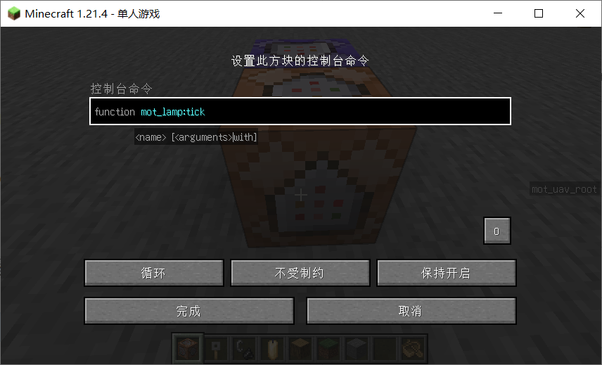

# 第三章：设备系统

## 第一节：模块与设备系统

### 模块控制

回到data目录，创建新的命名空间module_control

命名空间内创建function文件夹

创建module_control:_init

```
#module_control:_init
# 初始化模块控制

# 储存模块信息的数据结构
data modify storage module_control:io prefix_dict set value {}
data modify storage module_control:io list_infos set value []

# 建立编号池
data modify storage module_control:io free_addr set value []

scoreboard objectives add module_id dummy
# 编号从0开始以便访问列表下标
scoreboard players set #id module_id -1

# 外部访问初始化状态
scoreboard objectives add int dummy
scoreboard players set module_control_inited int 1
```

function文件夹内创建data目录


创建module_control:data/.doc.mcfo

```
#module_control:data/doc.mcfo

# 模块信息协议
_input_plate: {
	prefix: [storage module_control:io input.prefix, String],
	namespace: [storage module_control:io input.namespace, String]
}
```

创建module_control:data/_reg

```
#module_control:data/_reg
# 注册模块信息
# 输入storage module_control:io input
# 输出编号<res,int>

# 检查是否已经注册该路径
execute store result score res int run function module_control:data/check_dict with storage module_control:io input

# 如果已经注册路径
execute if score res int matches 1 run return run function module_control:data/replace_info

# 如果未注册路径
execute unless data storage module_control:io free_addr[0] run function module_control:new_addr
execute store result storage module_control:io index int 1 \
	store result score res int \
	run data get storage module_control:io free_addr[0]
data remove storage module_control:io free_addr[0]

function module_control:data/set_dict with storage module_control:io input
function module_control:data/replace_index with storage module_control:io {}
```

创建module_control:data/check_dict

```
#module_control:data/check_dict
# module_control:data/_reg调用

$return run execute if data storage module_control:io prefix_dict.$(prefix)
```

创建module_control:data/replace_info

```
#module_control:data/replace_info
# module_control:data/_reg调用

# 获取路径的编号
execute store result storage module_control:io index int 1 \
	store result score res int \
	run function module_control:data/get_dict with storage module_control:io input

# 替换模块信息
function module_control:data/replace_index with storage module_control:io {}
```

创建module_control:data/get_dict

```
#module_control:data/get_dict
# module_control:data/replace_info调用

$return run data get storage module_control:io prefix_dict.$(prefix)
```

创建module_control:data/replace_index

```
#module_control:data/replace_index
# module_control:data/replace_info调用
# module_control:data/_reg调用

$data modify storage module_control:io list_infos[$(index)] set from storage module_control:io input
```

创建module_control:new_addr

```
#module_control:new_addr
# module_control:data/_reg调用

data modify storage module_control:io free_addr prepend value 0
execute store result storage module_control:io free_addr[0] int 1 run scoreboard players add #id module_id 1

data modify storage module_control:io list_infos append value {}
```

创建module_control:data/set_dict

```
#module_control:data/set_dict
# module_control:data/_reg调用

$data modify storage module_control:io prefix_dict.$(prefix) set from storage module_control:io index
```

创建module_control:data/_del

```
#module_control:data/_del
# 删除模块信息
# 输入编号<inp,int>
# 输出模块信息storage module_control:io result

# 弹出模块信息
execute store result storage module_control:io index int 1 run scoreboard players get inp int
function module_control:data/get_index with storage module_control:io {}

# 删除路径
function module_control:data/rmv_dict with storage module_control:io result

# 释放编号
data modify storage module_control:io free_addr prepend from storage module_control:io index
```

创建module_control:data/get_index

```
#module_control:data/get_index
# module_control:data/_del调用

$data modify storage module_control:io result set from storage module_control:io list_infos[$(index)]
```

创建module_control:data/rmv_dict

```
#module_control:data/rmv_dict
# module_control:data/_del调用

$data remove storage module_control:io prefix_dict.$(prefix)
```

创建module_control:data/_query

```
#module_control:data/_query
# 查询模块信息
# 输入编号<inp,int>
# 输出模块信息storage module_control:io result

# 弹出模块信息
execute store result storage module_control:io index int 1 run scoreboard players get inp int
function module_control:data/get_index with storage module_control:io {}
```

修改module_control:data/get_index

```
#module_control:data/get_index
# module_control:data/_del调用
# module_control:data/_query调用

$data modify storage module_control:io result set from storage module_control:io list_infos[$(index)]
```

创建module_control:data/_print

```
#module_control:data/_print
# 输出模块数据结构调试信息

tellraw @a "module_data: {"
tellraw @a ["    prefix_dict: ",{"nbt":"prefix_dict","storage":"module_control:io"}]
tellraw @a ["    list_infos: ",{"nbt":"list_infos","storage":"module_control:io"}]
tellraw @a "}"
```

创建module_control:_call_method

```
#module_control:_call_method
# 调用模块实例的方法
# 以模块实例为执行者
# 输入macro {path:""}
# 输出storage module_control:io result

# 弹出模块信息
execute store result storage module_control:io index int 1 run scoreboard players get @s module_id
function module_control:data/get_index with storage module_control:io {}

$data modify storage module_control:io result.path set value "$(path)"
function module_control:run_func with storage module_control:io result
```

修改module_control:data/get_index

```
#module_control:data/get_index
# module_control:data/_del调用
# module_control:data/_query调用
# module_control:_call_method调用

$data modify storage module_control:io result set from storage module_control:io list_infos[$(index)]
```

创建module_control:run_func

```
#module_control:run_func
# module_control:_call_method调用

$function $(prefix)$(path)
```

在function目录下创建test文件夹

在test目录下创建两个模块: module_a, module_b


创建module_control:test/module_a/_init

```
#module_control:test/module_a/_init
# 初始化module_a

# 初始化模块控制
scoreboard objectives add int dummy
execute unless score module_control_inited int matches 1 run function module_control:_init

# 注册本模块
data modify storage module_control:io input set value {prefix:"module_control:test/module_a/",namespace:"module_control"}
function module_control:data/_reg
scoreboard players operation #module_control:test/module_a/ module_id = res int
```

创建module_control:test/module_a/_new

```
#module_control:test/module_a/_new
# 生成module_a实例
# 输出entity @e[tag=result,limit=1]

tag @e[tag=result] remove result
summon marker 0 0 0 {Tags:["result", "module_a"]}
scoreboard players operation @e[tag=result,limit=1] module_id = #module_control:test/module_a/ module_id
```

创建module_control:test/module_a/_say

```
#module_control:test/module_a/_say
# 实例说话
# 以实例为执行者

say meow
```

创建module_control:test/module_b/_init

```
#module_control:test/module_b/_init
# 初始化module_b

# 初始化模块控制
scoreboard objectives add int dummy
execute unless score module_control_inited int matches 1 run function module_control:_init

# 注册本模块
data modify storage module_control:io input set value {prefix:"module_control:test/module_b/",namespace:"module_control"}
function module_control:data/_reg
scoreboard players operation #module_control:test/module_b/ module_id = res int
```

创建module_control:test/module_b/_new

```
#module_control:test/module_b/_new
# 生成module_b实例
# 输出entity @e[tag=result,limit=1]

tag @e[tag=result] remove result
summon marker 0 0 0 {Tags:["result", "module_b"]}
scoreboard players operation @e[tag=result,limit=1] module_id = #module_control:test/module_b/ module_id
```

创建module_control:test/module_b/_say

```
#module_control:test/module_b/_say
# 实例说话
# 以实例为执行者

say woof
```

创建module_control:test/data

```
#module_control:test/data
# 聊天栏运行测试

tellraw @a "--- module_control data test ---"

# 注册模块a, b
tellraw @a "[test] reg a, b"
function module_control:test/module_a/_init
function module_control:test/module_b/_init
function module_control:data/_print

# 查询模块a
tellraw @a "[test] query a"
scoreboard players operation inp int = #module_control:test/module_a/ module_id
function module_control:data/_query
tellraw @a ["result: ", {"nbt":"result","storage":"module_control:io"}]

# 查询模块b
tellraw @a "[test] query b"
scoreboard players operation inp int = #module_control:test/module_b/ module_id
function module_control:data/_query
tellraw @a ["result: ", {"nbt":"result","storage":"module_control:io"}]

# 删除模块a
tellraw @a "[test] del a"
scoreboard players operation inp int = #module_control:test/module_a/ module_id
function module_control:data/_del
function module_control:data/_print

# 注册模块c
tellraw @a "[test] reg c"
data modify storage module_control:io input set value {prefix:"module_control:test/module_c/",namespace:"module_control"}
function module_control:data/_reg
scoreboard players operation #module_control:test/module_c/ module_id = res int
function module_control:data/_print

# 删除模块c, b
tellraw @a "[test] del c, b"
scoreboard players operation inp int = #module_control:test/module_c/ module_id
function module_control:data/_del
scoreboard players operation inp int = #module_control:test/module_b/ module_id
function module_control:data/_del
function module_control:data/_print
```

创建module_control:test/call_method

```
#module_control:test/call_method
# 聊天栏运行测试

tellraw @a "--- module_control call_method test ---"

# 注册模块a, b
tellraw @a "[test] reg a, b"
function module_control:test/module_a/_init
function module_control:test/module_b/_init

# 生成实例abaab
tellraw @a "[test] new a, b, a, a, b"
tag @e[tag=test] remove test
function module_control:test/module_a/_new
tag @e[tag=result,limit=1] add test
function module_control:test/module_b/_new
tag @e[tag=result,limit=1] add test
function module_control:test/module_a/_new
tag @e[tag=result,limit=1] add test
function module_control:test/module_a/_new
tag @e[tag=result,limit=1] add test
function module_control:test/module_b/_new
tag @e[tag=result,limit=1] add test

# 输出实例abaab
tellraw @a "[test] say a, b, a, a, b"
execute as @e[tag=test] run function module_control:_call_method {path:"_say"}

# 删除实例abaab
tellraw @a "[test] kill a, b, a, a, b"
kill @e[tag=test]

# 删除模块a, b
tellraw @a "[test] del a, b"
scoreboard players operation inp int = #module_control:test/module_a/ module_id
function module_control:data/_del
scoreboard players operation inp int = #module_control:test/module_b/ module_id
function module_control:data/_del
```

进入游戏运行测试

```
reload
function module_control:test/data
```


```
function module_control:test/call_method
```


测试所有功能正常

### 构建设备系统

为了给其它外接设备设计不同的碰撞数据，

我们将常量mot_uav_ch, collision_points修改为可变量

打开mot终端，添加collision/_load_data

```
cre collision/_load_data
```


编写collision/_load_data

```
#mot_uav:collision/_load_data
# 加载无人机碰撞数据

# 着陆底盘距离
scoreboard players set mot_uav_ch int 2500

# 碰撞点列表
data modify storage mot_uav:io collision_points set value [\
	[-0.25d, -0.25d, -0.25d],\
	[-0.25d, -0.25d, 0.25d],\
	[-0.25d, 0.25d, -0.25d],\
	[-0.25d, 0.25d, 0.25d],\
	[0.25d, -0.25d, -0.25d],\
	[0.25d, -0.25d, 0.25d],\
	[0.25d, 0.25d, -0.25d],\
	[0.25d, 0.25d, 0.25d]\
]

# 是否加载完成
return 1
```

修改tick函数，调用collision/_load_data

```
#mot_uav:tick

# 玩家物品栏更新检测
execute as @a[tag=mot_uav_inv_c] run function mot_uav:inv_detect

# 无人机主程序入口
execute if entity @e[tag=mot_uav,limit=1] if function mot_uav:collision/_load_data as @e[tag=mot_uav] run function mot_uav:main

# 玩家视线搜索程序入口
execute as @a[tag=mot_uav_player,tag=!iframe_player] run function mot_uav:raycast
```

为了允许外部向无人机添加冲量，我们将list_impulse修改为无人机的属性

注释main函数第40行

```
#mot_uav:main
# mot_uav:tick调用
# 实体对象主程序

...

# 遍历碰撞点列表
#data modify storage mot_uav:io list_impulse set value []
execute store result score loop int run data get storage mot_uav:io collision_points
execute if score loop int matches 1.. as 0-0-0-0-0 run function mot_uav:collision/loop
scoreboard players set temp_c int 0
execute if data storage mot_uav:io list_impulse[0] run function mot_uav:collision/apply

...
```

修改collision/apply第19行，清空积攒的冲量

```
#mot_uav:collision/apply
# mot_uav:main调用

...
# 如果着陆就不再运行碰撞
execute if score res int matches 0 run return run data modify storage mot_uav:io list_impulse set value []

...
```

修改.doc.mcfo，添加list_impulse属性

```
#mot_uav:doc.mcfo

# 临时对象
_this:{
	...
	static:<motion_static,int>,
	list_impulse:[storage mot_uav:io list_impulse,ListCompound],
	velocity:{<vx,int,1w>, <vy,int,1w>, <vz,int,1w>},
	...
}
```

打开mot终端，输入回车，同步数据接口


在mot中创建impulse/_append, impulse/_append_list接口

```
cre impulse/_append impulse/_append_list
```


编写impulse/_append

```
#mot_uav:impulse/_append
# 外部添加冲量
# 输入冲量数据模板storage mot_uav:io input
# 以mot_uav实例为执行者

data modify entity @s item.components."minecraft:custom_data".list_impulse append from storage mot_uav:io input
```

编写impulse/_append_list

```
#mot_uav:impulse/_append_list
# 外部批量添加冲量
# 输入冲量列表storage mot_uav:io input
# 以mot_uav实例为执行者

data modify entity @s item.components."minecraft:custom_data".list_impulse append from storage mot_uav:io input[]
```

创建device文件夹

创建device/.doc.mcfo

```
#mot_uav:device/doc.mcfo

# 外接设备协议
_this: {
	<mot_uav_root,int>
}

_interface: {
	_sync_request: {
		input: {
			<inp,int>,
			[storage mot_uav:io slot_type,String]
		},
		result: <res,int>
	},
	_sync_coord: {
		input: {
			mot_uav,
			vec: {
				<vec_x,int,1w>,
				<vec_y,int,1w>,
				<vec_z,int,1w>
			}
		},
	},
	_use_signal: {
		result: <res,int>
	}
}
```

修改mot_uav:_new，无人机本体也被视为一种设备

```
#mot_uav:_new
# 使用数据模板生成实体对象
# 输入数据模板storage mot_uav:io input
# 输入执行位置
# 输出 @e[tag=result,limit=1]

tag @e[tag=result] remove result
summon item_display ~ ~ ~ {Tags:["mot_uav", "result", "mot_device"],\
	...
}
...
```

打开mot终端，创建device/_main_motion, device/_main_sync, device/_sync_request, device/_sync_coord

```
cre device/_main_motion device/_main_sync device/_sync_request device/_sync_coord
```


以上接口作为外接设备的预制代码

外接设备可以直接使用这些代码，也可以有自己的特殊实现

编写device/_main_motion，直接照搬mot_uav:main中的物理逻辑

```
#mot_uav:device/_main_motion

# 静体优化
execute unless score motion_static int matches 0 as 0-0-0-0-0 if function mot_uav:static/detect run return fail

# 速度迭代
scoreboard players operation x int += vx int
scoreboard players operation y int += vy int
scoreboard players operation z int += vz int

# 角速度的四元数迭代
scoreboard players operation quat_phi int += angular_len int
execute as 0-0-0-0-0 run function math:quat/_xyzw
# 四元数姿态同步到局部坐标系
function math:quat/_touvw

# 速度阻尼
scoreboard players operation vx int *= mot_uav_k int
scoreboard players operation vy int *= mot_uav_k int
scoreboard players operation vz int *= mot_uav_k int
execute if score vx int matches ..-1 run scoreboard players add vx int 9999
execute if score vy int matches ..-1 run scoreboard players add vy int 9999
execute if score vz int matches ..-1 run scoreboard players add vz int 9999
scoreboard players operation vx int /= 10000 int
scoreboard players operation vy int /= 10000 int
scoreboard players operation vz int /= 10000 int

# 角速度阻尼
scoreboard players operation inp int = mot_uav_ak int
function mot_uav:angular/_factor

# 重力加速度
scoreboard players operation vy int -= mot_uav_g int

# 遍历碰撞点列表
#data modify storage mot_uav:io list_impulse set value []
execute store result score loop int run data get storage mot_uav:io collision_points
execute if score loop int matches 1.. as 0-0-0-0-0 run function mot_uav:collision/loop
scoreboard players set temp_c int 0
execute if data storage mot_uav:io list_impulse[0] run function mot_uav:collision/apply

# 同步实体坐标
execute store result storage math:io xyz[0] double 0.0001 run scoreboard players get x int
execute store result storage math:io xyz[1] double 0.0001 run scoreboard players get y int
execute store result storage math:io xyz[2] double 0.0001 run scoreboard players get z int
data modify entity @s Pos set from storage math:io xyz

# 同步四元数姿态
execute store result storage math:io xyzw[0] float 0.0001 run scoreboard players get quat_x int
execute store result storage math:io xyzw[1] float 0.0001 run scoreboard players get quat_y int
execute store result storage math:io xyzw[2] float 0.0001 run scoreboard players get quat_z int
execute store result storage math:io xyzw[3] float 0.0001 run scoreboard players get quat_w int
# 成功修改姿态才会播放插值动画
data modify storage mot_uav:io cmp set from entity @s transformation.left_rotation
data modify entity @s transformation.left_rotation set from storage math:io xyzw
execute store success score sres int run data modify storage mot_uav:io cmp set from entity @s transformation.left_rotation
execute if score sres int matches 1 run data modify entity @s start_interpolation set value 0
execute on passengers if entity @s[tag=!local_quat] run function mot_uav:display/sync_pose
execute on passengers if entity @s[tag=local_quat] run function mot_uav:display/sync_local
```

编写device/_main_sync，实现姿态同步算法，然后确认连接是否断开

```
#mot_uav:device/_main_sync

# 连接确认
scoreboard players set res int 0
execute as @e[tag=mot_device] if score @s mot_uav_id = mot_uav_root int run function module_control:_call_method {path:"_get_slot_id"}
execute unless score res int = @s mot_uav_id run return run scoreboard players set mot_uav_root int 0

# 缓存原点坐标
scoreboard players operation tempx int = x int
scoreboard players operation tempy int = y int
scoreboard players operation tempz int = z int

# 计算xyz坐标使得插槽坐标重合
scoreboard players operation u int = mot_sync_u int
scoreboard players operation v int = mot_sync_v int
scoreboard players operation w int = mot_sync_w int
function math:uvw/_tofvec
scoreboard players operation x int = vec_x int
scoreboard players operation y int = vec_y int
scoreboard players operation z int = vec_z int
scoreboard players operation x int -= fvec_x int
scoreboard players operation y int -= fvec_y int
scoreboard players operation z int -= fvec_z int
scoreboard players add n int 1

# 计算线速度
scoreboard players operation vec_x int = angular_x int
scoreboard players operation vec_y int = angular_y int
scoreboard players operation vec_z int = angular_z int
scoreboard players operation fvec_x int = x int
scoreboard players operation fvec_y int = y int
scoreboard players operation fvec_z int = z int
scoreboard players operation fvec_x int -= tempx int
scoreboard players operation fvec_y int -= tempy int
scoreboard players operation fvec_z int -= tempz int
function math:vec/_cross_fvec
# 转换弧度制
scoreboard players operation vec_x int *= 349 int
scoreboard players operation vec_y int *= 349 int
scoreboard players operation vec_z int *= 349 int
scoreboard players operation vec_x int /= 10000 int
scoreboard players operation vec_y int /= 10000 int
scoreboard players operation vec_z int /= 10000 int
# 叠加平动速度
scoreboard players operation vx int += vec_x int
scoreboard players operation vy int += vec_y int
scoreboard players operation vz int += vec_z int

# 碰撞检测
execute store result score loop int run data get storage mot_uav:io collision_points
execute if score loop int matches 1.. as 0-0-0-0-0 run function mot_uav:collision/loop

# 发送冲量
execute if data storage mot_uav:io list_impulse[0] as @e[tag=mot_device] if score @s mot_uav_id = mot_uav_root int run function mot_uav:device/connect_receive

# 同步实体坐标
execute store result storage math:io xyz[0] double 0.0001 run scoreboard players get x int
execute store result storage math:io xyz[1] double 0.0001 run scoreboard players get y int
execute store result storage math:io xyz[2] double 0.0001 run scoreboard players get z int
data modify entity @s Pos set from storage math:io xyz

# 同步四元数姿态
execute store result storage math:io xyzw[0] float 0.0001 run scoreboard players get quat_x int
execute store result storage math:io xyzw[1] float 0.0001 run scoreboard players get quat_y int
execute store result storage math:io xyzw[2] float 0.0001 run scoreboard players get quat_z int
execute store result storage math:io xyzw[3] float 0.0001 run scoreboard players get quat_w int
# 成功修改姿态才会播放插值动画
data modify storage mot_uav:io cmp set from entity @s transformation.left_rotation
data modify entity @s transformation.left_rotation set from storage math:io xyzw
execute store success score sres int run data modify storage mot_uav:io cmp set from entity @s transformation.left_rotation
execute if score sres int matches 1 run data modify entity @s start_interpolation set value 0
execute on passengers if entity @s[tag=!local_quat] run function mot_uav:display/sync_pose
execute on passengers if entity @s[tag=local_quat] run function mot_uav:display/sync_local

# 关闭静体优化
scoreboard players set motion_static int 0
```

打开mot终端，创建device/connect_receive

```
cre device/connect_receive
```


编写device/connect_receive

```
#mot_uav:device/connect_receive
# mot_uav:device/_main_sync调用

data modify storage mot_uav:io input set from storage mot_uav:io list_impulse
function mot_uav:impulse/_append_list
data modify storage mot_uav:io list_impulse set value []
```

打开mot终端，创建_get_slot_id

```
cre _get_slot_id
```


编写_get_slot_id

```
#mot_uav:_get_slot_id
# 返回槽位连接编号
# 以无人机实例为执行者
# 输入storage mot_uav:io slot_type
# 输出<res,int>

execute if data storage mot_uav:io {slot_type:"left"} run scoreboard players operation res int = @s left_slot_id
execute if data storage mot_uav:io {slot_type:"down"} run scoreboard players operation res int = @s down_slot_id
execute if data storage mot_uav:io {slot_type:"right"} run scoreboard players operation res int = @s right_slot_id
```

编写device/_sync_coord

```
#mot_uav:device/_sync_coord
# 输入mot_uav临时对象
# 输入vec{<vec_x,int,1w>,<vec_y,int,1w>,<vec_z,int,1w>}
# 以外接设备实例为执行者

function math:vec/_store
function mot_uav:_store_motion
```

打开mot终端，创建_store_motion接口

```
cre _store_motion
```


实现_store_motion

```
#mot_uav:_store_motion
# 储存运动学数据
# 输入无人机实例

scoreboard players operation @s vx = vx int
scoreboard players operation @s vy = vy int
scoreboard players operation @s vz = vz int
scoreboard players operation @s angular_x = angular_x int
scoreboard players operation @s angular_y = angular_y int
scoreboard players operation @s angular_z = angular_z int
scoreboard players operation @s angular_len = angular_len int
scoreboard players operation @s x = x int
scoreboard players operation @s y = y int
scoreboard players operation @s z = z int
scoreboard players operation @s ivec_x = ivec_x int
scoreboard players operation @s ivec_y = ivec_y int
scoreboard players operation @s ivec_z = ivec_z int
scoreboard players operation @s jvec_x = jvec_x int
scoreboard players operation @s jvec_y = jvec_y int
scoreboard players operation @s jvec_z = jvec_z int
scoreboard players operation @s kvec_x = kvec_x int
scoreboard players operation @s kvec_y = kvec_y int
scoreboard players operation @s kvec_z = kvec_z int
scoreboard players operation @s quat_x = quat_x int
scoreboard players operation @s quat_y = quat_y int
scoreboard players operation @s quat_z = quat_z int
scoreboard players operation @s quat_w = quat_w int
scoreboard players operation @s quat_start_x = quat_start_x int
scoreboard players operation @s quat_start_y = quat_start_y int
scoreboard players operation @s quat_start_z = quat_start_z int
scoreboard players operation @s quat_start_w = quat_start_w int
scoreboard players operation @s quat_orth_x = quat_orth_x int
scoreboard players operation @s quat_orth_y = quat_orth_y int
scoreboard players operation @s quat_orth_z = quat_orth_z int
scoreboard players operation @s quat_orth_w = quat_orth_w int
scoreboard players operation @s quat_phi = quat_phi int
```

编写device/_sync_request

```
#mot_uav:device/_sync_request
# 输入请求设备编号<inp,int>
# 输入插槽类型storage mot_uav:io slot_type
# 以外接设备实例为执行者
# 输出<res,int>，同意连接?设备编号:0

# 没有连接设备则同意请求
execute if score @s mot_uav_root matches 0 run return run function mot_uav:device/agree_request

# 连接到无人机设备则拒接请求
scoreboard players operation tempid int = @s mot_uav_root
execute as @e[tag=mot_uav] if score @s mot_uav_id = tempid int run return run scoreboard players set res int 0

# 连接到非无人机设备则同意请求
function mot_uav:device/agree_request
```

打开mot终端，创建device/agree_request

```
cre device/agree_request
```


编写device/agree_request

```
#mot_uav:device/agree_request
# mot_uav:device/_sync_request调用

# 设置连接
scoreboard players operation @s mot_uav_root = inp int

# 保存插槽类型
data modify entity @s item.components."minecraft:custom_data".slot_type set from storage mot_uav:io slot_type

# 返回自身编号
scoreboard players operation res int = @s mot_uav_id
```

由于无人机本身也是一种mot_device，我们需要实现协议所需的接口

打开mot终端，创建_sync_request接口

```
cre _sync_request
```


编写_sync_request

```
#mot_uav:_sync_request

# 直接拒接请求
scoreboard players set res int 0
```

### 设备插槽

我们为无人机设计三个插槽位置：left_slot, down_slot, right_slot

修改.doc.mcfo，为无人机添加三个属性left_slot_id, down_slot_id, right_slot_id

```
#mot_uav:doc.mcfo

# 临时对象
_this:{
	left_slot_id:<left_slot_id,int>,
	down_slot_id:<down_slot_id,int>,
	right_slot_id:<right_slot_id,int>,
	...
}
```

打开mot终端，输入回车，同步数据接口


打开mot终端，创建left_slot, down_slot, right_slot相关接口

```
cre left_slot/main left_slot/_connect left_slot/_deconnect
```

```
cre down_slot/main down_slot/_connect down_slot/_deconnect
```

```
cre right_slot/main right_slot/_connect right_slot/_deconnect
```


编写left_slot/_connect, down_slot/_connect, right_slot/_connect

```
#mot_uav:left_slot/_connect
# 输入mot_uav临时对象
# 输入设备编号<inp,int>

# 完成单方向连接
scoreboard players operation left_slot_id int = inp int

# 关闭静体优化
scoreboard players set motion_static int 0
```

```
#mot_uav:down_slot/_connect
# 输入mot_uav临时对象
# 输入设备编号<inp,int>

# 完成单方向连接
scoreboard players operation down_slot_id int = inp int

# 关闭静体优化
scoreboard players set motion_static int 0
```

```
#mot_uav:right_slot/_connect
# 输入mot_uav临时对象
# 输入设备编号<inp,int>

# 完成单方向连接
scoreboard players operation right_slot_id int = inp int

# 关闭静体优化
scoreboard players set motion_static int 0
```

编写left_slot/_deconnect, down_slot/_deconnect, right_slot/_deconnect

```
#mot_uav:left_slot/_deconnect
# 输入mot_uav临时对象

# 生成断连冲量
scoreboard players set u int 2500
scoreboard players set v int 0
scoreboard players set w int 0
function math:uvw/_tofvec
scoreboard players operation impulse_x int = x int
scoreboard players operation impulse_y int = y int
scoreboard players operation impulse_z int = z int
scoreboard players operation impulse_x int += fvec_x int
scoreboard players operation impulse_y int += fvec_y int
scoreboard players operation impulse_z int += fvec_z int
scoreboard players operation impulse_fx int = fvec_x int
scoreboard players operation impulse_fy int = fvec_y int
scoreboard players operation impulse_fz int = fvec_z int
function mot_uav:impulse/_model

# 为断连设备添加冲量
data modify storage mot_uav:io input set from storage mot_uav:io result
execute as @e[tag=mot_device] if score @s mot_uav_id = left_slot_id int run function mot_uav:impulse/_append

# 完成单方向断连
scoreboard players set left_slot_id int 0
```

```
# 生成断连冲量
scoreboard players set u int 0
scoreboard players set v int -2500
scoreboard players set w int 0
function math:uvw/_tofvec
scoreboard players operation impulse_x int = x int
scoreboard players operation impulse_y int = y int
scoreboard players operation impulse_z int = z int
scoreboard players operation impulse_x int += fvec_x int
scoreboard players operation impulse_y int += fvec_y int
scoreboard players operation impulse_z int += fvec_z int
scoreboard players set u int 0
scoreboard players set v int 0
scoreboard players set w int 2500
function math:uvw/_tofvec
scoreboard players operation impulse_fx int = fvec_x int
scoreboard players operation impulse_fy int = fvec_y int
scoreboard players operation impulse_fz int = fvec_z int
function mot_uav:impulse/_model
```

```
#mot_uav:right_slot/_deconnect
# 输入mot_uav临时对象

# 生成断连冲量
scoreboard players set u int -2500
scoreboard players set v int 0
scoreboard players set w int 0
function math:uvw/_tofvec
scoreboard players operation impulse_x int = x int
scoreboard players operation impulse_y int = y int
scoreboard players operation impulse_z int = z int
scoreboard players operation impulse_x int += fvec_x int
scoreboard players operation impulse_y int += fvec_y int
scoreboard players operation impulse_z int += fvec_z int
scoreboard players operation impulse_fx int = fvec_x int
scoreboard players operation impulse_fy int = fvec_y int
scoreboard players operation impulse_fz int = fvec_z int
function mot_uav:impulse/_model

# 为断连设备添加冲量
data modify storage mot_uav:io input set from storage mot_uav:io result
execute as @e[tag=mot_device] if score @s mot_uav_id = right_slot_id int run function mot_uav:impulse/_append

# 完成单方向断连
scoreboard players set right_slot_id int 0
```

编写left_slot/main, down_slot/main, right_slot/main

```
#mot_uav:left_slot/main
# mot_uav:main调用

# 连接确认
scoreboard players set tempid int 0
execute as @e[tag=mot_device] if score @s mot_uav_id = left_slot_id int run scoreboard players operation tempid int = @s mot_uav_root
execute unless score tempid int = @s mot_uav_id run return run scoreboard players set left_slot_id int 0

# 发送姿态同步数据
scoreboard players set u int 2500
scoreboard players set v int 0
scoreboard players set w int 0
function math:uvw/_tovec
execute as @e[tag=mot_device] if score @s mot_uav_id = left_slot_id int run function module_control:_call_method {path:"_sync_coord"}
```

```
#mot_uav:down_slot/main
# mot_uav:main调用

# 连接确认
scoreboard players set tempid int 0
execute as @e[tag=mot_device] if score @s mot_uav_id = down_slot_id int run scoreboard players operation tempid int = @s mot_uav_root
execute unless score tempid int = @s mot_uav_id run return run scoreboard players set down_slot_id int 0

# 发送姿态同步数据
scoreboard players set u int 0
scoreboard players set v int -2500
scoreboard players set w int 0
function math:uvw/_tovec
execute as @e[tag=mot_device] if score @s mot_uav_id = down_slot_id int run function module_control:_call_method {path:"_sync_coord"}
```

```
#mot_uav:right_slot/main
# mot_uav:main调用

# 连接确认
scoreboard players set tempid int 0
execute as @e[tag=mot_device] if score @s mot_uav_id = right_slot_id int run scoreboard players operation tempid int = @s mot_uav_root
execute unless score tempid int = @s mot_uav_id run return run scoreboard players set right_slot_id int 0

# 发送姿态同步数据
scoreboard players set u int -2500
scoreboard players set v int 0
scoreboard players set w int 0
function math:uvw/_tovec
execute as @e[tag=mot_device] if score @s mot_uav_id = right_slot_id int run function module_control:_call_method {path:"_sync_coord"}
```

修改main函数，调用三个槽位的主程序

```
#mot_uav:main
# mot_uav:tick调用
# 实体对象主程序

...

# 外接设备
execute if score left_slot_id int matches 1.. run function mot_uav:left_slot/main
execute if score down_slot_id int matches 1.. run function mot_uav:down_slot/main
execute if score right_slot_id int matches 1.. run function mot_uav:right_slot/main

# 同步机翼电机开关
...
```

### 接入控制程序

创建控制程序program/left_connect

创建program/left_connect/.doc.mcfo

```
#mot_uav:program/left_connect/doc.mcfo

# 控制程序的临时对象
_this: {
	pointer: [storage mot_uav:io ptr,String],
	state: <state,int,1>
}
```

打开mot终端，创建program/left_connect/_proj, program/left_connect/_model, program/left_connect/_run

```
cre program/left_connect/_proj program/left_connect/_model program/left_connect/_run
```


实现program/left_connect/_proj, program/left_connect/_model

```
#mot_uav:program/left_connect/_proj
# 数据模板投射到临时对象
# 输入[storage mot_uav:io input]

data modify storage mot_uav:io ptr set from storage mot_uav:io input.pointer
execute store result score state int run data get storage mot_uav:io input.state
```

```
#mot_uav:program/left_connect/_model
# 使用临时对象构建数据模板
# 输出[storage mot_uav:io result]

data modify storage mot_uav:io result set value {pointer:"", state:0}

data modify storage mot_uav:io result.pointer set from storage mot_uav:io ptr
execute store result storage mot_uav:io result.state int 1 run scoreboard players get state int
```

实现program/left_connect/_run

```
#mot_uav:program/left_connect/_run
# 输入mot_uav临时对象
# 输出mot_uav临时对象

# 提前返回
execute if score state int matches 2 run return fail

# 连接输入
scoreboard players operation inp int = tempid int
data modify storage mot_uav:io slot_type set value "left"

# 计算插槽坐标，向附近设备发送请求
scoreboard players set u int 2500
scoreboard players set v int 0
scoreboard players set w int 0
function math:uvw/_topos
scoreboard players set res int 0
execute at @s as @e[tag=mot_device,distance=..1] run function mot_uav:program/left_connect/check_request
scoreboard players operation inp int = res int

# 连接程序结束
scoreboard players set state int 2

# 确认连接
execute if score inp int matches 0 run return run tp @s 0 0 0
execute at @s run playsound minecraft:block.piston.contract player @a ~ ~ ~ 0.5 2.0
function mot_uav:left_slot/_connect

# 区块安全
tp @s 0 0 0
```

修改fans/main函数，获取tempid

```
#mot_uav:fans/main
# mot_uav:main调用

...

# 运行控制程序
execute if score temp_c int matches 1 run return fail
scoreboard players operation tempid int = @s mot_uav_id
execute if data storage mot_uav:io program.pointer as 0-0-0-0-0 run function mot_uav:fans/run_program with storage mot_uav:io program
```

打开mot终端，创建program/left_connect/check_request

```
cre program/left_connect/check_request
```


编写program/left_connect/check_request

```
#mot_uav:program/left_connect/check_request
# mot_uav:program/left_connect/_run调用

execute if score res int matches 1.. run return fail
function module_control:_call_method {path:"_sync_request"}
```

按同样的方式创建program/down_connect

```
#mot_uav:program/down_connect/doc.mcfo

# 控制程序的临时对象
_this: {
	pointer: [storage mot_uav:io ptr,String],
	state: <state,int,1>
}
```

```
cre program/down_connect/_proj program/down_connect/_model program/down_connect/_run program/down_connect/check_request
```

```
#mot_uav:program/down_connect/_proj
# 数据模板投射到临时对象
# 输入[storage mot_uav:io input]

data modify storage mot_uav:io ptr set from storage mot_uav:io input.pointer
execute store result score state int run data get storage mot_uav:io input.state
```

```
#mot_uav:program/down_connect/_model
# 使用临时对象构建数据模板
# 输出[storage mot_uav:io result]

data modify storage mot_uav:io result set value {pointer:"", state:0}

data modify storage mot_uav:io result.pointer set from storage mot_uav:io ptr
execute store result storage mot_uav:io result.state int 1 run scoreboard players get state int
```

```
#mot_uav:program/down_connect/_run
# 输入mot_uav临时对象
# 输出mot_uav临时对象

# 提前返回
execute if score state int matches 2 run return fail

# 连接输入
scoreboard players operation inp int = tempid int
data modify storage mot_uav:io slot_type set value "down"

# 计算插槽坐标，向附近设备发送请求
scoreboard players set u int 0
scoreboard players set v int -2500
scoreboard players set w int 0
function math:uvw/_topos
scoreboard players set res int 0
execute at @s as @e[tag=mot_device,distance=..1] run function mot_uav:program/down_connect/check_request
scoreboard players operation inp int = res int

# 连接程序结束
scoreboard players set state int 2

# 确认连接
execute if score inp int matches 0 run return run tp @s 0 0 0
execute at @s run playsound minecraft:block.piston.contract player @a ~ ~ ~ 0.5 2.0
function mot_uav:down_slot/_connect

# 区块安全
tp @s 0 0 0
```

```
#mot_uav:program/down_connect/check_request
# mot_uav:program/down_connect/_run调用

execute if score res int matches 1.. run return fail
function module_control:_call_method {path:"_sync_request"}
```

按同样的方式创建program/right_connect

```
#mot_uav:program/right_connect/doc.mcfo

# 控制程序的临时对象
_this: {
	pointer: [storage mot_uav:io ptr,String],
	state: <state,int,1>
}
```

```
cre program/right_connect/_proj program/right_connect/_model program/right_connect/_run program/right_connect/check_request
```

```
#mot_uav:program/right_connect/_proj
# 数据模板投射到临时对象
# 输入[storage mot_uav:io input]

data modify storage mot_uav:io ptr set from storage mot_uav:io input.pointer
execute store result score state int run data get storage mot_uav:io input.state
```

```
#mot_uav:program/right_connect/_model
# 使用临时对象构建数据模板
# 输出[storage mot_uav:io result]

data modify storage mot_uav:io result set value {pointer:"", state:0}

data modify storage mot_uav:io result.pointer set from storage mot_uav:io ptr
execute store result storage mot_uav:io result.state int 1 run scoreboard players get state int
```

```
#mot_uav:program/right_connect/_run
# 输入mot_uav临时对象
# 输出mot_uav临时对象

# 提前返回
execute if score state int matches 2 run return fail

# 连接输入
scoreboard players operation inp int = tempid int
data modify storage mot_uav:io slot_type set value "right"

# 计算插槽坐标，向附近设备发送请求
scoreboard players set u int -2500
scoreboard players set v int 0
scoreboard players set w int 0
function math:uvw/_topos
scoreboard players set res int 0
execute at @s as @e[tag=mot_device,distance=..1] run function mot_uav:program/right_connect/check_request
scoreboard players operation inp int = res int

# 连接程序结束
scoreboard players set state int 2

# 确认连接
execute if score inp int matches 0 run return run tp @s 0 0 0
execute at @s run playsound minecraft:block.piston.contract player @a ~ ~ ~ 0.5 2.0
function mot_uav:right_slot/_connect

# 区块安全
tp @s 0 0 0
```

```
#mot_uav:program/right_connect/check_request
# mot_uav:program/right_connect/_run调用

execute if score res int matches 1.. run return fail
function module_control:_call_method {path:"_sync_request"}
```

创建控制程序program/left_deconnect

.doc.mcfo, _proj, _model与left_connect相同

```
#mot_uav:program/left_deconnect/doc.mcfo

# 控制程序的临时对象
_this: {
	pointer: [storage mot_uav:io ptr,String],
	state: <state,int,1>
}
```

```
cre program/left_deconnect/_proj program/left_deconnect/_model program/left_deconnect/_run
```

```
#mot_uav:program/left_deconnect/_proj
# 数据模板投射到临时对象
# 输入[storage mot_uav:io input]

data modify storage mot_uav:io ptr set from storage mot_uav:io input.pointer
execute store result score state int run data get storage mot_uav:io input.state
```

```
#mot_uav:program/left_deconnect/_model
# 使用临时对象构建数据模板
# 输出[storage mot_uav:io result]

data modify storage mot_uav:io result set value {pointer:"", state:0}

data modify storage mot_uav:io result.pointer set from storage mot_uav:io ptr
execute store result storage mot_uav:io result.state int 1 run scoreboard players get state int
```

编写program/left_deconnect/_run，实现断开连接程序

```
#mot_uav:program/left_deconnect/_run
# 输入mot_uav临时对象
# 输出mot_uav临时对象

# 提前返回
execute if score state int matches 2 run return fail

# 断开连接
function mot_uav:left_slot/_deconnect

# 播放音效
execute store result storage math:io xyz[0] double 0.0001 run scoreboard players get impulse_x int
execute store result storage math:io xyz[1] double 0.0001 run scoreboard players get impulse_y int
execute store result storage math:io xyz[2] double 0.0001 run scoreboard players get impulse_z int
data modify entity @s Pos set from storage math:io xyz
execute at @s run playsound minecraft:block.piston.extend player @a ~ ~ ~ 0.5 2.0

# 区块安全
tp @s 0 0 0

# 连接程序结束
scoreboard players set state int 2
```

按同样的方式创建program/down_deconnect

```
#mot_uav:program/down_deconnect/doc.mcfo

# 控制程序的临时对象
_this: {
	pointer: [storage mot_uav:io ptr,String],
	state: <state,int,1>
}
```

```
cre program/down_deconnect/_proj program/down_deconnect/_model program/down_deconnect/_run
```

```
#mot_uav:program/down_deconnect/_proj
# 数据模板投射到临时对象
# 输入[storage mot_uav:io input]

data modify storage mot_uav:io ptr set from storage mot_uav:io input.pointer
execute store result score state int run data get storage mot_uav:io input.state
```

```
#mot_uav:program/down_deconnect/_model
# 使用临时对象构建数据模板
# 输出[storage mot_uav:io result]

data modify storage mot_uav:io result set value {pointer:"", state:0}

data modify storage mot_uav:io result.pointer set from storage mot_uav:io ptr
execute store result storage mot_uav:io result.state int 1 run scoreboard players get state int
```

```
#mot_uav:program/down_deconnect/_run
# 输入mot_uav临时对象
# 输出mot_uav临时对象

# 提前返回
execute if score state int matches 2 run return fail

# 断开连接
function mot_uav:down_slot/_deconnect

# 播放音效
execute store result storage math:io xyz[0] double 0.0001 run scoreboard players get impulse_x int
execute store result storage math:io xyz[1] double 0.0001 run scoreboard players get impulse_y int
execute store result storage math:io xyz[2] double 0.0001 run scoreboard players get impulse_z int
data modify entity @s Pos set from storage math:io xyz
execute at @s run playsound minecraft:block.piston.extend player @a ~ ~ ~ 0.5 2.0

# 区块安全
tp @s 0 0 0

# 连接程序结束
scoreboard players set state int 2
```

按同样的方式创建program/right_deconnect

```
#mot_uav:program/right_deconnect/doc.mcfo

# 控制程序的临时对象
_this: {
	pointer: [storage mot_uav:io ptr,String],
	state: <state,int,1>
}
```

```
cre program/right_deconnect/_proj program/right_deconnect/_model program/right_deconnect/_run
```

```
#mot_uav:program/right_deconnect/_proj
# 数据模板投射到临时对象
# 输入[storage mot_uav:io input]

data modify storage mot_uav:io ptr set from storage mot_uav:io input.pointer
execute store result score state int run data get storage mot_uav:io input.state
```

```
#mot_uav:program/right_deconnect/_model
# 使用临时对象构建数据模板
# 输出[storage mot_uav:io result]

data modify storage mot_uav:io result set value {pointer:"", state:0}

data modify storage mot_uav:io result.pointer set from storage mot_uav:io ptr
execute store result storage mot_uav:io result.state int 1 run scoreboard players get state int
```

```
#mot_uav:program/right_deconnect/_run
# 输入mot_uav临时对象
# 输出mot_uav临时对象

# 提前返回
execute if score state int matches 2 run return fail

# 断开连接
function mot_uav:right_slot/_deconnect

# 播放音效
execute store result storage math:io xyz[0] double 0.0001 run scoreboard players get impulse_x int
execute store result storage math:io xyz[1] double 0.0001 run scoreboard players get impulse_y int
execute store result storage math:io xyz[2] double 0.0001 run scoreboard players get impulse_z int
data modify entity @s Pos set from storage math:io xyz
execute at @s run playsound minecraft:block.piston.extend player @a ~ ~ ~ 0.5 2.0

# 区块安全
tp @s 0 0 0

# 连接程序结束
scoreboard players set state int 2
```

创建控制程序program/left_use

.doc.mcfo, _proj, _model与left_connect相同

```
#mot_uav:program/left_use/doc.mcfo

# 控制程序的临时对象
_this: {
	pointer: [storage mot_uav:io ptr,String],
	state: <state,int,1>
}
```

```
cre program/left_use/_proj program/left_use/_model program/left_use/_run
```

```
#mot_uav:program/left_use/_proj
# 数据模板投射到临时对象
# 输入[storage mot_uav:io input]

data modify storage mot_uav:io ptr set from storage mot_uav:io input.pointer
execute store result score state int run data get storage mot_uav:io input.state
```

```
#mot_uav:program/left_use/_model
# 使用临时对象构建数据模板
# 输出[storage mot_uav:io result]

data modify storage mot_uav:io result set value {pointer:"", state:0}

data modify storage mot_uav:io result.pointer set from storage mot_uav:io ptr
execute store result storage mot_uav:io result.state int 1 run scoreboard players get state int
```

```
#mot_uav:program/left_use/_run
# 输入mot_uav临时对象
# 输出mot_uav临时对象

# 提前返回
execute if score state int matches 2 run return fail

# 设备使用中，则程序继续运行
scoreboard players set state int 1

# 向设备发送使用信号
scoreboard players set res int 1
execute as @e[tag=mot_device] if score @s mot_uav_id = left_slot_id int \
	run function module_control:_call_method {path:"_use_signal"}

# 设备是否使用结束
execute if score res int matches 1 run scoreboard players set state int 2
```

按同样的方式创建program/down_use

```
#mot_uav:program/down_use/doc.mcfo

# 控制程序的临时对象
_this: {
	pointer: [storage mot_uav:io ptr,String],
	state: <state,int,1>
}
```

```
cre program/down_use/_proj program/down_use/_model program/down_use/_run
```

```
#mot_uav:program/down_use/_proj
# 数据模板投射到临时对象
# 输入[storage mot_uav:io input]

data modify storage mot_uav:io ptr set from storage mot_uav:io input.pointer
execute store result score state int run data get storage mot_uav:io input.state
```

```
#mot_uav:program/down_use/_model
# 使用临时对象构建数据模板
# 输出[storage mot_uav:io result]

data modify storage mot_uav:io result set value {pointer:"", state:0}

data modify storage mot_uav:io result.pointer set from storage mot_uav:io ptr
execute store result storage mot_uav:io result.state int 1 run scoreboard players get state int
```

```
#mot_uav:program/down_use/_run
# 输入mot_uav临时对象
# 输出mot_uav临时对象

# 提前返回
execute if score state int matches 2 run return fail

# 设备使用中，则程序继续运行
scoreboard players set state int 1

# 向设备发送使用信号
scoreboard players set res int 1
execute as @e[tag=mot_device] if score @s mot_uav_id = down_slot_id int \
	run function module_control:_call_method {path:"_use_signal"}

# 设备是否使用结束
execute if score res int matches 1 run scoreboard players set state int 2
```

按同样的方式创建program/right_use

```
#mot_uav:program/right_use/doc.mcfo

# 控制程序的临时对象
_this: {
	pointer: [storage mot_uav:io ptr,String],
	state: <state,int,1>
}
```

```
cre program/right_use/_proj program/right_use/_model program/right_use/_run
```

```
#mot_uav:program/right_use/_proj
# 数据模板投射到临时对象
# 输入[storage mot_uav:io input]

data modify storage mot_uav:io ptr set from storage mot_uav:io input.pointer
execute store result score state int run data get storage mot_uav:io input.state
```

```
#mot_uav:program/right_use/_model
# 使用临时对象构建数据模板
# 输出[storage mot_uav:io result]

data modify storage mot_uav:io result set value {pointer:"", state:0}

data modify storage mot_uav:io result.pointer set from storage mot_uav:io ptr
execute store result storage mot_uav:io result.state int 1 run scoreboard players get state int
```

```
#mot_uav:program/right_use/_run
# 输入mot_uav临时对象
# 输出mot_uav临时对象

# 提前返回
execute if score state int matches 2 run return fail

# 设备使用中，则程序继续运行
scoreboard players set state int 1

# 向设备发送使用信号
scoreboard players set res int 1
execute as @e[tag=mot_device] if score @s mot_uav_id = right_slot_id int \
	run function module_control:_call_method {path:"_use_signal"}

# 设备是否使用结束
execute if score res int matches 1 run scoreboard players set state int 2
```

添加一个近着陆程序program/near_landing

实现直接照抄landing，只不过修改_run中的参数

```
#mot_uav:program/near_landing/doc.mcfo

# 高度控制程序的临时对象
_this: {
	pointer: [storage mot_uav:io ptr,String],
	state: <state,int,1>
}
```

```
cre program/near_landing/_proj program/near_landing/_model program/near_landing/_run
```

```
#mot_uav:program/near_landing/_proj
# 数据模板投射到临时对象
# 输入[storage mot_uav:io input]

data modify storage mot_uav:io ptr set from storage mot_uav:io input.pointer
execute store result score state int run data get storage mot_uav:io input.state
```

```
#mot_uav:program/near_landing/_model
# 使用临时对象构建数据模板
# 输出[storage mot_uav:io result]

data modify storage mot_uav:io result set value {pointer:"", state:0}

data modify storage mot_uav:io result.pointer set from storage mot_uav:io ptr
execute store result storage mot_uav:io result.state int 1 run scoreboard players get state int
```

```
#mot_uav:program/near_landing/_run
# 输入mot_uav临时对象
# 输出mot_uav临时对象

# 计算target_y
scoreboard players operation vec_x int = x int
scoreboard players operation vec_y int = y int
scoreboard players operation vec_z int = z int
scoreboard players operation vec_y int -= mot_uav_ch int
scoreboard players operation vec_x int /= 10000 int
scoreboard players operation vec_y int /= 10000 int
scoreboard players operation vec_z int /= 10000 int
scoreboard players remove vec_y int 1
scoreboard players operation vec_x int *= 10000 int
scoreboard players operation vec_y int *= 10000 int
scoreboard players operation vec_z int *= 10000 int
execute store result storage math:io xyz[0] double 0.0001 run scoreboard players add vec_x int 5000
execute store result storage math:io xyz[1] double 0.0001 run scoreboard players add vec_y int 5000
execute store result storage math:io xyz[2] double 0.0001 run scoreboard players add vec_z int 5000
data modify entity @s Pos set from storage math:io xyz
scoreboard players operation target_y int = vec_y int
execute at @s unless block ~ ~ ~ #mot_uav:pass run scoreboard players add target_y int 10000
scoreboard players operation target_y int += mot_uav_ch int

function mot_uav:program/landing/_model
data modify storage mot_uav:io temp set from storage mot_uav:io result

# 维持高度
data modify storage mot_uav:io input set from storage mot_uav:class default_programs[{id:"height"}]
execute store result storage mot_uav:io input.target_y double 0.0001 run scoreboard players get target_y int
function mot_uav:program/height/_proj
function mot_uav:program/height/_run
# 状态变量设置为height程序的状态
execute store result storage mot_uav:io temp.state int 1 run scoreboard players get state int

data modify storage mot_uav:io input set from storage mot_uav:io temp
function mot_uav:program/landing/_proj

# 区块安全
tp @s 0 0 0
```

我们修改program/forward，使其不仅能够前进，还能按照局部坐标位移

修改program/forward/.doc.mcfo

```
#mot_uav:program/forward/doc.mcfo

# 位移控制程序的临时对象
_this: {
	u:<u,int,1w>,
	v:<v,int,1w>,
	w:<w,int,1w>,
	pointer: [storage mot_uav:io ptr,String],
	target_y: <target_y,int,1w>,
	target_pos: {
		<target_x,int,1w>,
		<target_y,int,1w>,
		<target_z,int,1w>
	},
	damp_params: {
		<damp_k,int,1w>,
		<damp_b,int,1w>,
		<damp_f,int,1w>
	},
	state: <state,int,1>
}
```

修改program/forward/_proj, program/forward/_model

```
#mot_uav:program/forward/_proj
# 数据模板投射到临时对象
# 输入[storage mot_uav:io input]

execute store result score u int run data get storage mot_uav:io input.u 10000
execute store result score v int run data get storage mot_uav:io input.v 10000
execute store result score w int run data get storage mot_uav:io input.w 10000
data modify storage mot_uav:io ptr set from storage mot_uav:io input.pointer
execute store result score target_y int run data get storage mot_uav:io input.target_y 10000
execute store result score target_x int run data get storage mot_uav:io input.target_pos[0] 10000
execute store result score target_z int run data get storage mot_uav:io input.target_pos[2] 10000
execute store result score damp_k int run data get storage mot_uav:io input.damp_params[0] 10000
execute store result score damp_b int run data get storage mot_uav:io input.damp_params[1] 10000
execute store result score damp_f int run data get storage mot_uav:io input.damp_params[2] 10000
execute store result score state int run data get storage mot_uav:io input.state
```

```
#mot_uav:program/forward/_model
# 使用临时对象构建数据模板
# 输出[storage mot_uav:io result]

data modify storage mot_uav:io result set value {u:0.0d, v:0.0d, w:0.0d, pointer:"", target_y:0.0d, target_pos:[0.0d,0.0d,0.0d], damp_params:[0.0d,0.0d,0.0d], state:0}

execute store result storage mot_uav:io result.u double 0.0001 run scoreboard players get u int
execute store result storage mot_uav:io result.v double 0.0001 run scoreboard players get v int
execute store result storage mot_uav:io result.w double 0.0001 run scoreboard players get w int
data modify storage mot_uav:io result.pointer set from storage mot_uav:io ptr
execute store result storage mot_uav:io result.target_y double 0.0001 run scoreboard players get target_y int
execute store result storage mot_uav:io result.target_pos[0] double 0.0001 run scoreboard players get target_x int
execute store result storage mot_uav:io result.target_pos[1] double 0.0001 run scoreboard players get target_y int
execute store result storage mot_uav:io result.target_pos[2] double 0.0001 run scoreboard players get target_z int
execute store result storage mot_uav:io result.damp_params[0] double 0.0001 run scoreboard players get damp_k int
execute store result storage mot_uav:io result.damp_params[1] double 0.0001 run scoreboard players get damp_b int
execute store result storage mot_uav:io result.damp_params[2] double 0.0001 run scoreboard players get damp_f int
execute store result storage mot_uav:io result.state int 1 run scoreboard players get state int
```

修改program/init/forward/_run

```
#mot_uav:program/forward/_run
# 输入mot_uav临时对象
# 输出mot_uav临时对象

scoreboard players set state int 1

# 计算target_pos
function math:uvw/_tovec
scoreboard players operation target_x int = vec_x int
scoreboard players operation target_z int = vec_z int

# 转存为position程序
data modify storage mot_uav:io ptr set value "mot_uav:program/position"
```

添加一个不会终止的等待程序program/waiting

创建program/waiting/.doc.mcfo

```
#mot_uav:program/waiting/doc.mcfo

# 高度控制程序的临时对象
_this: {
	pointer: [storage mot_uav:io ptr,String],
	state: <state,int,1>,
	target_y: <target_y,int,1w>,
	wait_time: <wait_time,int,1>
}
```

创建program/waiting/_proj, program/waiting/_model, program/waiting/_run

```
cre program/waiting/_proj program/waiting/_model program/waiting/_run
```

编写program/waiting/_proj, program/waiting/_model, program/waiting/_run

```
#mot_uav:program/waiting/_proj
# 数据模板投射到临时对象
# 输入[storage mot_uav:io input]

data modify storage mot_uav:io ptr set from storage mot_uav:io input.pointer
execute store result score state int run data get storage mot_uav:io input.state
execute store result score target_y int run data get storage mot_uav:io input.target_y 10000
execute store result score wait_time int run data get storage mot_uav:io input.wait_time
```

```
#mot_uav:program/waiting/_model
# 使用临时对象构建数据模板
# 输出[storage mot_uav:io result]

data modify storage mot_uav:io result set value {pointer:"", state:0, target_y:0.0d}

data modify storage mot_uav:io result.pointer set from storage mot_uav:io ptr
execute store result storage mot_uav:io result.state int 1 run scoreboard players get state int
execute store result storage mot_uav:io result.target_y double 0.0001 run scoreboard players get target_y int
execute store result storage mot_uav:io result.wait_time int 1 run scoreboard players get wait_time int
```

```
#mot_uav:program/waiting/_run
# 输入mot_uav临时对象
# 输出mot_uav临时对象

scoreboard players set state int 1
execute if score wait_time int matches 1.. run scoreboard players remove wait_time int 1
execute if score wait_time int matches 0 run scoreboard players set state int 2

function mot_uav:program/waiting/_model
data modify storage mot_uav:io temp set from storage mot_uav:io result

# 维持高度
data modify storage mot_uav:io input set from storage mot_uav:class default_programs[{id:"height"}]
execute store result storage mot_uav:io input.target_y double 0.0001 run scoreboard players get target_y int
function mot_uav:program/height/_proj
function mot_uav:program/height/_run

data modify storage mot_uav:io input set from storage mot_uav:io temp
function mot_uav:program/waiting/_proj
```


修改program/init，添加这些控制程序的模板

```
#mot_uav:program/init
# mot_uav:_init调用

# 预设控制程序的数据模板
data modify storage mot_uav:class default_programs set value [\
	{id:"waiting", pointer:"mot_uav:program/waiting", state:0, wait_time:-1},\
	{id:"landing", pointer:"mot_uav:program/landing", state:0},\
	{id:"near_landing", pointer:"mot_uav:program/near_landing", state:0},\
	{id:"left_connect", pointer:"mot_uav:program/left_connect", state:0},\
	{id:"left_deconnect", pointer:"mot_uav:program/left_deconnect", state:0},\
	{id:"left_use", pointer:"mot_uav:program/left_use", state:0},\
	{id:"down_connect", pointer:"mot_uav:program/down_connect", state:0},\
	{id:"down_deconnect", pointer:"mot_uav:program/down_deconnect", state:0},\
	{id:"down_use", pointer:"mot_uav:program/down_use", state:0},\
	{id:"right_connect", pointer:"mot_uav:program/right_connect", state:0},\
	{id:"right_deconnect", pointer:"mot_uav:program/right_deconnect", state:0},\
	{id:"right_use", pointer:"mot_uav:program/right_use", state:0},\
	{id:"height", pointer:"mot_uav:program/height", target_y:0.0d, damp_params:[0.95d,1.0d,0.008d], state:0},\
	{id:"rotation", pointer:"mot_uav:program/rotation", target_y:0.0d, target_theta:0.0d, damp_params:[0.0095d,0.01d,0.08d], state:0},\
	{id:"position", pointer:"mot_uav:program/position", target_y:0.0d, target_pos:[0.0d,0.0d,0.0d], damp_params:[0.95d,1.0d,0.008d], state:0},\
	{id:"up", pointer:"mot_uav:program/up", delta_y:0.0d, target_y:0.0d, damp_params:[0.95d,1.0d,0.008d], state:0},\
	{id:"turn", pointer:"mot_uav:program/turn", delta_theta:0.0d, target_y:0.0d, target_theta:0.0d, damp_params:[0.0095d,0.01d,0.08d], state:0},\
	{id:"forward", pointer:"mot_uav:program/forward", u:0.0d, v:0.0d, w:0.0d, target_y:0.0d, target_pos:[0.0d,0.0d,0.0d], damp_params:[0.95d,1.0d,0.008d], state:0}\
]
```

### 测试红石灯设备

接下来我们创建一个用于测试的设备模块mot_lamp

回到data目录，创建一个新的命名空间为mot_lamp

在mot_lamp内创建function文件夹

部署新的mot副本，放入.mot_memory, .mot.py, .doc.mcfo


修改mot_lamp/function/.mot_memory/objects/global_settings

```
# 无需初始化/创建的数据位置
global_default: {
	positions: {
		<@s, x>, <@s, y>, <@s, z>,
		<@s, x, 1w>, <@s, y, 1w>, <@s, z, 1w>
	},
	caches: {
		[storage math:io xyz, ListDouble, 3],
		[storage math:io xyzw, ListFloat, 4],
		[storage math:io rec, ListCompound, 1],
		[storage math:io rotation, ListFloat, 2]
	}
}

# 整数常量
int_consts: {-1, 0, 1, 2, 3, 4, 5, 10, 100, 1000, 10000}

# 项目名称
project_name:mot_lamp

# 实体对象的数据位置
entity_store_path:item.components."minecraft:custom_data"

# 实体对象的类型
entity_type:item_display

# 初始化模块时创建的接口
init_interfaces:{
	_get,_store,_new,set,del,main,tick
}
```

编写.doc.mcfo，直接继承mot_uav中的运动属性，并添加mot_uav_root, slot_type属性

```
#mot_lamp:doc.mcfo

# 临时对象
_this:{
	slot_type:[storage mot_uav:io slot_type,String],
	mot_uav_root:<mot_uav_root,int>,
	static:<motion_static,int>,
	list_impulse:[storage mot_uav:io list_impulse,ListCompound],
	velocity:{<vx,int,1w>, <vy,int,1w>, <vz,int,1w>},
	angular_vec:{
		<angular_x,int,1w>,
		<angular_y,int,1w>,
		<angular_z,int,1w>
	},
	angular_len:<angular_len,int,1w>,
	position:{<x,int,1w>, <y,int,1w>, <z,int,1w>},
	uvw_coord:{
		ivec:{<ivec_x,int,1w>, <ivec_y,int,1w>, <ivec_z,int,1w>},
		jvec:{<jvec_x,int,1w>, <jvec_y,int,1w>, <jvec_z,int,1w>},
		kvec:{<kvec_x,int,1w>, <kvec_y,int,1w>, <kvec_z,int,1w>}
	},
	quaternion:{
		xyzw:{
			<quat_x,int,1w>,
			<quat_y,int,1w>,
			<quat_z,int,1w>,
			<quat_w,int,1w>
		},
		start_xyzw:{
			<quat_start_x,int,1w>,
			<quat_start_y,int,1w>,
			<quat_start_z,int,1w>,
			<quat_start_w,int,1w>
		},
		orth_xyzw:{
			<quat_orth_x,int,1w>,
			<quat_orth_y,int,1w>,
			<quat_orth_z,int,1w>,
			<quat_orth_w,int,1w>
		},
		phi:<quat_phi,int,1w>
	}
}
```

打开mot_lamp下的mot终端，输入初始化命令

```
init
```

创建_init接口

```
cre _init
```

输入回车同步代码


将_init, tick, main, _new, _del函数加入白名单

```
protect _init tick main _new _del
```


修改_new函数，构建mot_lamp的展示实体

```
#mot_lamp:_new
# 使用数据模板生成实体对象
# 输入数据模板storage mot_lamp:io input
# 输入执行位置
# 输出 @e[tag=result,limit=1]

tag @e[tag=result] remove result
summon item_display ~ ~ ~ {Tags:["mot_lamp", "result", "mot_device"],\
	item:{id:"minecraft:redstone",count:1b},\
	transformation:{right_rotation:[0f,0f,0f,1f],scale:[0.0f,0.0f,0.0f],left_rotation:[0f,0f,0f,1f],translation:[0f,0f,0f]},\
	CustomName:'"mot_lamp"',\
	teleport_duration:1, interpolation_duration:1,\
	Passengers:[\
		{id:"minecraft:block_display",Tags:["mot_lamp_display","lamp"],CustomName:'"mot_lamp_display"',block_state:{Name:"minecraft:redstone_lamp",Properties:{lit:"true"}},transformation:{right_rotation:[0f,0f,0f,1f],scale:[0.25f,0.25f,0.25f],left_rotation:[0f,0f,0f,1f],translation:[-0.125f,-0.125f,-0.125f]},interpolation_duration:1,brightness:{sky:15, block:15}}\
	]\
}
execute as @e[tag=result,limit=1] on passengers run function mot_uav:set_uvw
execute as @e[tag=result,limit=1] run function mot_lamp:set
execute as @e[tag=result,limit=1] run function mot_lamp:set_operations
```

为了方便辨认展示实体属于哪个模块，我们为mot_lamp的展示实体设置了CustomName属性

这里同样设置一下mot_uav:_new中的CustomName

```
#mot_uav:_new
# 使用数据模板生成实体对象
# 输入数据模板storage mot_uav:io input
# 输入执行位置
# 输出 @e[tag=result,limit=1]

tag @e[tag=result] remove result
summon item_display ~ ~ ~ {Tags:["mot_uav", "result", "mot_device"],\
	item:{id:"minecraft:observer", count:1b},\
	transformation:{right_rotation:[0f,0f,0f,1f],scale:[0.5f,0.5f,0.5f],left_rotation:[0f,0f,0f,1f],translation:[0f,0f,0f]},\
	CustomName:'"mot_uav"',\
	teleport_duration:1, interpolation_duration:1,\
	Passengers:[\
		{id:"minecraft:block_display",Tags:["mot_uav_display","torch"],CustomName:'"mot_uav_torch"',block_state:{Name:"minecraft:redstone_torch",Properties:{lit:"true"}},transformation:{right_rotation:[0f,0f,0f,1f],scale:[0.5f,0.5f,0.5f],left_rotation:[0f,0f,0f,1f],translation:[-0.25f,0.25f,-0.25f]},interpolation_duration:1,brightness:{sky:15, block:15}},\
		{id:"minecraft:item_display",Tags:["mot_uav_display","fan_0","fan","local_quat"],CustomName:'"mot_uav_fan_0"',item:{id:"minecraft:heavy_weighted_pressure_plate",count:1b},transformation:{right_rotation:[0f,0.3826f,0f,0.9238f],scale:[0.2f,0.5f,1.2f],left_rotation:[0f,0f,0f,1f],translation:[0f,0.6f,0f]},interpolation_duration:1},\
		{id:"minecraft:item_display",Tags:["mot_uav_display","fan_1","fan","local_quat"],CustomName:'"mot_uav_fan_1"',item:{id:"minecraft:heavy_weighted_pressure_plate",count:1b},transformation:{right_rotation:[0f,0.3826f,0f,0.9238f],scale:[1.2f,0.5f,0.2f],left_rotation:[0f,0f,0f,1f],translation:[0f,0.6f,0f]},interpolation_duration:1},\
	]\
}
execute as @e[tag=result,limit=1] on passengers run function mot_uav:set_uvw
execute as @e[tag=result,limit=1] run function mot_uav:set
execute as @e[tag=result,limit=1] run function mot_uav:set_operations
```

为了解决编号超过2147483647的问题，我们给mot_uav_id引入统一的编号池机制

同时完成mot_uav模块的注册

修改mot_uav:_class

```
#mot_uav:_class
# 生成预设静态数据模板

# 生成测试数据模板
function mot_uav:_zero
execute positioned 8 -56 8 rotated 0.0 0.0 as @e[tag=math_marker,limit=1] run function mot_uav:_anchor_to
function mot_uav:_model
data modify storage mot_uav:class test set from storage mot_uav:io result

# 无人机计数器
scoreboard objectives add mot_uav_id dummy
scoreboard players set #id mot_uav_id 0

# 编号池
data modify storage mot_uav:io free_addr set value []

# 初始化模块控制
scoreboard objectives add int dummy
execute unless score module_control_inited int matches 1 run function module_control:_init

# 注册本模块
data modify storage module_control:io input set value {prefix:"mot_uav:",namespace:"mot_uav"}
function module_control:data/_reg
scoreboard players operation #mot_uav: module_id = res int
```

打开mot_uav下的mot终端，创建_new_id, new_addr

```
cre _new_id new_addr
```


编写mot_uav:_new_id

```
#mot_uav:_new_id
# 分配编号
# 输出<res,int>

execute unless data storage mot_uav:io free_addr[0] run function mot_uav:new_addr
execute store result score res int run data get storage mot_uav:io free_addr[0]
data remove storage mot_uav:io free_addr[0]
```

编写mot_uav:new_addr

```
#mot_uav:new_addr
# mot_uav:_new_id调用

data modify storage mot_uav:io free_addr prepend value 0
execute store result storage mot_uav:io free_addr[0] int 1 run scoreboard players add #id mot_uav_id 1
```

修改mot_uav:set_operations中获取编号的方式

同时获取模块编号

```
#mot_uav:set_operations
# mot_uav:_new调用

# 同步机翼电机开关
function mot_uav:fans/update_torch

# 初始化本地四元数
execute on passengers if entity @s[tag=local_quat] run scoreboard players set @s iquat_w 10000

# 获取无人机编号
function mot_uav:_new_id
scoreboard players operation @s mot_uav_id = res int

# 获取模块编号
scoreboard players operation @s module_id = #mot_uav: module_id

# 初始化为iframe_box对象
function iframe:box/_prescript
```

修改mot_uav:_del，释放编号

```
#mot_uav:_del
# 销毁实体对象
# 输入执行实体

data modify storage mot_uav:io free_addr prepend value 0
execute store result storage mot_uav:io free_addr[0] int 1 run scoreboard players get @s mot_uav_id

execute on passengers run kill @s
kill @s
```

修改mot_lamp:_del，改变设备实例销毁方式

```
#mot_lamp:_del
# 销毁实例

data modify storage mot_uav:io free_addr prepend value 0
execute store result storage mot_uav:io free_addr[0] int 1 run scoreboard players get @s mot_uav_id

execute on passengers run kill @s
kill @s
```

修改mot_lamp:_init，注册该模块

```
#mot_lamp:_init
# 初始化mot_lamp包

# 初始化模块控制
scoreboard objectives add int dummy
execute unless score module_control_inited int matches 1 run function module_control:_init

# 注册本模块
data modify storage module_control:io input set value {prefix:"mot_lamp:",namespace:"mot_lamp"}
function module_control:data/_reg
scoreboard players operation #mot_lamp: module_id = res int

# 添加记分板
scoreboard objectives add mot_uav_root dummy

# 设置常量
function mot_lamp:_consts

# 设置静态模板
function mot_lamp:_class
```

打开mot_lamp下的mot终端，创建set_operations

```
cre set_operations
```


编写mot_lamp:set_operations

```
#mot_lamp:set_operations
# mot_lamp:_new调用

# 进入关闭状态
function mot_lamp:_off

# 获取设备编号
function mot_uav:_new_id
scoreboard players operation @s mot_uav_id = res int

# 获取模块编号
scoreboard players operation @s module_id = #mot_lamp: module_id
```

打开mot_lamp下的mot终端，创建_on, _off

```
cre _on _off
```


编写mot_lamp:_on, mot_lamp:_off

```
#mot_lamp:_on
# 打开红石灯
# 以设备实例为执行者

execute on passengers run data modify entity @s brightness set value {sky:15, block:15}
execute on passengers run data modify entity @s block_state.Properties.lit set value "true"

execute at @s run playsound minecraft:block.lever.click player @a ~ ~ ~ 0.5 0.5
```

```
#mot_lamp:_off
# 关闭红石灯
# 以设备实例为执行者

execute on passengers run data remove entity @s brightness
execute on passengers run data modify entity @s block_state.Properties.lit set value "false"

execute at @s run playsound minecraft:block.lever.click player @a ~ ~ ~ 0.5 0.5
```

我们在mot_uav中以同样的方式控制红石信号火把的亮灭

修改mot_uav:fans/update_torch

```
#mot_uav:fans/update_torch
# mot_uav:fans/_on调用
# mot_uav:fans/_off调用
# mot_uav:fans/_update调用
# mot_uav:set_operations调用

data modify storage mot_uav:io temp set value "false"
execute if score @s fans_power matches 1.. run data modify storage mot_uav:io temp set value "true"

execute on passengers if entity @s[tag=torch] run \
	data modify entity @s block_state.Properties.lit set from storage mot_uav:io temp

execute if data storage mot_uav:io {temp:"true"} on passengers if entity @s[tag=torch] run \
	data modify entity @s brightness set value {sky:15, block:15}

execute if data storage mot_uav:io {temp:"false"} on passengers if entity @s[tag=torch] run \
	data remove entity @s brightness

execute if score @s fans_power matches 0 run data modify entity @s item.components."minecraft:custom_data".program.state set value 0
```

打开mot_lamp下的mot终端，创建collision/_load_data

```
cre collision/_load_data
```


编写collision/_load_data

```
#mot_uav:collision/_load_data
# 加载红石灯碰撞数据

# 着陆底盘距离
scoreboard players set mot_uav_ch int 1250

# 碰撞点列表
data modify storage mot_uav:io collision_points set value [\
	[-0.125d, -0.125d, -0.125d],\
	[-0.125d, -0.125d, 0.125d],\
	[-0.125d, 0.125d, -0.125d],\
	[-0.125d, 0.125d, 0.125d],\
	[0.125d, -0.125d, -0.125d],\
	[0.125d, -0.125d, 0.125d],\
	[0.125d, 0.125d, -0.125d],\
	[0.125d, 0.125d, 0.125d]\
]

# 是否加载完成
return 1
```

修改mot_lamp:tick

```
#mot_lamp:tick

execute if entity @e[tag=mot_lamp,limit=1] if function mot_lamp:collision/_load_data as @e[tag=mot_lamp] run function mot_lamp:main
```

修改mot_lamp:main

```
#mot_lamp:main
# mot_lamp:tick调用
# 实体对象主程序

function mot_lamp:_get

scoreboard players operation tempid int = @s mot_uav_root
execute if score tempid int matches 0 run function mot_uav:device/_main_motion
execute if score tempid int matches 1.. if function mot_lamp:sync_uvw run function mot_uav:device/_main_sync

function mot_lamp:_store

# 坐标安全
execute unless score y int matches -640000..5120000 run function mot_uav:_del
```

打开mot_lamp下的mot终端，创建sync_uvw

```
cre sync_uvw
```


编写sync_uvw

```
#mot_lamp:sync_uvw
# mot_lamp:main调用

scoreboard players set mot_sync_u int 0
scoreboard players set mot_sync_v int 0
scoreboard players set mot_sync_w int 0

execute if data storage mot_uav:io {slot_type:"left"} run scoreboard players set mot_sync_u int -1250
execute if data storage mot_uav:io {slot_type:"down"} run scoreboard players set mot_sync_v int 1250
execute if data storage mot_uav:io {slot_type:"right"} run scoreboard players set mot_sync_u int 1250

# 设置完成
return 1
```

打开mot_lamp下的mot终端，创建协议要求的接口_sync_request, _sync_coord, _use_signal

```
cre _sync_request _sync_coord _use_signal
```


_sync_coord, _sync_request均采用默认实现

```
#mot_lamp:_sync_request

function mot_uav:device/_sync_request
```

```
#mot_lamp:_sync_coord

function mot_uav:device/_sync_coord
```

实现_use_signal接口

```
#mot_lamp:_use_signal
# 接收使用信号
# 输出<res,int>, 使用结束?1:0

# 改变红石灯状态
execute on passengers run data modify storage mot_lamp:io lit set from entity @s block_state.Properties.lit
execute if data storage mot_lamp:io {lit:"true"} run function mot_lamp:_off
execute if data storage mot_lamp:io {lit:"false"} run function mot_lamp:_on

# 单次触发直接结束
scoreboard players set res int 1
```

打开mot_lamp下的mot终端，创建_class, _zero, _model, _anchor_to接口

```
cre _class _zero _model _anchor_to
```

输入回车同步代码

将_class接口加入白名单

```
protect _class
```


_anchor_to接口直接照抄mot_uav实现

```
#mot_lamp:_anchor_to
# 输入执行坐标
# 输入执行朝向
# 需要传入世界实体为执行者

tp @s ~ ~ ~
data modify storage math:io xyz set from entity @s Pos
execute store result score x int run data get storage math:io xyz[0] 10000
execute store result score y int run data get storage math:io xyz[1] 10000
execute store result score z int run data get storage math:io xyz[2] 10000

function math:quat/_facing_to
function math:quat/_touvw

# 更新四元数旋转参数
function mot_uav:angular/_update
```

编写_class接口

```
#mot_lamp:_class
# 生成预设静态数据模板

# 生成测试数据模板
function mot_lamp:_zero
execute positioned 8 -59 8 rotated 0.0 0.0 as @e[tag=math_marker,limit=1] run function mot_lamp:_anchor_to
function mot_lamp:_model
data modify storage mot_lamp:class test set from storage mot_lamp:io result
```

打开mot_lamp下的mot终端，创建一个异步测试项目命名为display

```
creisp test/display/start
```


修改test/display/start

```
#mot_lamp:test/display/start

# 生成测试程序实体
tag @e[tag=result] remove result
data modify storage mot_lamp:io input set from storage mot_lamp:class test
function mot_lamp:_new

...

# 设置测试程序运行时间
scoreboard players set @e[tag=result,limit=1] killtime 200
```

```
#mot_lamp:test/display/end

function mot_lamp:_del
```

进入游戏运行测试

```
reload
function mot_uav:_init
function mot_lamp:_init
```

放置一个循环命令方块运行mot_lamp:tick

```
function mot_lamp:tick
```



聊天栏继续运行

```
function mot_lamp:test/display/start
```


红石灯落地

接下来测试设备连接功能

我们回到mot_uav命名空间

打开mot_uav下的mot终端，创建异步测试项目命名为device_sync

```
creisp test/device_sync/start
```


修改test/device_sync/start

额外生成mot_lamp作为测试设备，并调用test/program/main作为本测试主程序

```
#mot_uav:test/device_sync/start

# 生成测试程序实体
function mot_lamp:_init
data modify storage mot_lamp:io input set from storage mot_lamp:class test
function mot_lamp:_new
tag @e[tag=result,limit=1] add test_device
data modify storage mot_uav:io input set from storage mot_uav:class test
function mot_uav:_new

execute as @e[tag=result,limit=1] run function marker_control:data/_get

# 控制程序管线
data modify storage marker_control:io result.lst_programs set value []
# 上升1格
data modify storage marker_control:io result.lst_programs append from storage mot_uav:class default_programs[{id:"up"}]
data modify storage marker_control:io result.lst_programs[-1].delta_y set value 1.0d
# 降落近地面
data modify storage marker_control:io result.lst_programs append from storage mot_uav:class default_programs[{id:"near_landing"}]
# 连接设备
data modify storage marker_control:io result.lst_programs append from storage mot_uav:class default_programs[{id:"down_connect"}]
# 上升3格
data modify storage marker_control:io result.lst_programs append from storage mot_uav:class default_programs[{id:"up"}]
data modify storage marker_control:io result.lst_programs[-1].delta_y set value 3.0d
# 打开设备
data modify storage marker_control:io result.lst_programs append from storage mot_uav:class default_programs[{id:"down_use"}]
# 前进5格
data modify storage marker_control:io result.lst_programs append from storage mot_uav:class default_programs[{id:"forward"}]
data modify storage marker_control:io result.lst_programs[-1].w set value 5.0d
data remove storage marker_control:io result.lst_programs[-1].target_y
# 关闭设备
data modify storage marker_control:io result.lst_programs append from storage mot_uav:class default_programs[{id:"down_use"}]
# 降落近地面
data modify storage marker_control:io result.lst_programs append from storage mot_uav:class default_programs[{id:"near_landing"}]
# 断开设备
data modify storage marker_control:io result.lst_programs append from storage mot_uav:class default_programs[{id:"down_deconnect"}]
# 右偏0.5格
data modify storage marker_control:io result.lst_programs append from storage mot_uav:class default_programs[{id:"forward"}]
data modify storage marker_control:io result.lst_programs[-1].u set value -0.5d
data remove storage marker_control:io result.lst_programs[-1].target_y
# 连接设备
data modify storage marker_control:io result.lst_programs append from storage mot_uav:class default_programs[{id:"left_connect"}]
# 等待1秒
data modify storage marker_control:io result.lst_programs append from storage mot_uav:class default_programs[{id:"waiting"}]
data modify storage marker_control:io result.lst_programs[-1].wait_time set value 20
# 打开设备
data modify storage marker_control:io result.lst_programs append from storage mot_uav:class default_programs[{id:"left_use"}]
# 等待1秒
data modify storage marker_control:io result.lst_programs append from storage mot_uav:class default_programs[{id:"waiting"}]
data modify storage marker_control:io result.lst_programs[-1].wait_time set value 20
# 关闭设备
data modify storage marker_control:io result.lst_programs append from storage mot_uav:class default_programs[{id:"left_use"}]
# 等待1秒
data modify storage marker_control:io result.lst_programs append from storage mot_uav:class default_programs[{id:"waiting"}]
data modify storage marker_control:io result.lst_programs[-1].wait_time set value 20
# 断开设备
data modify storage marker_control:io result.lst_programs append from storage mot_uav:class default_programs[{id:"left_deconnect"}]
# 左偏1格
data modify storage marker_control:io result.lst_programs append from storage mot_uav:class default_programs[{id:"forward"}]
data modify storage marker_control:io result.lst_programs[-1].u set value 1.0d
data remove storage marker_control:io result.lst_programs[-1].target_y
# 连接设备
data modify storage marker_control:io result.lst_programs append from storage mot_uav:class default_programs[{id:"right_connect"}]
# 等待1秒
data modify storage marker_control:io result.lst_programs append from storage mot_uav:class default_programs[{id:"waiting"}]
data modify storage marker_control:io result.lst_programs[-1].wait_time set value 20
# 打开设备
data modify storage marker_control:io result.lst_programs append from storage mot_uav:class default_programs[{id:"right_use"}]
# 等待1秒
data modify storage marker_control:io result.lst_programs append from storage mot_uav:class default_programs[{id:"waiting"}]
data modify storage marker_control:io result.lst_programs[-1].wait_time set value 20
# 关闭设备
data modify storage marker_control:io result.lst_programs append from storage mot_uav:class default_programs[{id:"right_use"}]
# 等待1秒
data modify storage marker_control:io result.lst_programs append from storage mot_uav:class default_programs[{id:"waiting"}]
data modify storage marker_control:io result.lst_programs[-1].wait_time set value 20
# 断开设备
data modify storage marker_control:io result.lst_programs append from storage mot_uav:class default_programs[{id:"right_deconnect"}]
# 等待1秒
data modify storage marker_control:io result.lst_programs append from storage mot_uav:class default_programs[{id:"waiting"}]
data modify storage marker_control:io result.lst_programs[-1].wait_time set value 20
# 结束测试
data modify storage marker_control:io result.lst_programs append value {}

# 设置测试程序主函数和销毁函数
data modify storage marker_control:io result.tick_func set value "mot_uav:test/program/main"
data modify storage marker_control:io result.del_func set value "mot_uav:test/device_sync/end"

execute as @e[tag=result,limit=1] run function marker_control:data/_store
tag @e[tag=result,limit=1] add entity_ticked
tag @e[tag=result,limit=1] add entity_todel

# 设置测试程序运行时间
scoreboard players set @e[tag=result,limit=1] killtime 500

scoreboard players set n int 1
```

修改test/device_sync/end，销毁所有测试实例

```
#mot_uav:test/device_sync/end

execute as @e[tag=test_device] run function module_control:_call_method {path:"_del"}
function mot_uav:_del
```

进入游戏运行测试

```
reload
function mot_uav:test/device_sync/start
```


观察到无人机完成了所有动作

### 接入GUI系统

接下来我们为无人机的GUI添加外接设备按钮

修改guis/entered/items，填充GUI物品

```
#mot_uav:guis/entered/items

...

item replace entity @s hotbar.4 with heavy_weighted_pressure_plate[minecraft:custom_data={iframe_ui:1b,button:4b},minecraft:custom_name='{"text":"left_device","color":"red"}']
item replace entity @s hotbar.5 with heavy_weighted_pressure_plate[minecraft:custom_data={iframe_ui:1b,button:5b},minecraft:custom_name='{"text":"down_device","color":"red"}']
item replace entity @s hotbar.6 with heavy_weighted_pressure_plate[minecraft:custom_data={iframe_ui:1b,button:6b},minecraft:custom_name='{"text":"right_device","color":"red"}']
```

修改guis/entered/main，实现按钮逻辑

```
#mot_uav:guis/entered/main

...

# 检测GUI发生变动
scoreboard players set update_gui int 0

execute unless data storage iframe:io inv[].components."minecraft:custom_data"{button:0b} run function mot_uav:guis/entered/s_up_down
execute unless data storage iframe:io inv[].components."minecraft:custom_data"{button:1b} run function mot_uav:guis/entered/s_clockwise
execute unless data storage iframe:io inv[].components."minecraft:custom_data"{button:2b} run scoreboard players set update_gui int 1
execute unless data storage iframe:io inv[].components."minecraft:custom_data"{button:3b} run function mot_uav:guis/entered/button_3
execute unless data storage iframe:io inv[].components."minecraft:custom_data"{button:4b} run function mot_uav:guis/entered/left_q
execute unless data storage iframe:io inv[].components."minecraft:custom_data"{button:5b} run function mot_uav:guis/entered/down_q
execute unless data storage iframe:io inv[].components."minecraft:custom_data"{button:6b} run function mot_uav:guis/entered/right_q
execute unless data storage iframe:io inv[].components."minecraft:custom_data"{button:7b} run function mot_uav:guis/entered/s_on_off
execute unless data storage iframe:io inv[].components."minecraft:custom_data"{button:8b} run return run function mot_uav:guis/entered/exit

execute if data storage iframe:io inv[{Slot:-106b}].components."minecraft:custom_data"{button:0b} run function mot_uav:guis/entered/button_0
execute if data storage iframe:io inv[{Slot:-106b}].components."minecraft:custom_data"{button:1b} run function mot_uav:guis/entered/button_1
execute if data storage iframe:io inv[{Slot:-106b}].components."minecraft:custom_data"{button:2b} run function mot_uav:guis/entered/button_2
execute if data storage iframe:io inv[{Slot:-106b}].components."minecraft:custom_data"{button:4b} run function mot_uav:guis/entered/button_4
execute if data storage iframe:io inv[{Slot:-106b}].components."minecraft:custom_data"{button:5b} run function mot_uav:guis/entered/button_5
execute if data storage iframe:io inv[{Slot:-106b}].components."minecraft:custom_data"{button:6b} run function mot_uav:guis/entered/button_6

execute if score update_gui int matches 1 run function mot_uav:guis/entered/items
```

请注意我们调换了F键检测与刷新物品栏的顺序

这是因为我们希望，在F键触发的函数中，也能通过将update_gui置1来实现单次触发

打开mot_uav下的mot终端，创建按钮函数

```
cre guis/entered/left_q guis/entered/down_q guis/entered/right_q guis/entered/button_4 guis/entered/button_5 guis/entered/button_6
```


实现guis/entered/left_q, guis/entered/down_q, guis/entered/right_q中的装卸逻辑

```
#mot_uav:guis/entered/left_q

# 获取无人机
execute store result score tempid int run data get storage iframe:io result.mot_uav_id
scoreboard players set res int 0
execute as @e[tag=mot_uav] if score @s mot_uav_id = tempid int run tag @s add tmp

# 根据left_slot状态上传程序
execute as @e[tag=tmp,limit=1] run function mot_uav:_get
execute if score left_slot_id int matches 0 run data modify storage mot_uav:io program set from storage mot_uav:class default_programs[{id:"left_connect"}]
execute if score left_slot_id int matches 1.. run data modify storage mot_uav:io program set from storage mot_uav:class default_programs[{id:"left_deconnect"}]
execute as @e[tag=tmp,limit=1] run function mot_uav:_store

tag @e[tag=tmp] remove tmp

scoreboard players set update_gui int 1
```

```
#mot_uav:guis/entered/down_q

# 获取无人机
execute store result score tempid int run data get storage iframe:io result.mot_uav_id
scoreboard players set res int 0
execute as @e[tag=mot_uav] if score @s mot_uav_id = tempid int run tag @s add tmp

# 根据down_slot状态上传程序
execute as @e[tag=tmp,limit=1] run function mot_uav:_get
execute if score down_slot_id int matches 0 run data modify storage mot_uav:io program set from storage mot_uav:class default_programs[{id:"down_connect"}]
execute if score down_slot_id int matches 1.. run data modify storage mot_uav:io program set from storage mot_uav:class default_programs[{id:"down_deconnect"}]
execute as @e[tag=tmp,limit=1] run function mot_uav:_store

tag @e[tag=tmp] remove tmp

scoreboard players set update_gui int 1
```

```
#mot_uav:guis/entered/right_q

# 获取无人机
execute store result score tempid int run data get storage iframe:io result.mot_uav_id
scoreboard players set res int 0
execute as @e[tag=mot_uav] if score @s mot_uav_id = tempid int run tag @s add tmp

# 根据right_slot状态上传程序
execute as @e[tag=tmp,limit=1] run function mot_uav:_get
execute if score right_slot_id int matches 0 run data modify storage mot_uav:io program set from storage mot_uav:class default_programs[{id:"right_connect"}]
execute if score right_slot_id int matches 1.. run data modify storage mot_uav:io program set from storage mot_uav:class default_programs[{id:"right_deconnect"}]
execute as @e[tag=tmp,limit=1] run function mot_uav:_store

tag @e[tag=tmp] remove tmp

scoreboard players set update_gui int 1
```

实现guis/entered/button_4, guis/entered/button_5, guis/entered/button_6

```
#mot_uav:guis/entered/button_4

# 获取左插槽设备
execute store result score tempid int run data get storage iframe:io result.mot_uav_id
execute as @e[tag=mot_uav] if score @s mot_uav_id = tempid int run scoreboard players operation tempid int = @s left_slot_id
execute as @e[tag=mot_device] if score @s mot_uav_id = tempid int run tag @s add tmp
execute unless entity @e[tag=tmp,limit=1] run return run scoreboard players set update_gui int 1

scoreboard players set res int 1
execute as @e[tag=tmp,limit=1] run function module_control:_call_method {path:"_use_signal"}
execute if score res int matches 1 run scoreboard players set update_gui int 1

tag @e[tag=tmp] remove tmp
```

```
#mot_uav:guis/entered/button_5

# 获取左插槽设备
execute store result score tempid int run data get storage iframe:io result.mot_uav_id
execute as @e[tag=mot_uav] if score @s mot_uav_id = tempid int run scoreboard players operation tempid int = @s down_slot_id
execute as @e[tag=mot_device] if score @s mot_uav_id = tempid int run tag @s add tmp
execute unless entity @e[tag=tmp,limit=1] run return run scoreboard players set update_gui int 1

scoreboard players set res int 1
execute as @e[tag=tmp,limit=1] run function module_control:_call_method {path:"_use_signal"}
execute if score res int matches 1 run scoreboard players set update_gui int 1

tag @e[tag=tmp] remove tmp
```

```
#mot_uav:guis/entered/button_6

# 获取左插槽设备
execute store result score tempid int run data get storage iframe:io result.mot_uav_id
execute as @e[tag=mot_uav] if score @s mot_uav_id = tempid int run scoreboard players operation tempid int = @s right_slot_id
execute as @e[tag=mot_device] if score @s mot_uav_id = tempid int run tag @s add tmp
execute unless entity @e[tag=tmp,limit=1] run return run scoreboard players set update_gui int 1

scoreboard players set res int 1
execute as @e[tag=tmp,limit=1] run function module_control:_call_method {path:"_use_signal"}
execute if score res int matches 1 run scoreboard players set update_gui int 1

tag @e[tag=tmp] remove tmp
```

进入游戏运行测试

```
reload
function mot_uav:test/general/start
execute as @e[tag=test,limit=1] run function mot_uav:_controller
```

生成测试红石灯

```
function mot_lamp:test/display/start
```


通过GUI操作无人机，成功完成了设备的装卸与使用

值得注意的是，由于我们采用了这样的设计：

无人机与外接设备只负责它们自己的连接信号，与外部是解耦的

因此当外部出现意外情况时，例如mot_lamp的display测试时间结束，自行消失

无人机的连接也会自动断开，系统运行正常

## 第二节：添加外接设备

### 添加机枪设备

### 添加激光设备

### 添加瞄准程序

### 添加方块搬运器设备

### 添加栓绳船设备

### 添加投弹设备

## 第三节：设备应用实例