# mot实例教程——遥控无人机

本文适用mc版本：JE1.21.4

本文的代码部分会出现省略标记："..."，代表这里是之前已经编写好的代码。请根据展示出的代码上下文，**推断出新代码正确的插入或修改位置**！

## 安装前置库并初始化

下载并安装iframe_1.1框架
https://github.com/xiaodou8593/iframe_1.1

下载并安装math3.1本体
https://github.com/xiaodou8593/math3.1

下载并安装math3.1线性代数库
https://github.com/xiaodou8593/math3.1_lalib

下载并安装math3.1图形库
https://github.com/xiaodou8593/math3.1_gelib


下载并安装perf_1.1性能测试框架
https://github.com/xiaodou8593/perf_1.1

初始化前置库
```
function iframe:_init
function math:_init
function math:_init_la
function math:_init_ge
function perf:_init
```

导入1.21.4粒子设置
```
function math:particles/_load_1214
```

## 创建数据包并安装mot

**mot的代码同步功能会清空已有代码，所以请谨慎把mot安装到您已有的数据包中！**

创建一个数据包，命名空间是mot_uav

将mot_memory、.mot.py、.doc.mcfo放进function文件夹里面

打开mot_memory/objects/global_settings.mcfo

项目名称(project_name)设置为mot_uav

双击.mot.py运行mot

**关闭mot后重新打开mot不会影响运行结果**，因此您在学习本教程的时候可以随时退出，有时间回来再打开mot继续学习

## 设计无人机的临时对象

打开.doc.mcfo，定义一个对象命名为_this
```
#mot_uav:doc.mcfo

# 临时对象
_this:{}
```

我们希望无人机继承线性代数库(lalib)中的局部坐标系(uvw)和四元数(quat)模块

打开math:uvw/_get，可以看到如下数据字段：
```
#math:uvw/_get
# 局部坐标系临时化

scoreboard players operation ivec_x int = @s ivec_x
scoreboard players operation ivec_y int = @s ivec_y
scoreboard players operation ivec_z int = @s ivec_z
scoreboard players operation jvec_x int = @s jvec_x
scoreboard players operation jvec_y int = @s jvec_y
scoreboard players operation jvec_z int = @s jvec_z
scoreboard players operation kvec_x int = @s kvec_x
scoreboard players operation kvec_y int = @s kvec_y
scoreboard players operation kvec_z int = @s kvec_z
scoreboard players operation x int = @s x
scoreboard players operation y int = @s y
scoreboard players operation z int = @s z
```

我们把这些数据导入_this对象定义：

```
#mot_uav:doc.mcfo

# 临时对象
_this:{
	position:{<x,int,1w>, <y,int,1w>, <z,int,1w>},
	uvw_coord:{
		ivec:{<ivec_x,int,1w>, <ivec_y,int,1w>, <ivec_z,int,1w>},
		jvec:{<jvec_x,int,1w>, <jvec_y,int,1w>, <jvec_z,int,1w>},
		kvec:{<kvec_x,int,1w>, <kvec_y,int,1w>, <kvec_z,int,1w>}
	}
}
```

其中**1w表示记分板是10000倍率的定点小数**，也可以直接写成10000（看开发者个人喜好）

这里{}的嵌套结构和命名是自定义的，是为了在mot中更好地检索临时对象

把临时对象展平之后，只要**保证基本数据项的顺序不变，就不影响在mcf中的生成结果**

打开math:quat/_get，可以看到如下数据字段：
```
#math:quat/_get
# 四元数临时化

scoreboard players operation quat_x int = @s quat_x
scoreboard players operation quat_y int = @s quat_y
scoreboard players operation quat_z int = @s quat_z
scoreboard players operation quat_w int = @s quat_w
scoreboard players operation quat_start_x int = @s quat_start_x
scoreboard players operation quat_start_y int = @s quat_start_y
scoreboard players operation quat_start_z int = @s quat_start_z
scoreboard players operation quat_start_w int = @s quat_start_w
scoreboard players operation quat_orth_x int = @s quat_orth_x
scoreboard players operation quat_orth_y int = @s quat_orth_y
scoreboard players operation quat_orth_z int = @s quat_orth_z
scoreboard players operation quat_orth_w int = @s quat_orth_w
scoreboard players operation quat_phi int = @s quat_phi
```

我们把这些数据导入_this对象定义：
```
#mot_uav:doc.mcfo

# 临时对象
_this:{
	position:{<x,int,1w>, <y,int,1w>, <z,int,1w>},
	uvw_coord:{
		ivec:{<ivec_x,int,1w>, <ivec_y,int,1w>, <ivec_z,int,1w>},
		jvec:{<jvec_x,int,1w>, <jvec_y,int,1w>, <jvec_z,int,1w>},
		kvec:{<kvec_x,int,1w>, <kvec_y,int,1w>, <kvec_z,int,1w>}
	},
	quaternion:{
		xyzw:{
			<quat_x,int,1w>,
			<quat_y,int,1w>,
			<quat_z,int,1w>,
			<quat_w,int,1w>
		},
		start_xyzw:{
			<quat_start_x,int,1w>,
			<quat_start_y,int,1w>,
			<quat_start_z,int,1w>,
			<quat_start_w,int,1w>
		},
		orth_xyzw:{
			<quat_orth_x,int,1w>,
			<quat_orth_y,int,1w>,
			<quat_orth_z,int,1w>,
			<quat_orth_w,int,1w>
		},
		phi:<quat_phi,int,1w>
	}
}
```

查看定义的临时对象：

打开mot终端窗口，敲一次回车（功能是解析全部对象并同步代码）

输入对象名字_this，回车

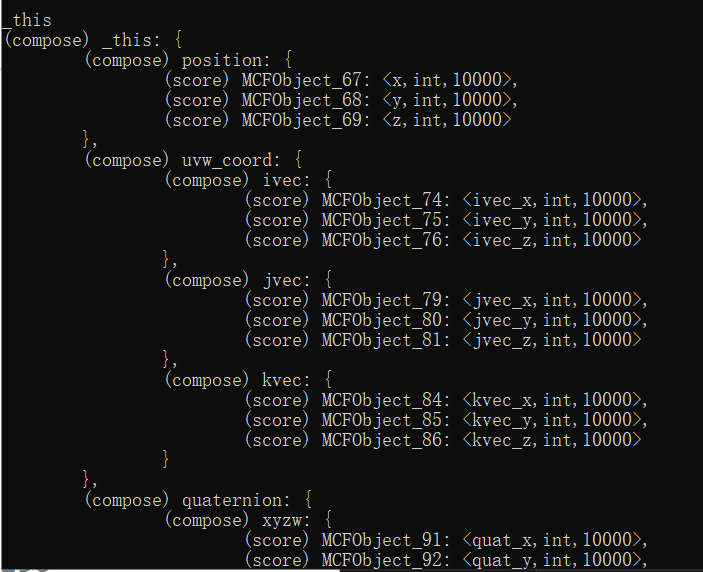

没有语法错误提示即成功

## 特性测试

为了实现无人机的移动，我们需要测试mc中的几种不同的移动实现方案，并找出最佳方案

我们创建一个异步测试项目，命名为move

打开mot终端，输入命令
```
creisp test/move/start
```
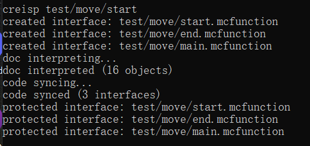

creisp命令可以拆解为四部分：cre-i-s-p

cre意为create，创建函数接口。可以看到：除了我们指定的test/move/start函数以外，还创建了另外的两个关联的函数test/move/main和test/move/end

如果我们打开mot的模板记忆文件夹mot_memory/templates/test/(test_name)，会看到这三个函数的模板在同一个文件夹内。因此，**创建其中的一个模板，也会关联另外两个模板**

i意为interpret，**解析当前目录和mot_memory/objects中全部.mcfo文件**的对象格式，在mot内存中创建这些对象

您可以使用list命令查看解析得到的全部对象
```
list
```
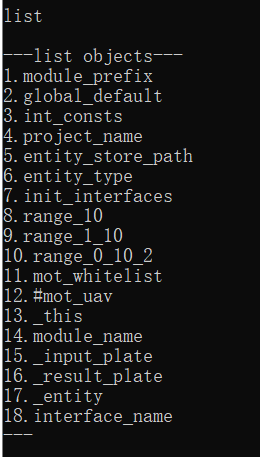

s意为sync，同步代码，mot会寻找模块内所有的.mcfunction函数，找到这些函数在mot_memory/templates中对应的函数模板，并读取这些模板的内容，**用interpret过程解析出来的对象填充这些模板的内容**，同步到.mcfunction函数中

我们在之前敲的回车键，就等价于依次执行interpret, sync

p意为protect，把函数接口加入白名单，当再次sync同步代码的时候就会**避开这些函数接口**，使得开发者可以自由编辑这些接口

总的来说，creisp命令的作用就是创建一些接口，对它们进行一次初始的代码同步，以后可以由开发者自由编辑这些代码，不再进行同步

我们打开创建好的test/move/start，追加四条命令：
```
#mot_uav:test/move/start
...

# 生成不同的移动方案
summon item_display 0.0 -54.5 0.0 {item:{id:"minecraft:red_wool", count:1b},Tags:["test", "test_move_1", "test_move"]}

summon item_display 0.0 -54.5 1.5 {item:{id:"minecraft:green_wool", count:1b},Tags:["test", "test_move_2", "test_move"], teleport_duration:1}

summon area_effect_cloud 0.0 -55.0 3.0 {Tags:["test", "upd_aec", "test_move_3", "test_move"], Duration:2147483647, Passengers:[{id:"minecraft:item_display", Tags:["test","test_move"], item:{id:"minecraft:blue_wool",count:1b}}]}

summon item_display 0.0 -54.5 4.5 {Tags:["test", "test_move_4", "test_move"], teleport_duration:1, Passengers:[{id:"minecraft:item_display", Tags:["test", "test_move"], item:{id:"minecraft:yellow_wool", count:1b}}]}

summon item_display 0.0 -54.5 6.0 {item:{id:"minecraft:cyan_wool", count:1b},Tags:["test", "test_move_5", "test_move"], Passengers:[{id:"minecraft:area_effect_cloud", Duration:2147483647, Tags:["upd_aec", "test", "test_move"]}]}
```

我们打开test/move/main，编写移动方案测试命令：
```
#mot_uav:test/move/main

execute as @e[tag=test_move_1] at @s run tp @s ~0.5 ~ ~
execute as @e[tag=test_move_2] at @s run tp @s ~0.5 ~ ~
execute as @e[tag=test_move_3] at @s run tp @s ~0.5 ~ ~
execute as @e[tag=test_move_4] at @s run tp @s ~0.5 ~ ~
execute as @e[tag=test_move_5] at @s run tp @s ~0.5 ~ ~
```

我们打开test/move/end，编写移动方案销毁命令：
```
#mot_uav:test/move/end

kill @e[tag=test_move]
```

进入游戏，运行测试：
```
reload
function mot_uav:test/move/start
```

我们发现观察时间太短，修改测试运行时间为3秒：
```
#mot_uav:test/move/start
...
# 设置测试程序运行时间
scoreboard players set @e[tag=result,limit=1] killtime 60
...
```

重新运行测试，并观察item_display的移动状况

我们观察到：

1. 红色羊毛和青色羊毛的运动非常不流畅，断断续续

2. 绿色羊毛，蓝色羊毛，黄色羊毛的运动非常流畅，而且完全同步

我们得出结论：

1. teleport_duration为1的item_display可以起到与upd_aec相同的运动更新效果

2. upd_aec是被骑乘者时才会有更新效果，是骑乘者则没有更新效果

3. 骑乘upd_aec的实体坐标会被抬高0.5格，骑乘item_display的实体坐标不会被抬高

Ps: upd_aec是指Age标签每刻刷新的药水云，它在早期数据包中被用来更新实体，在客户端同步多个实体的运动

目前来看，**完全可以用teleport_duration为1的item_display替代传统的upd_aec**

它具有以下优点：

1. 可以使用item.components."minecraft:custom_data"储存数据

2. 可以额外展示一个模型

3. 骑乘实体的坐标不会被抬高，省去偏移的工作

## 初始化mot_uav数据包

打开mot终端，输入命令
```
cre _init
```
说明：

1. mot_uav的项目结构是：整个数据包只有mot_uav这个模块，因此初始化使用的是对外开放的_init接口，在_init模板中会创建mot运行所需的int记分板

2. 另外一种项目结构是：数据包内有多个模块，mot管理对应模块时，应创建内部的init函数，**此时为了mot能够正常运行，整个项目应确保提供一个int记分板 (scoreboard objectives add int dummy)**

终端继续输入命令
```
init
```

然后直接敲一次回车，同步代码

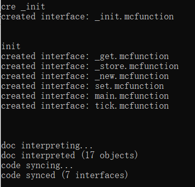

进入游戏重载并执行初始化
```
reload
function mot_uav:_init
```

在开发阶段为了方便调试，我们可以放置一个紫cb来运行mot_uav模块的tick入口（在实际应用场景中这个调用的入口可以灵活调整，例如放到你的地图小游戏主循环里，本教程不涉及）

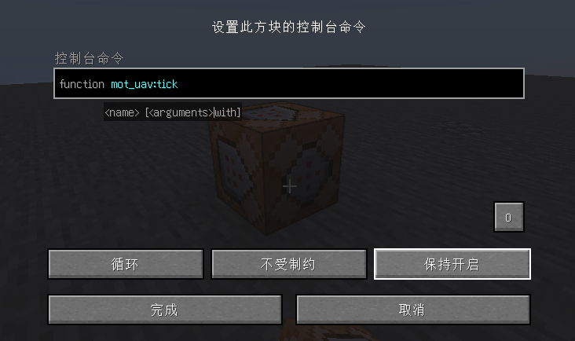

## 构建mot_uav的坐标系统

打开mot终端创建一个在白名单中的_anchor_to接口

```
creisp _anchor_to
```

我们来实现执行方位到mot_uav临时对象的转换方法

首先确定输入输出
```
#mot_uav:_anchor_to
# 输入执行位置
# 输入执行朝向
# 需要传入世界实体为执行者
```

（当输入或输出为本模块的临时对象时，作者在习惯上会省略，这里省略了输出）

执行坐标转临时对象坐标
```
#mot_uav:_anchor_to
# 输入执行坐标
# 输入执行朝向
# 需要传入世界实体为执行者

tp @s ~ ~ ~
data modify storage math:io xyz set from entity @s Pos
execute store result score x int run data get storage math:io xyz[0] 10000
execute store result score y int run data get storage math:io xyz[1] 10000
execute store result score z int run data get storage math:io xyz[2] 10000

```

执行朝向转四元数姿态
```
#mot_uav:_anchor_to
...

function math:quat/_facing_to
```

这里调用的函数修改了临时对象`quaternion.xyzw`

四元数姿态同步到局部坐标系
```
#mot_uav:_anchor_to
...

function math:quat/_facing_to
function math:quat/_touvw
```

这里调用的函数修改了临时对象`uvw_coord: {ivec, jvec, kvec}`

打开mot终端创建一个_model接口和_zero接口
```
creis _model _zero
```

请注意，这里的creis命令不包含p，这意味着两个函数不被mot保护，会自动同步它们的代码

创建一个白名单的_class接口

```
creisp _class
```

另外，您可以使用mot_whitelist命令查看已经加入白名单的有哪些函数
```
mot_whitelist
```

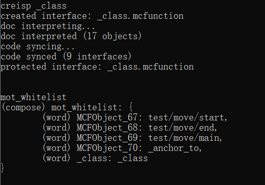

这里的mot_whitelist本质上和_this一样，属于对象的名称，通过直接输入对象的名称来查看内容

我们来编写_class接口，生成测试所需要的数据模板
```
#mot_uav:_class
# 生成预设静态数据模板

# 生成测试数据模板
function mot_uav:_zero
execute positioned 8 -56 8 rotated 0.0 0.0 as @e[tag=math_marker,limit=1] run function mot_uav:_anchor_to
function mot_uav:_model
data modify storage mot_uav:class test set from storage mot_uav:io result
```

进入游戏运行_class接口
```
reload
function mot_uav:_class
data get storage mot_uav:class test
```

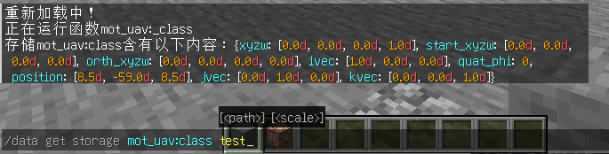

创建一个坐标系统的异步测试项目
```
creisp test/coord_sys/start
```

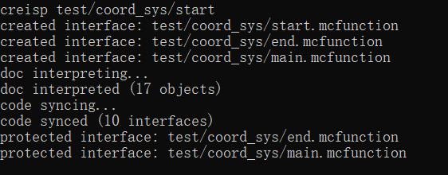

打开mot_uav:test/coord_sys/start

修改测试程序执行者为mot_uav的一个实例（使用test数据模板生成）

```
#mot_uav:test/coord_sys/start

# 生成测试程序实体
data modify storage mot_uav:io input set from storage mot_uav:class test
function mot_uav:_new
...
```

这里由于_new接口的返回值恰好也是`@e[tag=result,limit=1]`，所以不影响下文选择该实体

修改测试程序运行时间为10秒
```
#mot_uav:test/coord_sys/start
...
# 设置测试程序运行时间
scoreboard players set @e[tag=result,limit=1] killtime 200
```

打开mot:uav/test/coord_sys/main

加载测试实体的数据，渲染局部坐标系（这里直接调用了线性代数库中局部坐标系的渲染测试接口）
```
#mot_uav:test/coord_sys/main

# 实体对象数据临时化
function mot_uav:_get

# 渲染局部坐标系
scoreboard players set vec_n int 200
scoreboard players set vec_scale int 2
execute as @e[tag=math_marker,limit=1] run function math:uvw/_render_debug
```

打开mot:uav/test/coord_sys/end

销毁mot_uav测试对象
```
#mot_uav:test/coord_sys/end

function mot_uav:_del
```

进入游戏运行测试
```
reload
function mot_uav:test/coord_sys/start
```

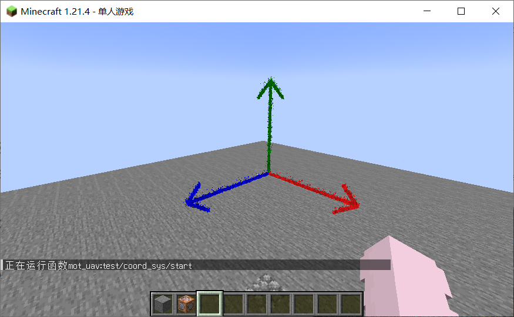

我们给mot_uav引入角速度

打开.doc.mcfo，设计_this临时对象

```
#mot_uav:doc.mcfo

# 临时对象
_this:{
	angular_vec:{
		<angular_x,int,1w>,
		<angular_y,int,1w>,
		<angular_z,int,1w>
	},
	angular_len:<angular_len,int,1w>,
	...
}
```

打开mot终端，输入回车同步代码

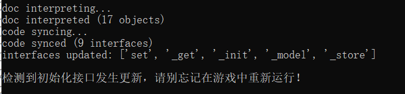

可以看到mot提醒我们_init函数发生了更新，这是因为我们给临时对象添加了新的字段，mot需要创建对应的记分板

我们进入游戏重新运行_init

```
reload
function mot_uav:_init
```

打开mot终端，创建一个angular/_update函数，用来把角速度同步到四元数

```
cre angular/_update
```

这里由于angular/_update是mot的记忆中没有的模板，不会被同步，所以不需要protect加入白名单即可自由编辑

我们打开angular/_update接口，完成它的实现

```
#mot_uav:angular/_update

# 把当前四元数姿态设置为旋转的初始姿态
function math:quat/_topose

# 计算角速度的单位向量和模长
scoreboard players operation vec_x int = angular_x int
scoreboard players operation vec_y int = angular_y int
scoreboard players operation vec_z int = angular_z int
function math:vec/_unit_sqrt
scoreboard players operation angular_len int = res int
scoreboard players operation angular_len int *= 10 int

# 用单位向量指定四元数旋转轴
function math:quat/axis/_uvecto

# 初始旋转角为0
scoreboard players set quat_phi int 0
```

math:vec/_unit_sqrt的输出`uvec`恰好是math:quat/axis/_uvecto的输入，因此这里省去了数据传输

angular/_update修改的是mot_uav临时对象中的`quaternion.start_xyzw`, `quaternion.orth_xyzw`, `quaternion.phi`, `angular_len`

这里再提供一个仅修改角速度大小的接口angular/_factor

打开mot终端输入
```
cre angular/_factor
```

打开angular/_factor完成它的实现

```
#mot_uav:angular/_factor
# 输入<inp, int, 1w>表示缩放因子

# 缩放角速度向量
scoreboard players operation angular_x int *= inp int
scoreboard players operation angular_x int /= 10000 int
scoreboard players operation angular_y int *= inp int
scoreboard players operation angular_y int /= 10000 int
scoreboard players operation angular_z int *= inp int
scoreboard players operation angular_z int /= 10000 int

# 计算新的模长
scoreboard players operation angular_len int *= inp int
scoreboard players operation angular_len int /= 10000 int
```

接下来我们在main函数中实现mot_uav角速度的四元数迭代

打开mot终端把main函数加入白名单
```
protect main
```

打开main，编写四元数迭代的实现

```
#mot_uav:main
# mot_uav:tick调用
# 实体对象主程序

function mot_uav:_get

# 角速度的四元数迭代
scoreboard players operation quat_phi int += angular_len int
execute as 0-0-0-0-0 run function math:quat/_xyzw
# 四元数姿态同步到局部坐标系
function math:quat/_touvw

function mot_uav:_store
```

这里用`0-0-0-0-0`而不是`@e[tag=math_marker,limit=1]`来选择世界实体，是因为在mot_uav主循环的位置性能更重要

mot_uav现在每tick的姿态由角速度确定的四元数旋转决定，**这个每tick输出的姿态会覆盖掉**我们之前在_anchor_to接口中为mot_uav输入的姿态

因此我们需要在此前实现的_anchor_to接口中更新四元数旋转参数，使得输入的姿态变为新的旋转初始姿态

```
#mot_uav:_anchor_to
...

# 更新四元数旋转参数
function mot_uav:angular/_update
```

进入游戏，重新运行测试数据模板的构建

```
reload
function mot_uav:_class
```

接下来我们编写角速度旋转的测试

打开mot终端创建名为angular的异步测试项目

```
creisp test/angular/start
```

像coord_sys测试项目一样，我们修改angular测试项目的执行者为一个mot_uav实例

```
#mot_uav:test/angular/start

# 生成测试程序实体
data modify storage mot_uav:io input set from storage mot_uav:class test
function mot_uav:_new

...
```

由于要运行多段测试，我们为测试实例设计一个状态机，在start函数中首先进入状态0

```
#mot_uav:test/angular/start
...

# 初始进入状态0
data modify storage marker_control:io result.state set value 0

execute as @e[tag=result,limit=1] run function marker_control:data/_store
...
```

我们打开test/angular/main编写状态机的主循环
```
#mot_uav:test/angular/main

function marker_control:data/_get

# 选择执行的状态
execute store result score temp_state int run data get storage marker_control:io result.state
execute if score temp_state int matches 0 run function mot_uav:test/angular/s0
execute if score temp_state int matches 1 run function mot_uav:test/angular/s1
execute if score temp_state int matches 2 run function mot_uav:test/angular/s2
execute if score temp_state int matches 3 run function mot_uav:test/angular/s3

# -1状态表示结束测试
execute unless score temp_state int matches -1 run scoreboard players set @s killtime 20

function marker_control:data/_store
```

这里结束测试的逻辑是：当测试实例状态不为-1时，不断刷新其killtime，则不会执行销毁函数；当测试实例状态为-1时，killtime不会再刷新，1秒后执行销毁函数

打开mot终端，创建各个状态函数

```
cre test/angular/s0 test/angular/s1 test/angular/s2 test/angular/s3
```

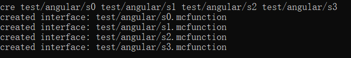

这里的状态函数在mot记忆中没有对应的模板，因此不需要加入白名单即可自由编辑

我们打开test/angular/s0，编写状态0的测试行为

```
#mot_uav:test/angular/s0

# 赋予角速度
function mot_uav:_get
scoreboard players set angular_x int 10000
scoreboard players set angular_y int 10000
scoreboard players set angular_z int 10000
function mot_uav:angular/_update
function mot_uav:_store

# 状态0的下一刻直接跳转到状态1
data modify storage marker_control:io result.state set value 1
```

我们打开test/angular/s1，编写状态1的测试行为

```
#mot_uav:test/angular/s1

# 角速度阻尼
function mot_uav:_get
scoreboard players set inp int 9900
function mot_uav:angular/_factor
function mot_uav:_store

# 渲染局部坐标系
scoreboard players set vec_n int 100
scoreboard players set vec_scale int 2
execute as @e[tag=math_marker,limit=1] run function math:uvw/_render_debug

# 渲染角速度向量
scoreboard players operation vec_x int = angular_x int
scoreboard players operation vec_y int = angular_y int
scoreboard players operation vec_z int = angular_z int
data modify storage math:io render_command set from storage math:class particle_commands.purple_dust
execute store result storage math:io xyz[0] double 0.0001 run scoreboard players get x int
execute store result storage math:io xyz[1] double 0.0001 run scoreboard players get y int
execute store result storage math:io xyz[2] double 0.0001 run scoreboard players get z int
data modify entity @e[tag=math_marker,limit=1] Pos set from storage math:io xyz
execute as @e[tag=math_marker,limit=1] at @s run function math:vec/_render_debug

# 当角速度衰减足够小后跳转到状态2
execute if score angular_len int matches ..1000 run data modify storage marker_control:io result.state set value 2
```

我们打开test/angular/s2，编写状态2的测试行为

```
#mot_uav:test/angular/s2

# 指定左轴(红色向量)为新的角速度方向(相当于上下摆头)
function mot_uav:_get
scoreboard players operation angular_x int = ivec_x int
scoreboard players operation angular_y int = ivec_y int
scoreboard players operation angular_z int = ivec_z int
scoreboard players operation angular_x int *= 2 int
scoreboard players operation angular_y int *= 2 int
scoreboard players operation angular_z int *= 2 int
function mot_uav:angular/_update
function mot_uav:_store

# 状态2下一刻直接跳转到状态3
data modify storage marker_control:io result.state set value 3
```

我们打开test/angular/s3，编写状态3的测试行为

```
#mot_uav:test/angular/s3

# 角速度阻尼
function mot_uav:_get
scoreboard players set inp int 9900
function mot_uav:angular/_factor
function mot_uav:_store

# 渲染局部坐标系
scoreboard players set vec_n int 100
scoreboard players set vec_scale int 2
execute as @e[tag=math_marker,limit=1] run function math:uvw/_render_debug

# 渲染角速度向量
scoreboard players operation vec_x int = angular_x int
scoreboard players operation vec_y int = angular_y int
scoreboard players operation vec_z int = angular_z int
data modify storage math:io render_command set from storage math:class particle_commands.purple_dust
execute store result storage math:io xyz[0] double 0.0001 run scoreboard players get x int
execute store result storage math:io xyz[1] double 0.0001 run scoreboard players get y int
execute store result storage math:io xyz[2] double 0.0001 run scoreboard players get z int
data modify entity @e[tag=math_marker,limit=1] Pos set from storage math:io xyz
execute as @e[tag=math_marker,limit=1] at @s run function math:vec/_render_debug

# 当角速度衰减足够小后跳转到状态-1
execute if score angular_len int matches ..1000 run data modify storage marker_control:io result.state set value -1
```

打开test/angular/end，编写mot_uav销毁

```
#mot_uav:test/angular/end

function mot_uav:_del
```

进入游戏运行测试

```
reload
function mot_uav:angular/start
```

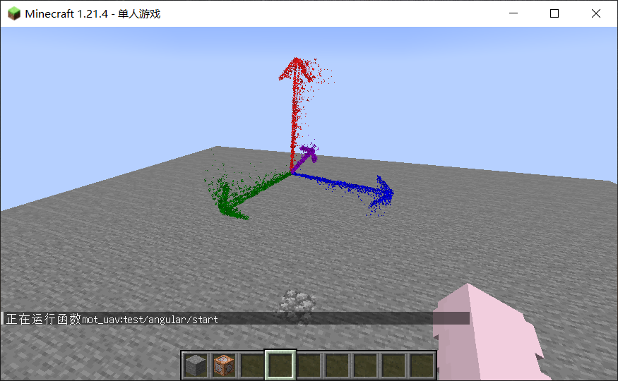

我们给mot_uav引入平动速度

打开.doc.mcfo，设计_this临时对象

```
#mot_uav:doc.mcfo

# 临时对象
_this:{
	velocity:{<vx,int,1w>, <vy,int,1w>, <vz,int,1w>},
	...
}
```

打开main函数，编写速度到位置的迭代

```
#mot_uav:main
# mot_uav:tick调用
# 实体对象主程序

function mot_uav:_get

# 速度迭代
scoreboard players operation x int += vx int
scoreboard players operation y int += vy int
scoreboard players operation z int += vz int

# 角速度的四元数迭代
scoreboard players operation quat_phi int += angular_len int
execute as 0-0-0-0-0 run function math:quat/_xyzw
# 四元数姿态同步到局部坐标系
function math:quat/_touvw

function mot_uav:_store
```

打开mot终端，创建速度的异步测试项目

```
creisp test/velocity/start
```

打开test/velocity/start，修改测试项目执行者为mot_uav实例，修改测试时间为5秒

```
#mot_uav:test/velocity/start

# 生成测试程序实体
data modify storage mot_uav:io input set from storage mot_uav:class test
function mot_uav:_new

execute as @e[tag=result,limit=1] run function marker_control:data/_get

# 设置测试程序主函数和销毁函数
data modify storage marker_control:io result.tick_func set value "mot_uav:test/velocity/main"
data modify storage marker_control:io result.del_func set value "mot_uav:test/velocity/end"

execute as @e[tag=result,limit=1] run function marker_control:data/_store
tag @e[tag=result,limit=1] add entity_ticked
tag @e[tag=result,limit=1] add entity_todel

# 设置测试程序运行时间
scoreboard players set @e[tag=result,limit=1] killtime 100
```

打开test/velocity/main，设置mot_uav移动速度

```
#mot_uav:test/velocity/main

# 实体对象数据临时化
function mot_uav:_get
scoreboard players set vx int 1000
scoreboard players set vy int 1000
scoreboard players set vz int 1000
function mot_uav:_store

# 渲染局部坐标系
scoreboard players set vec_n int 200
scoreboard players set vec_scale int 2
execute as @e[tag=math_marker,limit=1] run function math:uvw/_render_debug
```

打开test/velocity/end，编写mot_uav销毁

```
#mot_uav:test/velocity/end

function mot_uav:_del
```

进入游戏，重新运行初始化，运行测试项目

```
reload
function mot_uav:_init
function mot_uav:test/velocity/start
```


观察到移动的坐标系即成功

## 构建mot_uav展示实体

打开mot终端，创建一个异步测试项目名为display

```
creisp test/display/start
```

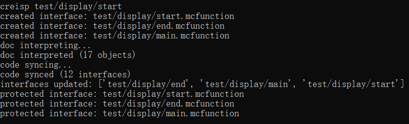

编写test/display/main，不断销毁和生成mot_uav实例

```
#mot_uav:test/display/main

# 销毁之前的测试实例
execute as @e[tag=test,tag=mot_uav] run function mot_uav:_del
# 生成新的测试实例
data modify storage mot_uav:io input set from storage mot_uav:class test
function mot_uav:_new
tag @e[tag=result,limit=1] add test

# 维持项目运行时间
scoreboard players set @s killtime 20
```

编写test/display/end，结束测试项目运行

```
#mot_uav:test/display/end

execute as @e[tag=test,tag=mot_uav] run function mot_uav:_del
kill @e[tag=test]
```

我们为无人机添加一个侦测器的本体外观

首先把_new接口加入白名单，防止它被代码同步

```
protect _new
```

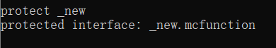

打开mot_memory/objects/global_settings，修改全局设置

```
...

# 实体对象的数据位置
entity_store_path:item.components."minecraft:custom_data"

# 实体对象的类型
entity_type:item_display

...
```

打开_new函数，修改实体生成

```
#mot_uav:_new
# 使用数据模板生成实体对象
# 输入数据模板storage mot_uav:io input
# 输入执行位置
# 输出 @e[tag=result,limit=1]

tag @e[tag=result] remove result
summon item_display ~ ~ ~ {Tags:["mot_uav", "result"], item:{id:"minecraft:observer", count:1b}, teleport_duration:1, interpolation_duration:1}
execute as @e[tag=result,limit=1] run function mot_uav:set
```

进入游戏，运行测试函数

```
reload
function mot_uav:test/display/start
```

我们发现展示实体位置生成错误，原因是忘记在main函数中同步实体坐标

首先在游戏中结束测试项目

```
function mot_uav:test/display/end
```

然后修改main函数

```
#mot_uav:main
# mot_uav:tick调用
# 实体对象主程序

...

# 同步实体坐标
execute store result storage math:io xyz[0] double 0.0001 run scoreboard players get x int
execute store result storage math:io xyz[1] double 0.0001 run scoreboard players get y int
execute store result storage math:io xyz[2] double 0.0001 run scoreboard players get z int
data modify entity @s Pos set from storage math:io xyz

function mot_uav:_store

# 坐标安全
execute unless score y int matches -640000..5120000 run function mot_uav:_del
```

为了防止mot_uav实体对象跑出世界，我们在最后还添加了坐标安全操作，y坐标超出范围即销毁

进入游戏重新运行测试

```
reload
function mot_uav:test/display/start
```

观察到展示实体因为运动的插值动画一直在闪烁，我们只好修改test/display/main中_new函数的执行位置


```
#mot_uav:test/display/main

# 销毁之前的测试实例
execute as @e[tag=test,tag=mot_uav] run function mot_uav:_del
# 生成新的测试实例
data modify storage mot_uav:io input set from storage mot_uav:class test
data modify entity @e[tag=math_marker,limit=1] Pos set from storage mot_uav:io input.position
execute at @e[tag=math_marker,limit=1] run function mot_uav:_new
tag @e[tag=result,limit=1] add test

# 维持项目运行时间
scoreboard players set @s killtime 20
```

进入游戏重新运行测试

```
function mot_uav:test/display/end
reload
function mot_uav:test/display/start
```

然而我们发现模型依旧在闪烁

我们只好修改生成的刷新方式，只有输入信号的时候才刷新生成

```
#mot_uav:test/display/main

# 维持项目运行时间
scoreboard players set @s killtime 20

# 信号检测
execute if score test int matches 0 run return fail
scoreboard players set test int 0

# 销毁之前的测试实例
execute as @e[tag=test,tag=mot_uav] run function mot_uav:_del
# 生成新的测试实例
data modify storage mot_uav:io input set from storage mot_uav:class test
data modify entity @e[tag=math_marker,limit=1] Pos set from storage mot_uav:io input.position
execute at @e[tag=math_marker,limit=1] run function mot_uav:_new
tag @e[tag=result,limit=1] add test
```

在test/display/start中设置初始信号为1

```
#mot_uav:test/display/start

...

# 设置测试程序运行时间
scoreboard players set @e[tag=result,limit=1] killtime 20

# 设置初始信号为1
scoreboard players set test int 1
```

进入游戏重新运行测试

```
function mot_uav:test/display/end
reload
function mot_uav:test/display/start
```

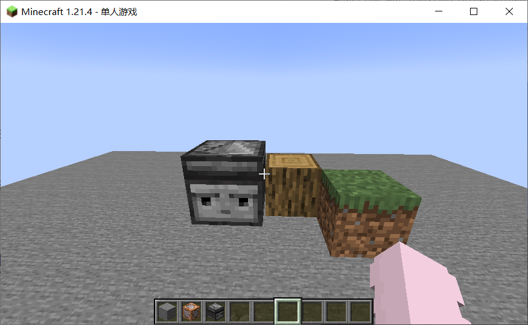

实例生成成功

这里的草方块和橡木原木用来对比模型的大小

我们希望无人机的比例稍微放缩一点，修改_new函数

```
#mot_uav:_new
# 使用数据模板生成实体对象
# 输入数据模板storage mot_uav:io input
# 输入执行位置
# 输出 @e[tag=result,limit=1]

tag @e[tag=result] remove result
summon item_display ~ ~ ~ {Tags:["mot_uav", "result"], item:{id:"minecraft:observer", count:1b}, transformation:{right_rotation:[0f,0f,0f,1f], scale:[0.5f,0.5f,0.5f], left_rotation:[0f,0f,0f,1f], translation:[0f,0f,0f]}, teleport_duration:1, interpolation_duration:1}
execute as @e[tag=result,limit=1] run function mot_uav:set
```

进入游戏刷新实体生成

```
reload
scoreboard players set test int 1
```

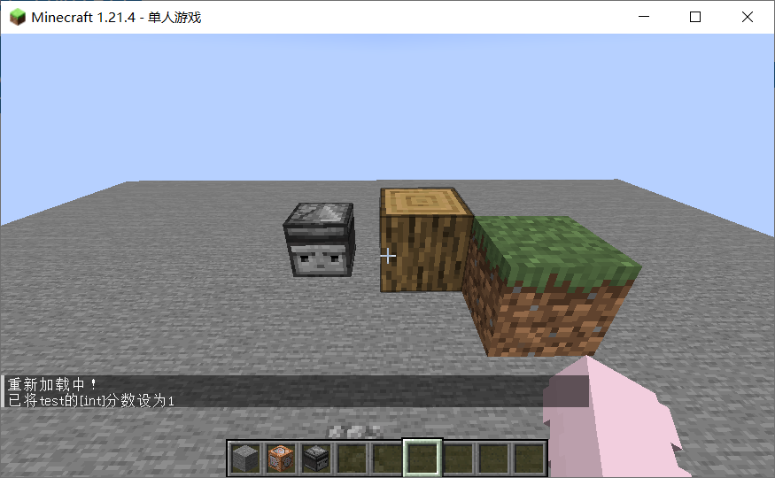

修改大小成功

我们修改_new函数，为无人机添加信号灯和机翼

```
#mot_uav:_new
# 使用数据模板生成实体对象
# 输入数据模板storage mot_uav:io input
# 输入执行位置
# 输出 @e[tag=result,limit=1]

tag @e[tag=result] remove result
summon item_display ~ ~ ~ {Tags:["mot_uav", "result"],\
	item:{id:"minecraft:observer", count:1b},\
	transformation:{right_rotation:[0f,0f,0f,1f],scale:[0.5f,0.5f,0.5f],left_rotation:[0f,0f,0f,1f],translation:[0f,0f,0f]},\
	teleport_duration:1, interpolation_duration:1,\
	Passengers:[\
		{id:"minecraft:block_display",Tags:["mot_uav_display","torch"],block_state:{Name:"minecraft:redstone_torch",Properties:{lit:"true"}},transformation:{right_rotation:[0f,0f,0f,1f],scale:[0.5f,0.5f,0.5f],left_rotation:[0f,0f,0f,1f],translation:[0f,0.5f,0f]},interpolation_duration:1,brightness:{sky:15, block:15}},\
		{id:"minecraft:item_display",Tags:["mot_uav_display","fan_0"],item:{id:"minecraft:heavy_weighted_pressure_plate",count:1b},transformation:{right_rotation:[0f,0f,0f,1f],scale:[0.5f,0.5f,0.5f],left_rotation:[0f,0f,0f,1f],translation:[0f,0.5f,0f]},interpolation_duration:1},\
		{id:"minecraft:item_display",Tags:["mot_uav_display","fan_1"],item:{id:"minecraft:heavy_weighted_pressure_plate",count:1b},transformation:{right_rotation:[0f,0f,0f,1f],scale:[0.5f,0.5f,0.5f],left_rotation:[0f,0f,0f,1f],translation:[0f,0.5f,0f]},interpolation_duration:1},\
	]\
}
execute as @e[tag=result,limit=1] run function mot_uav:set
```

把_del函数加入白名单，并重新实现销毁逻辑

```
protect _del
```

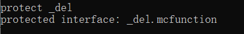

```
#mot_uav:_del
# 销毁实体对象
# 输入执行实体

execute on passengers run kill @s
kill @s
```

进入游戏，刷新实体对象模型

```
reload
scoreboard players set test int 1
```

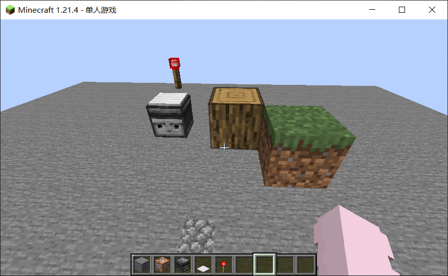

我们调整fan_0和fan_1的transformation.scale，分别设置为

```
scale:[0.2f,0.5f,1.2f]
scale:[1.2f,0.5f,0.2f]
```

进入游戏刷新模型

```
reload
scoreboard players set test int 1
```

我们调整torch, fan_0, fan_1的translation偏移到合理位置

```
translation:[-0.25f,0.25f,-0.25f]
translation:[0f,0.6f,0f]
translation:[0f,0.6f,0f]
```

进入游戏刷新模型

```
reload
scoreboard players set test int 1
```

展示实体构建完成，我们结束测试程序

```
function mot_uav:test/display/end
```

接下来，我们编写main函数，把四元数姿态同步到展示实体

```
#mot_uav:main
# mot_uav:tick调用
# 实体对象主程序

...

# 同步四元数姿态
execute store result storage math:io xyzw[0] float 0.0001 run scoreboard players get quat_x int
execute store result storage math:io xyzw[1] float 0.0001 run scoreboard players get quat_y int
execute store result storage math:io xyzw[2] float 0.0001 run scoreboard players get quat_z int
execute store result storage math:io xyzw[3] float 0.0001 run scoreboard players get quat_w int
# 成功修改姿态才会播放插值动画
data modify storage mot_uav:io cmp set from entity @s transformation.left_rotation
execute store success score sres int run data modify storage mot_uav:io cmp set from storage math:io xyzw
execute if score sres int matches 1 run data modify entity @s start_interpolation set value 0
data modify entity @s transformation.left_rotation set from storage math:io xyzw
execute on passengers run function mot_uav:display/sync_pose

function mot_uav:_store

# 坐标安全
execute unless score y int matches -640000..5120000 run function mot_uav:_del
```

打开mot终端，创建display/sync_pose函数

```
cre display/sync_pose
```

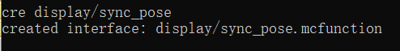

由于这里没有display/sync_pose的对应模板，我们不必把它加入白名单

编写display/sync_pose同步子实体的坐标和姿态

```
#mot_uav:display/sync_pose
# mot_uav:main调用

# 同步局部坐标
scoreboard players operation u int = @s u
scoreboard players operation v int = @s v
scoreboard players operation w int = @s w
function math:uvw/_tofvec
execute store result storage mot_uav:io translation[0] float 0.0001 run scoreboard players get fvec_x int
execute store result storage mot_uav:io translation[1] float 0.0001 run scoreboard players get fvec_y int
execute store result storage mot_uav:io translation[2] float 0.0001 run scoreboard players get fvec_z int
data modify entity @s transformation.translation set from storage mot_uav:io translation

# 同步四元数姿态
data modify entity @s transformation.left_rotation set from storage math:io xyzw
execute if score sres int matches 1 run data modify entity @s start_interpolation set value 0
```

由于这里记分板{<@s,u>, <@s,v>, <@s,w>}还没有被创建，而它们不属于mot_uav本体的字段，我们创建display/init函数初始化这些记分板

```
cre display/init
```

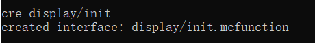

编写display/init创建这些记分板

```
#mot_uav:display/init
# mot_uav:_init调用

scoreboard objectives add u dummy
scoreboard objectives add v dummy
scoreboard objectives add w dummy
```

含有init.mcfunction的子目录会被mot识别为一个sub_module，**_init函数中会自动同步调用这些sub_module的init函数**

打开mot终端输入回车同步代码

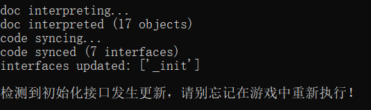

进入游戏重载并执行初始化

```
reload
function mot_uav:_init
```

我们修改_new函数，使得每个子实体获得自己初始的{<@s,u,1w>, <@s, v,1w>, <@s,w,1w>}

```
#mot_uav:_new

...

execute as @e[tag=result,limit=1] on passengers run function mot_uav:set_uvw
execute as @e[tag=result,limit=1] run function mot_uav:set
```

我们打开mot终端创建set_uvw函数

```
cre set_uvw
```

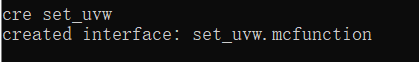

实现set_uvw函数

```
#mot_uav:set_uvw
# mot_uav:_new调用

data modify storage mot_uav:io translation set from entity @s transformation.translation
execute store result score @s u run data get storage mot_uav:io translation[0] 10000
execute store result score @s v run data get storage mot_uav:io translation[1] 10000
execute store result score @s w run data get storage mot_uav:io translation[2] 10000
```

我们运行之前写好的运行角速度测试

```
reload
function mot_uav:test/angular/start
```

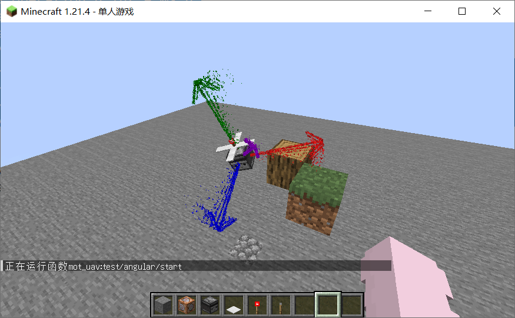

观察到转动的无人机即成功

## 构建冲量的临时对象

打开mot终端，新建冲量的目录和接口

```
cre impulse/_apply impulse/_render
```

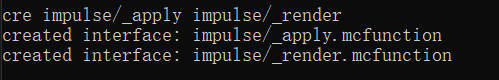

我们在impulse目录中手动创建.doc.mcfo，用于描述冲量的临时对象


```
#mot_uav:impulse/doc.mcfo

# 冲量的临时对象
_this:{
	vector:{
		<impulse_fx,int,1w>,
		<impulse_fy,int,1w>,
		<impulse_fz,int,1w>
	},
	point:{
		<impulse_x,int,1w>,
		<impulse_y,int,1w>,
		<impulse_z,int,1w>
	}
}
```

其中vector表示冲量的大小和方向，point则表示冲量的作用点

编写impulse/apply接口

```
#mot_uav:impulse/_apply
# 把冲量施加给mot_uav的临时对象

# 改变速度
scoreboard players operation vec_x int = impulse_fx int
scoreboard players operation vec_y int = impulse_fy int
scoreboard players operation vec_z int = impulse_fz int
scoreboard players operation vec_x int /= mot_uav_m int
scoreboard players operation vec_y int /= mot_uav_m int
scoreboard players operation vec_z int /= mot_uav_m int
scoreboard players operation vx int += vec_x int
scoreboard players operation vy int += vec_y int
scoreboard players operation vz int += vec_z int

# 计算相对于旋转中心的位矢
scoreboard players operation fvec_x int = impulse_x int
scoreboard players operation fvec_y int = impulse_y int
scoreboard players operation fvec_z int = impulse_z int
scoreboard players operation fvec_x int -= x int
scoreboard players operation fvec_y int -= y int
scoreboard players operation fvec_z int -= z int

# 叉乘计算冲量矩
scoreboard players operation vec_x int = impulse_fx int
scoreboard players operation vec_y int = impulse_fy int
scoreboard players operation vec_z int = impulse_fz int
function math:vec/_cross_fvec

# 改变角速度 (假设转动惯量在各方向均匀)
scoreboard players operation angular_x int += vec_x int
scoreboard players operation angular_y int += vec_y int
scoreboard players operation angular_z int += vec_z int

function mot_uav:angular/_update
```

打开mot终端，添加常量接口，设置常量

```
creisp _consts
```

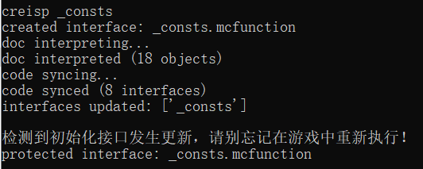

```
#mot_uav:_consts
# 创建常量

# 质量
scoreboard players set mot_uav_m int 10
```

编写impulse/_render接口

```
#mot_uav:impulse/_render
# 渲染冲量
# 需要以世界实体为执行者

# 按比例放大冲量
scoreboard players operation impulse_fx int *= 2 int
scoreboard players operation impulse_fy int *= 2 int
scoreboard players operation impulse_fz int *= 2 int

# 获取起始点
scoreboard players operation sstempx int = impulse_x int
scoreboard players operation sstempy int = impulse_y int
scoreboard players operation sstempz int = impulse_z int
execute store result storage math:io xyz[0] double 0.0001 run scoreboard players operation sstempx int -= impulse_fx int
execute store result storage math:io xyz[1] double 0.0001 run scoreboard players operation sstempy int -= impulse_fy int
execute store result storage math:io xyz[2] double 0.0001 run scoreboard players operation sstempz int -= impulse_fz int
data modify entity @s Pos set from storage math:io xyz

# 获取向量
scoreboard players operation vec_x int = impulse_fx int
scoreboard players operation vec_y int = impulse_fy int
scoreboard players operation vec_z int = impulse_fz int

# 设置渲染精细度和粒子
scoreboard players set vec_n int 50
data modify storage math:io render_command set from storage math:class particle_commands.red_dust

execute at @s run function math:vec/_render_debug

scoreboard players operation impulse_fx int /= 2 int
scoreboard players operation impulse_fy int /= 2 int
scoreboard players operation impulse_fz int /= 2 int
```

打开mot终端，创建一个异步测试项目，命名为impulse

```
creisp test/impulse/start
```

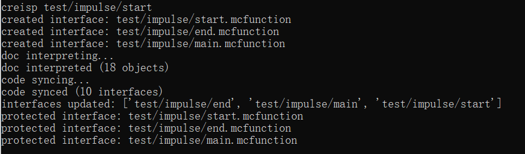

修改测试程序实体为mot_uav实例，并把测试运行时间设置为5秒

```
#mot_uav:test/impulse/start

# 生成测试程序实体
data modify storage mot_uav:io input set from storage mot_uav:class test
function mot_uav:_new

...

# 设置测试程序运行时间
scoreboard players set @e[tag=result,limit=1] killtime 100
```

在测试程序开始后的0.5秒，我们为mot_uav实例施加一个冲量

```
#mot_uav:test/impulse/main

# 过滤执行时刻
execute unless score @s killtime matches 90 run return fail

function mot_uav:_get

# 获取局部坐标系左上方作为冲量的作用点
scoreboard players set u int 2500
scoreboard players set v int 2500
scoreboard players set w int 0
function math:uvw/_tovec
scoreboard players operation impulse_x int = vec_x int
scoreboard players operation impulse_y int = vec_y int
scoreboard players operation impulse_z int = vec_z int

# 获取冲量的大小和方向
scoreboard players set u int 0
scoreboard players set v int 2500
scoreboard players set w int 0
function math:uvw/_tovec
scoreboard players operation impulse_fx int = vec_x int
scoreboard players operation impulse_fy int = vec_y int
scoreboard players operation impulse_fz int = vec_z int
scoreboard players operation impulse_fx int -= impulse_x int
scoreboard players operation impulse_fy int -= impulse_y int
scoreboard players operation impulse_fz int -= impulse_z int

# 渲染冲量
execute as @e[tag=math_marker,limit=1] run function mot_uav:impulse/_render

# 施加冲量
function mot_uav:impulse/_apply

function mot_uav:_store
```

结束测试程序时销毁mot_uav实例

```
#mot_uav:test/impulse/end

function mot_uav:_del
```

进入游戏运行测试

```
reload
function mot_uav:_init
function mot_uav:test/impulse/start
```

转动方向与预期相反，看来我们不小心搞错了叉乘的方向

修改impulse/_apply

```
#mot_uav:impulse/_apply
# 把冲量施加给mot_uav的临时对象

...

# 改变角速度 (假设转动惯量在各方向均匀)
scoreboard players operation angular_x int -= vec_x int
scoreboard players operation angular_y int -= vec_y int
scoreboard players operation angular_z int -= vec_z int

function mot_uav:angular/_update
```

打开_consts，修改质量大小

```
#mot_uav:_consts
# 创建常量

# 质量
scoreboard players set mot_uav_m int 20
```

打开test/impulse/main，修改冲量的大小

```
#mot_uav:test/impulse/main

...

# 获取冲量的大小和方向
scoreboard players set u int -7500
scoreboard players set v int 2500
scoreboard players set w int 0
function math:uvw/_tovec
...
```

进入游戏重新运行测试

```
reload
function mot_uav:_init
function mot_uav:test/impulse/start
```

## 阻尼，重力，碰撞

编写_consts，设置阻尼和重力的常量

```
#mot_uav:_consts
# 创建常量

# 质量
scoreboard players set mot_uav_m int 20

# 速度阻尼
scoreboard players set mot_uav_k int 9800

# 重力加速度
scoreboard players set mot_uav_g int 0
```

编写main，实现阻尼和重力加速度的迭代

```
#mot_uav:main
# mot_uav:tick调用
# 实体对象主程序

...

# 速度阻尼
scoreboard players operation vx int *= mot_uav_k int
scoreboard players operation vy int *= mot_uav_k int
scoreboard players operation vz int *= mot_uav_k int
scoreboard players operation vx int /= 10000 int
scoreboard players operation vy int /= 10000 int
scoreboard players operation vz int /= 10000 int

# 重力加速度
scoreboard players operation vy int -= mot_uav_g int

# 同步实体坐标
...
```

进入游戏运行测试

```
reload
function mot_uav:_consts
function mot_uav:test/impulse/start
```

观察到无人机在空中逐渐减速

我们再赋予正常的重力加速度进行测试

```
#mot_uav:_consts
# 创建常量

...

# 重力加速度
scoreboard players set mot_uav_g int 200
```

```
reload
function mot_uav:_consts
function mot_uav:test/impulse/start
```

观察到无人机下坠，但在地面发生了穿模

接下来我们实现mot_uav的碰撞系统

编写_consts，设置碰撞点列表

```
#mot_uav:_consts
# 创建常量

...

# 碰撞点列表
data modify storage mot_uav:io collision_points set value [\
	[-0.25d, -0.25d, -0.25d],\
	[-0.25d, -0.25d, 0.25d],\
	[-0.25d, 0.25d, -0.25d],\
	[-0.25d, 0.25d, 0.25d],\
	[0.25d, -0.25d, -0.25d],\
	[0.25d, -0.25d, 0.25d],\
	[0.25d, 0.25d, -0.25d],\
	[0.25d, 0.25d, 0.25d]\
]
```

编写main函数，遍历碰撞点

```
#mot_uav:main
# mot_uav:tick调用
# 实体对象主程序

...

# 重力加速度
scoreboard players operation vy int -= mot_uav_g int

# 遍历碰撞点列表
execute store result score loop int run data get storage mot_uav:io collision_points
execute if score loop int matches 1.. as 0-0-0-0-0 run function mot_uav:collision/loop

# 同步实体坐标
...
```

打开mot终端，创建循环函数

```
cre collision/loop
```

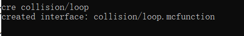

编写collision/loop，扫描每一个碰撞点

```
#mot_uav:collision/loop
# mot_uav:main调用

# 扫描每个碰撞点
data modify storage mot_uav:io collision_points append from storage mot_uav:io collision_points[0]
data remove storage mot_uav:io collision_points[0]
scoreboard players remove loop int 1
execute if score loop int matches 1.. run function mot_uav:collision/loop
```

让世界实体访问每一个碰撞点

```
#mot_uav:collision/loop
# mot_uav:main调用

# 调用局部坐标系的临时对象，访问碰撞点
execute store result score u int run data get storage mot_uav:io collision_points[0][0] 10000
execute store result score v int run data get storage mot_uav:io collision_points[0][1] 10000
execute store result score w int run data get storage mot_uav:io collision_points[0][2] 10000
function math:uvw/_topos
execute at @s unless block ~ ~ ~ #mot_uav:pass run function mot_uav:collision/bounce

# 扫描每个碰撞点
data modify storage mot_uav:io collision_points append from storage mot_uav:io collision_points[0]
data remove storage mot_uav:io collision_points[0]
scoreboard players remove loop int 1
execute if score loop int matches 1.. run function mot_uav:collision/loop
```

我们回到function上级目录，创建需要用到的方块标签tags/block/pass.json

```
{
	"values":[
		"minecraft:air",
		"minecraft:short_grass",
		"minecraft:tall_grass"
	]
}
```

我们关心if block的性能，在这里构建一个性能测试项目

mot的预设模板与perf包也进行了对接，因此可以比较方便地构建项目测试项目

与正确性测试项目同理，我们打开mot终端，创建一个名为if_block的性能测试项目

```
creisp perf/if_block/_start
```

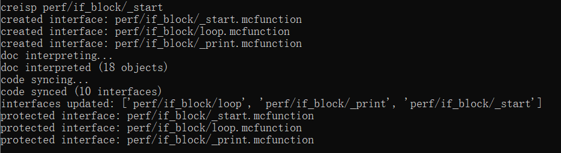

编写perf/if_block/_start，设置测试环境

```
#mot_uav:perf/if_block/_start
...

# 设置测试环境
setblock 0 0 0 air
setblock 0 1 0 stone
tag @e remove test_as_entity
summon marker 0 0 0 {Tags:["test_as_entity"]}
scoreboard players set @e[tag=test_as_entity,limit=1] killtime 25

...
```

编写perf/if_block/loop，设置测试命令

```
#mot_uav:perf/if_block/loop

# 在这里写测试命令
execute at @s if block ~ ~ ~ #mot_uav:pass
execute at @s if block ~ ~1 ~ #mot_uav:pass

scoreboard players remove perf_loop int 1
execute if score perf_loop int matches 1.. run function mot_uav:perf/if_block/loop
```

进入游戏，运行性能测试管线

```
data modify storage perf:io afk set value ["powerload", "benchmark", "mot_uav:perf/if_block"]
```

等待性能测试运行完毕


可以看到，两条if_block（成功和失败情况）加起来的开销大约只有4~5条记分板

打开mot终端，创建collision/_get_norm接口

```
cre collision/_get_norm
```

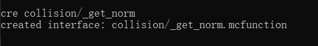

编写collision/_get_norm

```
#mot_uav:collision/_get_norm
# 获取当前位置所在地形的法向量
# 输入执行位置
# 输出nvec{<nvec_x,int,1w>, <nvec_y,int,1w>, <nvec_z,int,1w>}
# 需要以世界实体为执行者

tp @s ~ ~ ~
data modify storage math:io xyz set from entity @s Pos
execute store result score sstemp_xn int run data get storage math:io xyz[0] 10000
execute store result score sstemp_yn int run data get storage math:io xyz[1] 10000
execute store result score sstemp_zn int run data get storage math:io xyz[2] 10000

# 利用取余计算方块内坐标
scoreboard players operation sstemp_xn int %= 10000 int
scoreboard players operation sstemp_yn int %= 10000 int
scoreboard players operation sstemp_zn int %= 10000 int

# 面法向量的优先级(按从小到大排序) = 有邻近方块*10000 + (当前位置到面的距离-1)

scoreboard players set sstemp_xp int 9999
scoreboard players operation sstemp_xp int -= sstemp_xn int
execute unless block ~1 ~ ~ #mot_uav:pass run scoreboard players add sstemp_xp int 10000

scoreboard players set sstemp_yp int 9999
scoreboard players operation sstemp_yp int -= sstemp_yn int
execute unless block ~ ~1 ~ #mot_uav:pass run scoreboard players add sstemp_yp int 10000

scoreboard players set sstemp_zp int 9999
scoreboard players operation sstemp_zp int -= sstemp_zn int
execute unless block ~ ~ ~1 #mot_uav:pass run scoreboard players add sstemp_zp int 10000

execute unless block ~-1 ~ ~ #mot_uav:pass run scoreboard players add sstemp_xn int 10000
execute unless block ~ ~-1 ~ #mot_uav:pass run scoreboard players add sstemp_yn int 10000
execute unless block ~ ~ ~-1 #mot_uav:pass run scoreboard players add sstemp_zn int 10000

# 获取优先级排序第一名
scoreboard players operation sstemp_min int = sstemp_xp int
scoreboard players operation sstemp_min int < sstemp_xn int
scoreboard players operation sstemp_min int < sstemp_yp int
scoreboard players operation sstemp_min int < sstemp_yn int
scoreboard players operation sstemp_min int < sstemp_zp int
scoreboard players operation sstemp_min int < sstemp_zn int

# 输出法向量
scoreboard players set nvec_x int 0
scoreboard players set nvec_y int 0
scoreboard players set nvec_z int 0

execute if score sstemp_xp int = sstemp_min int run return run scoreboard players set nvec_x int 10000
execute if score sstemp_xn int = sstemp_min int run return run scoreboard players set nvec_x int -10000
execute if score sstemp_yp int = sstemp_min int run return run scoreboard players set nvec_y int 10000
execute if score sstemp_yn int = sstemp_min int run return run scoreboard players set nvec_y int -10000
execute if score sstemp_zp int = sstemp_min int run return run scoreboard players set nvec_z int 10000
execute if score sstemp_zn int = sstemp_min int run return run scoreboard players set nvec_z int -10000
```

打开mot终端，创建bounce函数

```
cre collision/bounce
```

编写bounce函数，施加碰撞冲量

```
#mot_uav:collision/bounce
# mot_uav:collision/loop调用

function mot_uav:collision/_get_norm

# 计算碰撞点的速度大小 (平动速度叠加旋转的线速度)
scoreboard players operation vec_x int = angular_x int
scoreboard players operation vec_y int = angular_y int
scoreboard players operation vec_z int = angular_z int
scoreboard players operation fvec_x int = @s x
scoreboard players operation fvec_y int = @s y
scoreboard players operation fvec_z int = @s z
scoreboard players operation fvec_x int -= x int
scoreboard players operation fvec_y int -= y int
scoreboard players operation fvec_z int -= z int
function math:vec/_cross_fvec
# 转换弧度制
scoreboard players operation vec_x int *= 349 int
scoreboard players operation vec_y int *= 349 int
scoreboard players operation vec_z int *= 349 int
scoreboard players operation vec_x int /= 10000 int
scoreboard players operation vec_y int /= 10000 int
scoreboard players operation vec_z int /= 10000 int
# 叠加平动速度
scoreboard players operation vec_x int += vx int
scoreboard players operation vec_y int += vy int
scoreboard players operation vec_z int += vz int

# 与法向量点乘
scoreboard players operation vec_x int *= nvec_x int
scoreboard players operation vec_y int *= nvec_y int
scoreboard players operation vec_z int *= nvec_z int
scoreboard players operation vec_x int += vec_y int
scoreboard players operation vec_x int += vec_z int
scoreboard players operation vec_x int /= 10000 int

# 如果速度方向是正在离开介质的，那么就不施加冲量
execute if score vec_x int matches 1.. run return fail

# 设置冲量的作用点
scoreboard players operation impulse_x int = @s x
scoreboard players operation impulse_y int = @s y
scoreboard players operation impulse_z int = @s z

# 根据弹性系数计算冲量大小
scoreboard players operation sstemp_v int = vec_x int
scoreboard players operation vec_x int *= mot_uav_b int
scoreboard players operation vec_x int /= -10000 int
scoreboard players operation vec_x int -= sstemp_v int
scoreboard players operation vec_x int *= mot_uav_m int

# 设置冲量的矢量部分
scoreboard players operation impulse_fx int = nvec_x int
scoreboard players operation impulse_fy int = nvec_y int
scoreboard players operation impulse_fz int = nvec_z int
scoreboard players operation impulse_fx int *= vec_x int
scoreboard players operation impulse_fy int *= vec_x int
scoreboard players operation impulse_fz int *= vec_x int
scoreboard players operation impulse_fx int /= 10000 int
scoreboard players operation impulse_fy int /= 10000 int
scoreboard players operation impulse_fz int /= 10000 int

# 对mot_uav临时对象施加矢量
function mot_uav:impulse/_apply
```

编写_consts，设置弹性系数常量

```
#mot_uav:_consts
...

# 重力加速度
scoreboard players set mot_uav_g int 200

# 弹性系数
scoreboard players set mot_uav_b int 8500

...
```

进入游戏，运行测试

```
reload
function mot_uav:_consts
function mot_uav:test/impulse/start
```

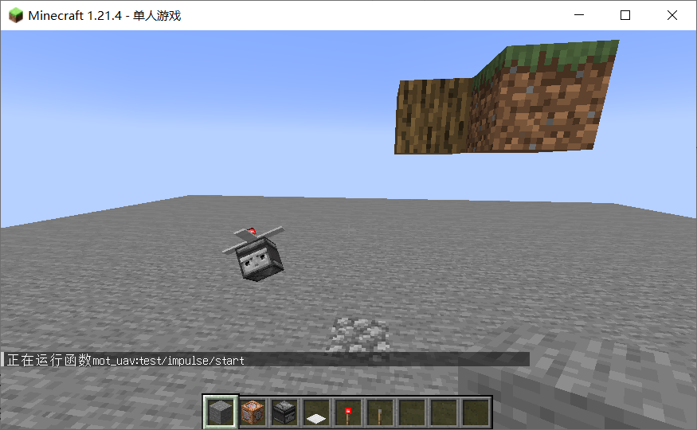

我们观察到实体对象不断在地上翻滚

创建一个异步测试项目，命名为fall

```
creisp test/fall/start
```

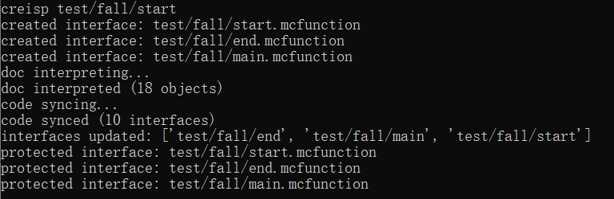

编写test/fall/start，设置测试实体和测试时间

```
#mot_uav:test/fall/start

# 生成测试程序实体
data modify storage mot_uav:io input set from storage mot_uav:class test
function mot_uav:_new

...

# 设置测试程序运行时间
scoreboard players set @e[tag=result,limit=1] killtime 200
```

编写test/fall/end，销毁测试实体

```
#mot_uav:test/fall/end

function mot_uav:_del
```

进入游戏，运行测试

```
reload
function mot_uav:test/fall/start
```

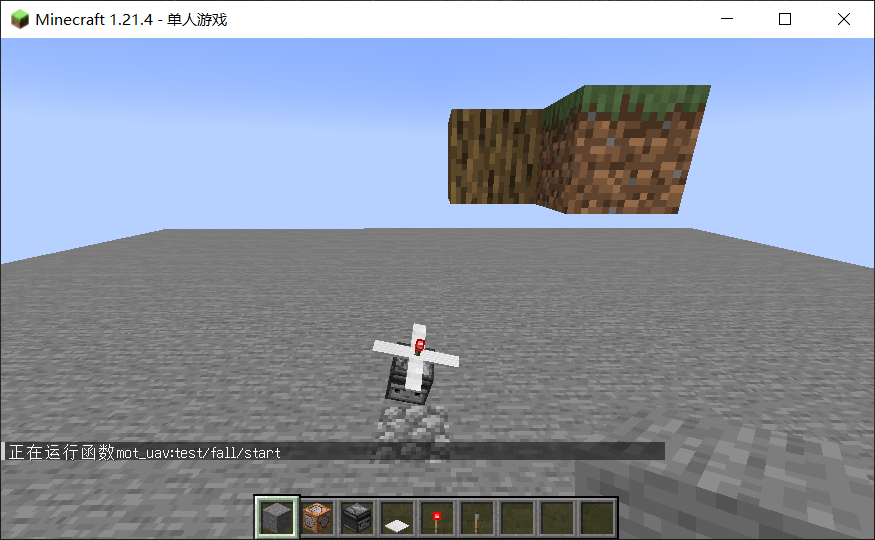

我们观察到，实体对象明明是竖直下落的，但它仍然在地上打滚

这是碰撞冲量施加的顺序性导致的

当第一个碰撞点接触地面后，为临时对象施加了冲量，改变了临时对象的状态

那么第二个碰撞点虽然检测到接触了地面，但是由于当前临时对象的状态是正在远离地面的，因此不会施加冲量

最后把临时对象同步给实体对象，表现效果就变成了无人机只有一个角落被施加了冲量

为了解决这个问题，我们需要延迟施加这些冲量

首先打开mot终端，创建冲量的_model和_proj接口

```
cre impulse/_model impulse/_proj
```

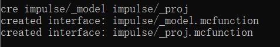

我们手动实现这两个接口

```
#mot_uav:impulse/_model
# 构建冲量的数据模板
# 输出数据模板storage mot_uav:io result

data modify storage mot_uav:io result set value {vector:[0.0d,0.0d,0.0d], point:[0.0d,0.0d,0.0d]}

execute store result storage mot_uav:io result.vector[0] double 0.0001 run scoreboard players get impulse_fx int
execute store result storage mot_uav:io result.vector[1] double 0.0001 run scoreboard players get impulse_fy int
execute store result storage mot_uav:io result.vector[2] double 0.0001 run scoreboard players get impulse_fz int
execute store result storage mot_uav:io result.point[0] double 0.0001 run scoreboard players get impulse_x int
execute store result storage mot_uav:io result.point[1] double 0.0001 run scoreboard players get impulse_y int
execute store result storage mot_uav:io result.point[2] double 0.0001 run scoreboard players get impulse_z int
```

```
#mot_uav:impulse/_proj
# 冲量的数据模板投射到临时对象
# 输入数据模板storage mot_uav:io input

execute store result score impulse_fx int run data get storage mot_uav:io input.vector[0] 10000
execute store result score impulse_fy int run data get storage mot_uav:io input.vector[1] 10000
execute store result score impulse_fz int run data get storage mot_uav:io input.vector[2] 10000
execute store result score impulse_x int run data get storage mot_uav:io input.point[0] 10000
execute store result score impulse_y int run data get storage mot_uav:io input.point[1] 10000
execute store result score impulse_z int run data get storage mot_uav:io input.point[2] 10000
```

修好main，用一个列表接收所有的冲量

```
#mot_uav:main
...

# 遍历碰撞点列表
data modify storage mot_uav:io list_impulse set value []
execute store result score loop int run data get storage mot_uav:io collision_points
execute if score loop int matches 1.. as 0-0-0-0-0 run function mot_uav:collision/loop
execute if data storage mot_uav:io list_impulse[0] run function mot_uav:collision/apply

...
```

修改collision/bounce，把施加冲量的命令注释掉，改为把冲量的数据模板添加进临时列表

```
#mot_uav:collision/bounce
...

# 对mot_uav临时对象施加矢量
#function mot_uav:impulse/_apply
function mot_uav:impulse/_model
data modify storage mot_uav:io list_impulse append from storage mot_uav:io result
```

打开mot终端，添加collision/apply与collision/apply_loop函数

```
cre collision/apply collision/apply_loop
```

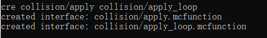

编写collision/apply

```
#mot_uav:collision/apply
# mot_uav:main调用

# 获取冲量数量
execute store result score cnt_impulse int run data get storage mot_uav:io list_impulse

# 遍历并施加每个冲量
function mot_uav:collision/apply_loop
```

编写collision/apply_loop

```
#mot_uav:collision/apply_loop
# mot_uav:collision/apply调用

# 把冲量投射为临时对象
data modify storage mot_uav:io input set from storage mot_uav:io list_impulse[0]
function mot_uav:impulse/_proj

# 根据权重调整冲量大小
scoreboard players operation impulse_fx int /= cnt_impulse int
scoreboard players operation impulse_fy int /= cnt_impulse int
scoreboard players operation impulse_fz int /= cnt_impulse int

# 施加冲量
function mot_uav:impulse/_apply

# 遍历每个冲量
data remove storage mot_uav:io list_impulse[0]
execute if data storage mot_uav:io list_impulse[0] run function mot_uav:collision/apply_loop
```

进入游戏，重新运行测试

```
reload
function mot_uav:test/fall/start
```

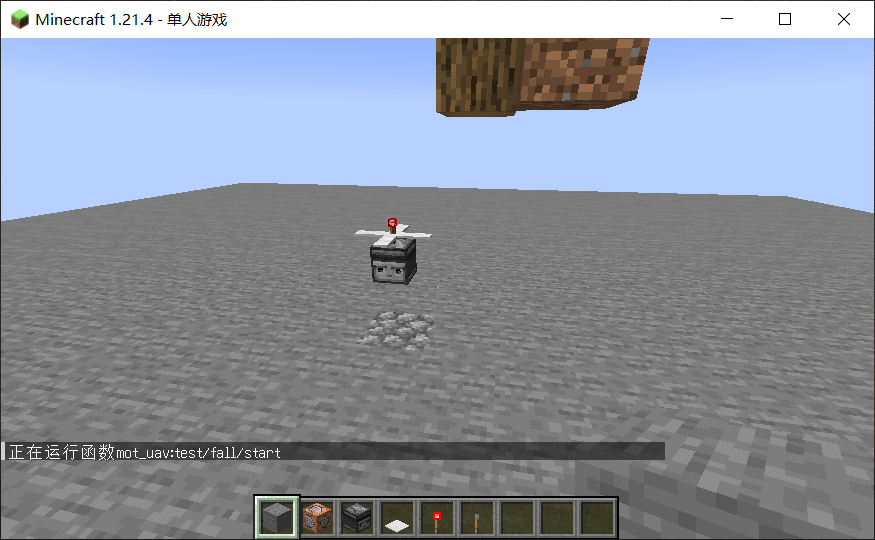

观察到无人机一直在地面弹跳，弹性疑似有点太好了

我们修改弹性系数常量

```
#mot_uav:_consts
...

# 弹性系数
scoreboard players set mot_uav_b int 6500

...
```

进入游戏重新运行测试

```
reload
function mot_uav:_consts
function mot_uav:test/fall/start
```

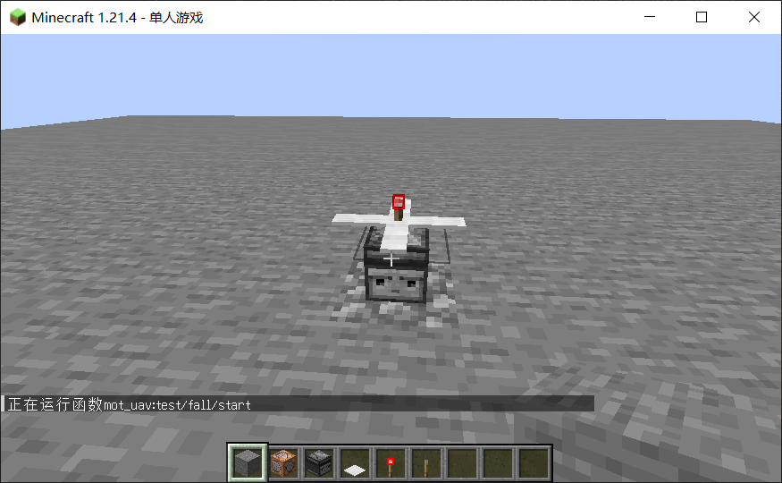

观察到无人机在地面颤抖

我们再次运行impulse测试

```
function mot_uav:test/impulse/start
```

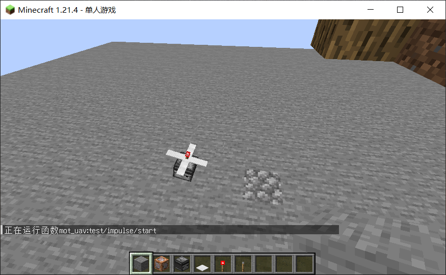

无人机不会在地上打滚了